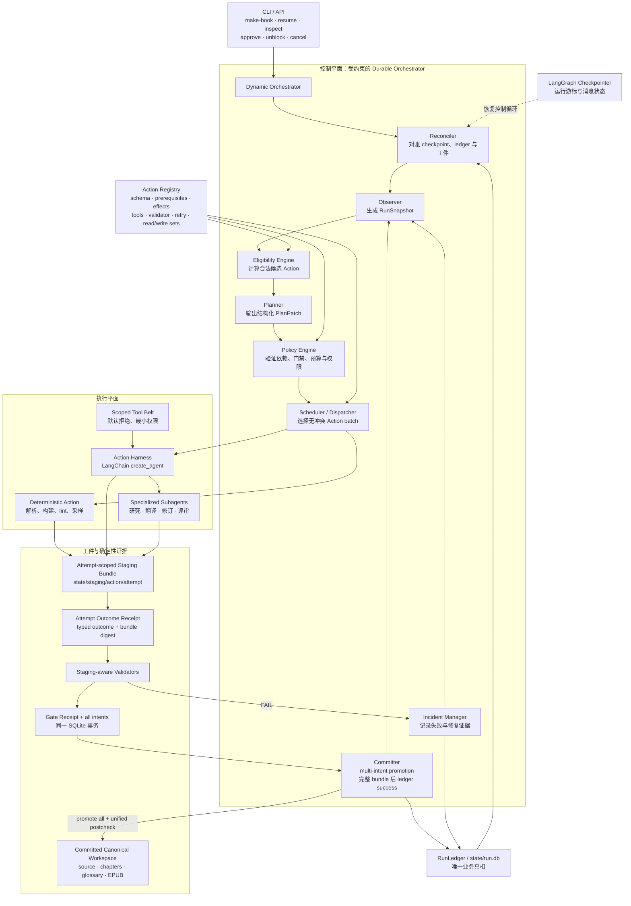

# ARCHITECTURE.md

> 本文件描述 AI Book Interpreter（ABI）的当前实现。强制规则见
> [`docs/DESIGN.md`](./docs/DESIGN.md)，完整协议见
> [`docs/design-docs/dynamic-agent-orchestration.md`](./docs/design-docs/dynamic-agent-orchestration.md)。

## 1. 高层视角

ABI 是一个自包含的自主翻译 agent。它不执行编号阶段或固定宏观路径，而是持续观察书籍工程的
durable facts，由 Planner 提出短期 `PlanPatch`，再由确定性的 Policy、Scheduler、Reconciler 与
Committer 限制、执行和提交。确定性门禁仍决定译文、EPUB 与 release 是否可提交；agent 不能宣布
PASS，也不能直接写业务状态。



## 2. 分层与依赖

```text
types → config → ir → project → epub → qa → release → tools → actions
      → planning → orchestrator → cli
providers 是横切边界；业务层不得直接 import LangChain/LangGraph/Langfuse SDK。
```

| 层 | 职责 |
| --- | --- |
| `types` / `config` / `ir` | frozen 边界模型、配置、输入解析与章节 IR |
| `project` | `BookProject`、RunLedger、artifact promotion 与 durable schema |
| `epub` / `qa` / `release` | 确定性构建、门禁、抽检与版本发布 |
| `tools` | scoped、attempt-aware 的最小权限工具 |
| `actions` | capability registry、typed executor 与 validator 合约 |
| `planning` | snapshot、eligibility、Planner、Policy、Scheduler |
| `orchestrator` | controller、dispatcher、reconciler、committer、lifecycle |
| `providers` | LLM、agent/checkpointer、宏观 durable runtime、observability |
| `cli` | 六个 lifecycle 命令与 eval 命令；不拥有业务 transition |

## 3. 持久化边界

每本书一个工程目录。canonical 工件仍位于 `source/`、`metadata/`、`chapters/`、`glossary/`、
`qa/`、`preproduction/`、`reviews/` 与 `output/`。控制与恢复数据位于：

```text
state/run.db                    # run/plan/action/attempt/receipt/gate/intent/incident
state/staging/{action}/{attempt}/ # executor 的唯一写入目标
state/graph_checkpoints.sqlite  # Action harness 游标、消息与 interrupt；不是业务真相
state/status_projection.json    # 可重建的人类视图
events.jsonl / metrics.json     # 可观测投影，可重建且不授权 transition
```

普通成功严格经过：冻结授权事实 → attempt → immutable outcome receipt → validator → gate receipt 与
完整 intent 集 → create-only promotion → unified canonical postcheck → ledger success。文件系统和 SQLite
不宣称跨介质原子性；Reconciler 按 receipt、checksum 和 intent 补完或 fail closed。

## 4. 动态恢复语义

- 自动 retry 保留旧 attempt=`RETRY_WAIT`，显式创建 attempt+1 与新 staging，沿用冻结 manifest/policy。
- 显式映射的 semantic repair 保留旧 Action，run 保持 `RUNNING`，创建新 plan/action/staging。
- integrity、未知分类、外部副作用不确定性一律 `BLOCKED`；人工 `unblock` 只创建新 identity。
- HITL 初始 `Paused` receipt 不改写；decision `CLAIMED → STARTED → RESOLVED`，continuation 追加并由
  effective-outcome 读取。`Succeeded` continuation 仍必须通过完整门禁与 promotion 协议。
- LangGraph checkpoint 只恢复执行游标；所有生命周期操作重新读取 RunLedger。

## 5. 翻译与发布质量

动态编排不改变翻译方法和成品门禁：每章翻译只接收原文、5–8 条文体规则和命中术语，只输出译文；
QA/修订作为独立 Action。EPUB 必须通过 publication lint、asset manifest 与 EPUBCheck；分层随机抽检、
独立评审和 release 前置工件都必须以 committed artifact/gate evidence 进入 ledger。

## 6. 可观测性与外部依赖

所有 LLM 调用走 providers，接入 Langfuse、`events.jsonl`、`metrics.json` 与预算门禁。EPUBCheck 需要
JRE；可通过 `ABI_EPUBCHECK_JAR` 或 PATH 中的 `epubcheck` 提供。
