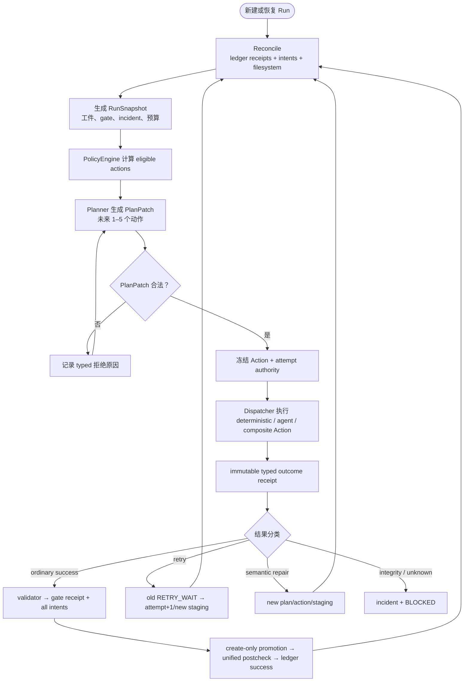

# ABI Agentic Pipeline：当前实现总览

> ABI 通过受约束的动态 Action loop 完成 ingest、研究、试译、逐章翻译、QA、EPUB、抽检、评审与
> release。总体架构图使用 [`ARCHITECTURE.md`](../../ARCHITECTURE.md) 中从已批准动态设计复制的唯一版本；
> 业务协议以 [`dynamic-agent-orchestration.md`](./dynamic-agent-orchestration.md) 为准。

## 1. 控制循环

Planner 只选择当前 eligibility 集合中的 capability。PolicyEngine 用完整 policy snapshot 重新验证依赖、
effects、权限、预算、write-set 冲突和 bounded progress；拒绝原因进入 ledger。ActionRegistry 是能力目录，
不是执行顺序表。

## 2. Action 与证据

Action 的授权事实包括 capability、typed parameters、dependencies、read/write sets、expected manifest、
expected evidence refs、retry policy/fingerprint 与 idempotency key。executor 只能写本 attempt staging，
返回 `ActionOutcomeEnvelope`。Agent harness 按 Action 渐进加载 skills 和 scoped tools，默认拒绝未授权工具。

普通成功不能跳过：outcome receipt、staging-aware validator、gate receipt、完整 intents、逐项 promotion、
unified canonical postcheck 与 ledger success。probe 是 evidence-only 专用结果，不能伪装为普通成功。

## 3. 翻译方法

- 全局/本书研究、style profile、术语表和预翻译实验都是显式工件与 Action。
- 每章翻译只得到原文、最关键 5–8 条文体规则与命中术语，只输出译文。
- 译后控制、忠实度、可读性/意象、术语审计与修订是独立 Action；缺陷进入 typed repair facts。
- 可复现问题触发问题族审计，而不是在同一翻译 prompt 中混入所有 QA 规则。
- `chapters/final/`、EPUB、抽检与 release 都依赖 committed prerequisites，不依赖文件“看起来存在”。

## 4. 失败语义

`RetryableFailure` 只能按冻结 policy 创建新 attempt；`RepairRequired` 必须带 class/source/reason。
mapped semantic repair 自动创建新 plan/action/staging，integrity 或未知分类阻断并等待人工证据。
`Indeterminate` 外部副作用只能通过绑定原 operation/idempotency/policy 的 probe 解析。HITL 使用不可变
初始 pause 与 append-only continuation，effective success 仍走完整门禁提交链。

## 5. 质量与完成条件

EPUB Action 运行 publication lint、asset manifest check 与 EPUBCheck。随机抽检使用确定性分层采样、
独立评审和阈值 validator。run 只有在 Registry 定义的 completion predicate、所有 release prerequisites、
artifacts 与 gate evidence 都已 committed，且没有 blocking incident 时才能 `COMPLETED`。

## 6. 源码入口

| 关注点 | 文件 |
| --- | --- |
| capability / executor / validator | `src/abi/actions/` |
| Planner / Policy / Scheduler / snapshots | `src/abi/planning/` |
| controller / dispatcher / reconcile / commit | `src/abi/orchestrator/` |
| ledger / schema / artifact promotion | `src/abi/project/` |
| durable macro runtime | `src/abi/providers/orchestration_runtime/` |
| Action harness / HITL checkpointer | `src/abi/providers/agent_runtime/` |
| scoped tools | `src/abi/tools/` |
| EPUB / QA / release | `src/abi/epub/`、`src/abi/qa/`、`src/abi/release/` |
