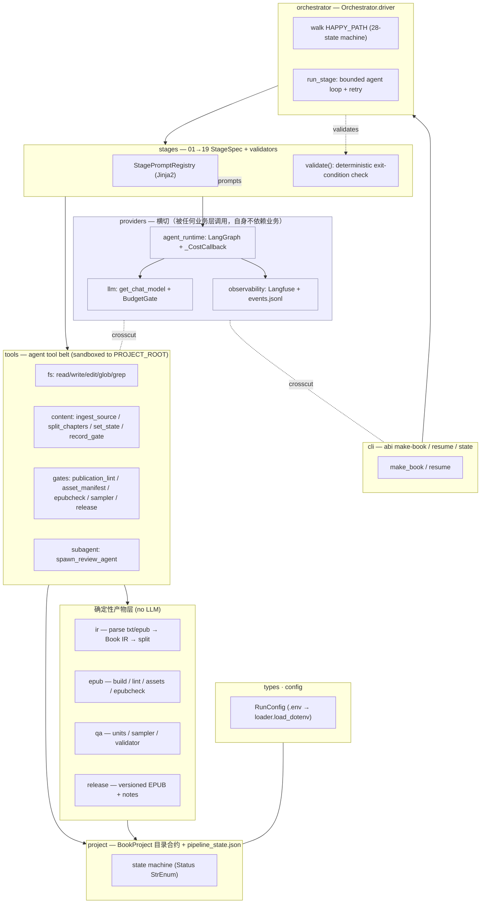
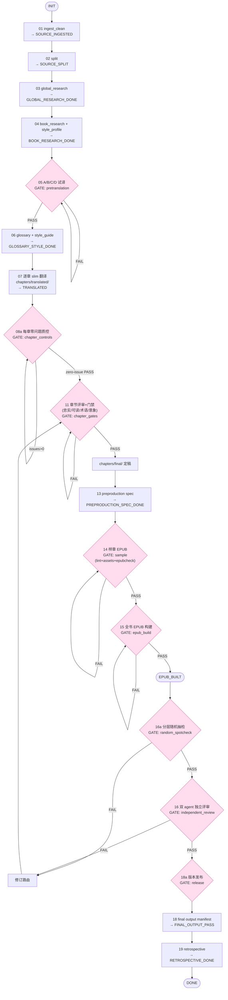

# Agentic 翻译流水线总览（v0.2 权威文档）

> 一句话定位：ABI 是一个**自洽的 agent 项目**——输入一本书（txt/epub/pdf），由 LLM 驱动的
> agent 在进程内自循环跑完「ingest → 研究 → 试译 → 逐章翻译 → 质控/评审 → EPUB 构建 →
> 随机抽检 → 独立评审 → 版本发布 → 复盘」，产出质量门禁通过、带版本的 EPUB。
>
> 前置阅读：[`core-beliefs.md`](./core-beliefs.md)、[`tech-stack.md`](./tech-stack.md)。
> 本文取代旧的三遍流水线设计（`pipeline.md` / `sliding-window.md` / `survey-design.md` /
> `assembly-design.md`），那些文档描述的是 v0.1 的确定性批量流程，已被本架构替换。

本文档统一收录三部分：**1) 整体架构图、2) 翻译流程图、3) Prompt 设计与翻译方法论**。

---

## 1. 整体架构图（分层 + agent 运行时）



**单向依赖（lint 强制）：**

```
types → config → ir → project → epub → qa → release → tools → stages → orchestrator → cli
providers (llm, agent_runtime, observability) ← 任何业务层（但 providers 不依赖业务）
```

- **project**：书籍工程目录合约 + `pipeline_state.json` 28 态状态机（`Status` 为 `StrEnum`）。
- **epub / qa / release**：确定性产物层，**不调用 LLM**，只被 `tools` 调用。
- **tools**：暴露给 agent 的工具带，是确定性业务层与 agent 运行时之间的唯一桥梁；所有文件操作
  沙箱化在 `PROJECT_ROOT` 内。
- **stages**：00→19 各阶段的 agent 调用（prompt 渲染）+ 确定性门禁校验（`validators.validate`）。
- **orchestrator**：驱动 28 态状态机，按 `HAPPY_PATH` 自循环到 `DONE`。
- **providers**：唯一横切层。所有 LLM 调用走 `providers.llm.get_chat_model()`，自动接入
  Langfuse trace + 本地 `events.jsonl`，并由 `BudgetGate` / `_CostCallback` 累计 token/cost。

---

## 2. 翻译流程图（28 态 happy path + 门禁）



每个粉色菱形都是**确定性门禁**：由工具（`publication_lint` / `asset_manifest_check` /
`epubcheck` / `validate_random_spotcheck` / `create_release`）或 `validators.validate()` 判
PASS/FAIL，**agent 不能自判通过**；FAIL 时 agent 自己修因重跑，不停下来等人
（`human_required=false`）。

### 阶段对照表（`STAGE_SEQUENCE`）

| 阶段 | 产出状态 | 门禁 | 工具档位 | 说明 |
| --- | --- | --- | --- | --- |
| 01 ingest_clean | SOURCE_INGESTED | — | authoring | 解析源文件 → 干净文本 + manifest |
| 02 split | SOURCE_SPLIT | — | authoring | 拆章 → `chapters/src/` + `toc.json` |
| 03 global_research | GLOBAL_RESEARCH_DONE | — | authoring | 全局翻译研究 |
| 04 book_research | BOOK_RESEARCH_DONE | — | authoring | 书籍专项研究 + `style_profile.md` |
| 05 pretranslation_trials | PRETRANSLATION_PASS | `pretranslation` | authoring | A/B/C/D 试译门禁 |
| 06 glossary_style | GLOSSARY_STYLE_DONE | — | authoring | `terms.csv` + `style_guide.md` |
| 07 translate_chapters | TRANSLATED | — | authoring | slim 逐章翻译 |
| 08a chapter_control | CHAPTER_POST_CONTROL_PASS | `chapter_controls` | authoring | 每章零问题质控 |
| 11 chapter_gate | CHAPTER_GATES_PASS | `chapter_gates` | authoring | 四维评审 → `chapters/final/` |
| 13 preproduction_spec | PREPRODUCTION_SPEC_DONE | — | production | 出版规格 |
| 14 preproduction_sample | PREPRODUCTION_SAMPLE_PASS | `sample` | production | 样章 EPUB |
| 15 full_build | EPUB_BUILT | `epub_build` | production | 全书 EPUB 构建 |
| 16a random_spotcheck | RANDOM_SPOTCHECK_PASS | `random_spotcheck` | review | 分层随机抽检 |
| 16 independent_review | INDEPENDENT_REVIEW_PASS | `independent_review` | review | 双 agent 独立评审 |
| 18a release | RELEASE_PASS | `release` | production | 版本发布 |
| 18 final_output | FINAL_OUTPUT_PASS | — | production | 最终产物清单 |
| 19 retrospective | RETROSPECTIVE_DONE → DONE | — | authoring | 复盘 + skill 回填 |

> 状态机定义见 `src/abi/project/state.py`；阶段绑定见 `src/abi/prompts/stages.py` 的
> `STAGE_SEQUENCE`；门禁校验见 `src/abi/stages/validators.py`。

---

## 3. Prompt 设计与翻译方法论

### 3.1 Prompt 编排（两层）

- **系统提示 `prompts/stages/_system.md.j2`**（全程不变）：定义 agent 角色、硬规则
  （只能在项目根内读写、门禁由工具裁决、`human_required=false` 自修复）、翻译质量铁律，
  以及一份 **Forbidden 清单**（见 §3.3）。
- **阶段提示 `prompts/stages/NN_*.md.j2`**（每阶段切换）：只讲「本阶段任务 + 退出条件 +
  该调哪个门禁工具」。由 `STAGE_SEQUENCE` 把每个 `StageSpec` 绑定到 `produces` 状态、
  `gate` 名、`tool_profile`（authoring / production / review）和 `max_iterations`。
- **参数化**：Jinja2 用 `{source_lang}-{target_lang}` 渲染，一套链服务所有语言方向。

### 3.2 核心翻译方法论（体现在流程里）

1. **先研究后翻译**：03 全局翻译研究 + 04 书籍专项研究，产出
   `metadata/style_profile.md`（语域、人称、标点、专有名词策略）。
2. **A/B/C/D 试译门禁（05）**：先在 3–5 个代表性段落上做四个变体——**A 忠实、B 可读、
   C 文学润色、D 最终候选**，并说明「为什么 D 最适合正文」。**不过这道门禁不准开始批量翻译**。
   这是防止「通篇直译腔」或「流畅但失味」的关键闸门。
3. **持久化上下文**：06 产出 `glossary/terms.csv` + `glossary/style_guide.md`，
   保证全书术语 / 风格一致。
4. **Slim 翻译调用（07）**：每章只喂 **原文 + style_guide 前 5–8 条规则 + 本章实际命中的
   术语（grep `terms.csv`）+ 最小邻接上下文**；**绝不**把整本 glossary、完整 skills、
   EPUB/release 规则塞进翻译调用。输出**只有译文**，不带 QA、不带解释、普通名词不加括号原文。
   这降低 token、提升专注度与一致性。
5. **每章零问题质控（08a）**：逐章做 `FULL_CHAPTER` 控制，必须达到
   `issues_found:0 / fixes_applied:0 / unresolved_blocking:0 / latest_round_status:PASS /
   allow_next_chapter:true` 才能进下一章。
6. **多维章节评审 + 门禁（11）**：忠实度 / 可读性 / 术语 / 意象四项评审 → 写
   `qa/gates/{slug}.gate.md`（`result: PASS`）→ 通过后才把译文升级进 `chapters/final/`。
7. **出版前确定性门禁（14/15）**：样章 EPUB 必须先过，再构建全书；构建前
   `publication_lint`（无本机绝对路径 / mojibake / BOM、围栏配平、目标语排版）+
   `asset_manifest_check`（图片本地存在）+ `epubcheck`（Java，0 fatal/0 error）全过。
8. **发布前双重保险（16a + 16）**：分层随机抽检（确定性采样器 + 卓越线 avg≥92 / min≥88、
   无 P0/P1/P2、release_confidence≥0.80、连续轮次通过）＋两个独立评审子 agent；
   任一 FAIL 走修订路由回到章节门禁。
9. **复盘回填（19）**：把本书发现的缺陷族沉淀回 skill。

### 3.3 Forbidden 清单（系统提示里硬禁止）

- 试译门禁未过就批量翻译；
- 本章 08a 未零问题就翻下一章；
- 章节门禁未过就写 `chapters/final/`；
- 样章 / lint / assets 未过就构建全书；
- 首版 EPUB 未经双重评审就宣称完成；
- 把「流畅但失味」的初稿当定稿；
- 机械地把英文长破折号标题链直接变成中文破折号链。

---

## 相关源码入口

| 关注点 | 文件 |
| --- | --- |
| 状态机 / 28 态 | `src/abi/project/state.py` |
| 目录合约 / 脚手架 | `src/abi/project/layout.py`、`scaffold.py` |
| 阶段绑定 / prompt 注册 | `src/abi/prompts/stages.py` + `prompts/stages/*.md.j2` |
| 阶段退出校验 | `src/abi/stages/validators.py` |
| 单阶段 agent 循环 | `src/abi/stages/runner.py` |
| 状态机驱动 | `src/abi/orchestrator/driver.py` |
| agent 运行时 (LangGraph) | `src/abi/providers/agent_runtime/runner.py` |
| 工具带 | `src/abi/tools/` |
| EPUB 构建 / 门禁 | `src/abi/epub/` |
| 随机抽检 / 评审 | `src/abi/qa/` |
| 版本发布 | `src/abi/release/create.py` |
| CLI | `src/abi/cli/main.py` |
