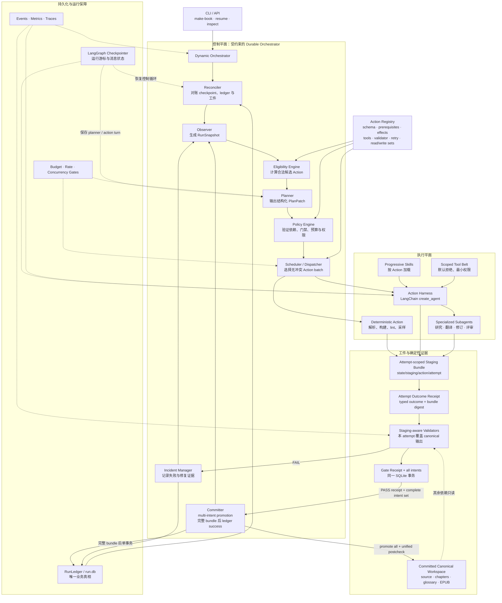
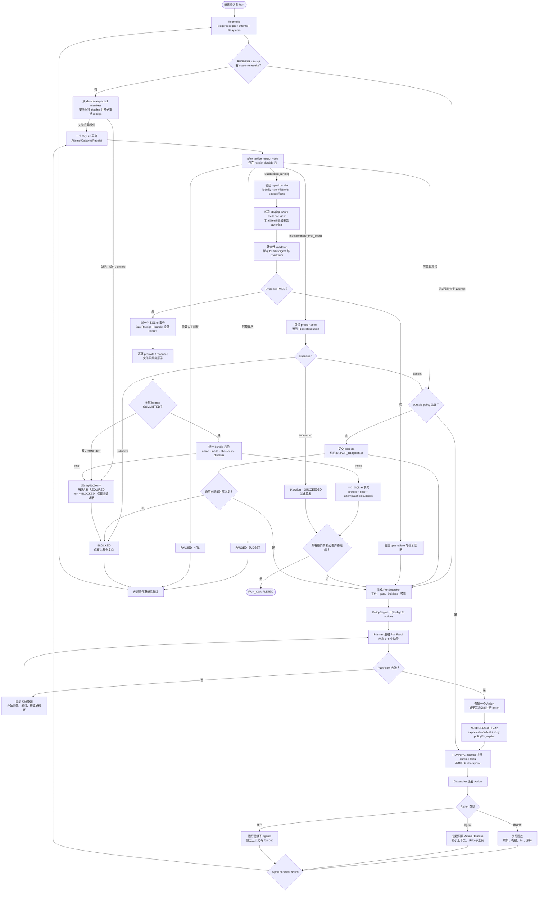
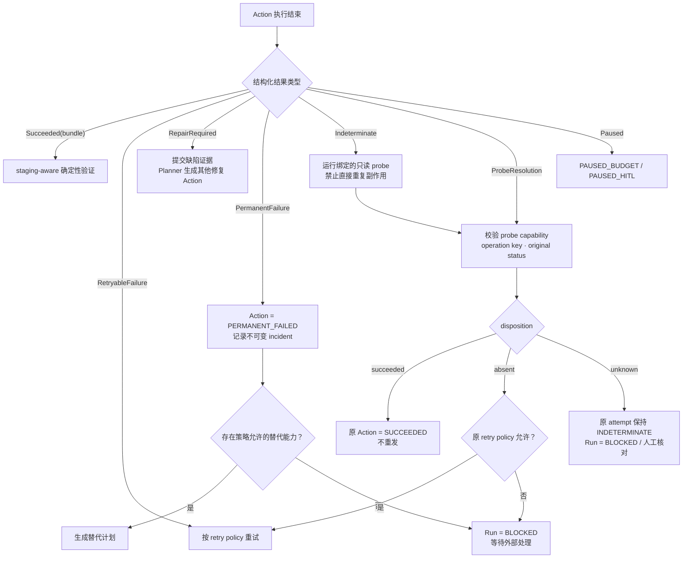

# 受约束的动态 Agent 编排

> **状态：已批准，待实现。** 2026-08-04；书面设计于 2026-08-04 经用户确认。
>
> **协议修订：已批准、具有约束力。** 2026-08-05；artifact bundle、attempt-scoped staging、
> staging-aware validation、multi-intent commit 与 typed probe resolution 是对 Tasks 1/4/7/8/9
> 的授权 breaker amendment。修订后的接口不兼容此前草案或已生成的任务/状态，不保留旧的
> 单文件 `Succeeded` 形状。
>
> **恢复闭环修订：已批准、具有约束力。** 2026-08-05 fix round 1；durable outcome/gate receipts、
> receipt-driven recovery、durable retry facts、统一 bundle 后验和不可变 conflict lifecycle 修复前一版
> 在 executor/validator 与 promotion 之间的未持久化窗口。以下正文是唯一当前契约。
>
> 本文定义 ABI 下一代宏观控制平面：用 `Planner + PolicyEngine + durable action loop`
> 取代固定 `HAPPY_PATH`。实现完成前，当前行为仍以
> [`agentic-pipeline.md`](./agentic-pipeline.md) 和
> [`langgraph-and-state-machine.md`](./langgraph-and-state-machine.md) 为准。
>
> 前置阅读：[`core-beliefs.md`](./core-beliefs.md)、
> [`agentic-pipeline.md`](./agentic-pipeline.md)、
> [`langgraph-and-state-machine.md`](./langgraph-and-state-machine.md)、
> [`tech-stack.md`](./tech-stack.md)。

## 1. 决策摘要

ABI 将保留“LLM 负责开放式工作、确定性代码负责裁决”的原则，但把这条边界从阶段内部扩展到
整条流水线：

- 不再按 `HAPPY_PATH` 的固定索引选择下一阶段。
- Planner 根据当前工件、门禁证据、缺陷、资源和预算提出短期 `PlanPatch`。
- `PolicyEngine` 计算合法动作并批准或拒绝计划；Planner 没有状态写权限。
- `ActionRegistry` 取代 `STAGE_SEQUENCE`，声明每种能力的 schema、前置条件、效果、权限、
  validator、重试和并发规则。
- Dispatcher 每轮执行一个 Action，或一组读写集合互不冲突的 Action。
- Validator 只在 staging-aware evidence view 上根据确定性证据裁决；Committer 先持久化完整
  bundle 的全部 promotion intents，再逐项提升，最后才在一个 SQLite 事务中提交业务事实与成功状态。
- SQLite `RunLedger` 是唯一业务真相；LangGraph checkpointer 只保存运行时游标与 agent 上下文。
- 业务提交追求 exactly-once；同一 `RUNNING` attempt 的 executor 不自动重跑，缺 receipt 时只重建或阻断。
  只有 durable failure receipt + retry policy 明确允许时才创建下一 attempt，副作用仍必须幂等或可对账。
- 不兼容旧 `pipeline_state.json`、旧 run 或旧状态枚举；不提供迁移器。

选型为**定制领域控制平面 + LangGraph durable runtime + LangChain v1 Action Harness**。
Deep Agents 的 context、skills、filesystem permission、subagent 等模式按需吸收，但不直接把
`write_todos` 当作 ABI 业务计划。第一版不引入 Temporal、DBOS 或 Restate 等外部 durable engine。

## 2. 为什么改变当前设计

当前系统已经有阶段内 ReAct loop，但宏观层仍是固定 workflow：

```text
pipeline_state.status
  → 在 HAPPY_PATH 中找下一个索引
  → 运行整个 StageSpec
  → validate(spec.produces)
  → advance
```

它的优点是可预测，但限制了自适应性和恢复粒度：

1. 不同书籍无论体裁、公式、插图和风险，都走近似相同的阶段链。
2. gate FAIL 后通常重跑大阶段，不能精准表达“只审计一个缺陷族并修订受影响章节”。
3. 宏观层无法显式并行无依赖工作。
4. `AgentRuntime.run()` 每次创建 `InMemorySaver`，阶段中断后丢失推理上下文。
5. 除预算外的运行时异常可能直接穿透 orchestrator，缺少统一恢复语义。
6. `FAILED` 被视为终态，当前 `resume` 无法从它继续。
7. agent 可调用 `set_state` 跳到任意 `Status`；这使确定性状态边界依赖 prompt 自律。
8. `validate()` 对未覆盖状态 fail-open，新增状态可能被错误视为 PASS。

新设计解决的是**宏观闭环控制**，不是取消所有依赖。诸如“先有完整译文才能评审”“所有发布硬门禁
通过后才能发布”仍由代码强制。

## 3. 目标与非目标

### 3.1 目标

- 根据书籍特征和实时质量证据动态选择、重排、重复或并行工作。
- 所有硬门禁、权限、预算和状态提交由确定性代码控制。
- 把恢复粒度降到 Action、agent turn 和 tool side effect。
- 区分可重试、需要其他动作修复、永久失败、结果不确定与主动暂停。
- 保留人类可审计的计划、证据、工件 provenance 和事件链。
- 让新增能力主要通过注册 Action 完成，而不是扩展全局状态枚举和固定阶段链。
- 保持翻译调用精简、reviewer 独立、所有 LLM 调用可观测等现有质量原则。

### 3.2 非目标

- 不让 Planner 自由创建任意工具、代码或子 agent。
- 不允许 agent 直接写业务状态、gate 或完成标志。
- 不迁移旧书籍工程、旧 `pipeline_state.json` 或进行中的任务。
- 第一版不支持分布式 worker、跨机器调度或外部 durable engine。
- 不把整本书内容、全部历史消息或所有 skills 长驻 Planner 上下文。
- 不以“更 agentic”为理由把可确定执行的解析、构建、lint、采样改成 LLM 任务。

## 4. 业界实现与取舍

调研结论不是选择一个包替换 ABI，而是吸收多个成熟实现已经收敛的边界：

| 实现 | 可借鉴能力 | ABI 的取舍 |
| --- | --- | --- |
| LangChain v1 `create_agent` | 标准 tool loop、structured output、middleware、动态模型和错误处理 | 用于每个 Action 的隔离 harness，替代已弃用的 `create_react_agent` |
| LangGraph | checkpoint、durable execution、interrupt、`Command`、retry 和图状态 | 承载宏观 control loop 与 Action harness 的恢复游标 |
| Deep Agents | 文件 backend、permissions、context offloading、skills、subagents、HITL | 吸收 harness 模式；`write_todos` 只是轻量任务表，不作为业务 Planner |
| OpenAI Agents SDK | LLM 编排与代码编排混合、agents-as-tools、guardrails、结构化结果 | 采用“LLM 提议、代码检查与执行”的混合模式，不绑定 OpenAI runner |
| Google ADK 2.0 | 动态代码控制流、子节点自动 checkpoint、恢复时跳过已完成节点 | 采用可重入 orchestrator + 已提交 Action 跳过语义 |
| Microsoft Agent Framework | Harness 与 type-safe workflow 分层、checkpoint 和 HITL | 保持 Action Harness 与领域控制平面分离 |
| Temporal / DBOS / Restate | 长任务、跨进程恢复、外部事件和可靠副作用 | 单机 CLI 第一版过重；保留未来替换 runtime 的边界 |

相关一手资料：

- [LangGraph persistence](https://docs.langchain.com/oss/python/langgraph/persistence)
- [LangGraph interrupts](https://docs.langchain.com/oss/python/langgraph/interrupts)
- [LangGraph fault tolerance](https://docs.langchain.com/oss/python/langgraph/fault-tolerance)
- [LangGraph v1 migration](https://docs.langchain.com/oss/python/migrate/langgraph-v1)
- [Deep Agents overview](https://docs.langchain.com/oss/python/deepagents/overview)
- [OpenAI Agents SDK orchestration](https://openai.github.io/openai-agents-python/multi_agent/)
- [OpenAI Agents SDK runner and durable integrations](https://openai.github.io/openai-agents-python/running_agents/)
- [Google ADK dynamic workflows](https://adk.dev/graphs/dynamic/)
- [Microsoft Agent Framework overview](https://learn.microsoft.com/en-us/agent-framework/overview/)

## 5. 总体架构



## 6. 动态控制循环



循环的唯一自由度是 Planner 提出“接下来做什么”。合法性、执行权限、证据裁决和业务提交都不由
Planner 控制。

## 7. 核心领域模型

所有外部边界使用 Pydantic frozen models。内部持久化也只接受已解析模型。

### 7.1 `ActionSpec`

```python
class ActionSpec(BaseModel):
    capability: str
    input_schema: str
    action_kind: Literal["deterministic", "agent", "composite"]
    prerequisites: tuple[PredicateSpec, ...]
    effects: tuple[EffectSpec, ...]
    expected_evidence: tuple[EvidenceSpec, ...]
    tool_allowlist: tuple[str, ...]
    skill_refs: tuple[str, ...]
    read_set: tuple[str, ...]
    write_set: tuple[str, ...]
    retry_policy: RetryPolicySpec
    validator: str
    resource_class: str
    probe_capability: str | None
```

Registry 启动时校验 capability 唯一、schema 可序列化、validator 存在、工具与 skill 引用有效、
read/write 集合合法。每个会产出工件的 ActionDefinition 还必须注册确定性的 effect expander，把已解析
参数展开为 `ExpectedArtifactManifest`；manifest 不能含目录或 glob，且必须落在 write set 内。Registry
校验失败时进程拒绝启动。probe capability 的附加只读约束见 7.4 节。

### 7.2 `PlanPatch`

```python
class PlanPatch(BaseModel):
    objective: str
    proposed_actions: tuple[ProposedAction, ...]
    superseded_action_ids: tuple[str, ...] = ()
    rationale: str

class ProposedAction(BaseModel):
    capability: str
    arguments: tuple[ActionArgument, ...]
    dependencies: tuple[str, ...]
    expected_evidence: tuple[str, ...]
    priority: int

class ActionArgument(BaseModel):
    name: str
    value_json: str
```

Planner 输出仅能引用本轮 `eligible_actions` 中的 capability。`PlanPatch` 采用短视窗策略，每次
包含 1–5 个未来动作；PolicyEngine 仍需重新验证模型输出，不能因为候选列表受限而信任它。

`ActionArgument` 是 Planner 边界的传输形状，不是业务输入。PolicyEngine 根据 `input_schema` 从
Registry 取得对应 `TypeAdapter`，将 `value_json` 解析成 capability 专属的 frozen Pydantic model，
再生成 `AuthorizedAction`。解析失败即拒绝计划；未解析的 JSON、`dict` 或 `Any` 不得进入 Dispatcher
或持久化为已授权参数。

### 7.3 `RunSnapshot` 与 `PlanningContext`

`RunSnapshot` 是来自 ledger 的完整、不可变 policy facts。每轮由一次 ledger
读取构造 `PlanningContext`：`policy_snapshot` 保留完整事实，只交给
`PolicyEngine` 复验；`planner_snapshot` 从前者派生为受限证据视图，只会被
序列化给 Planner。两者不能互换，尤其不得用采样后的 `planner_snapshot` 重算
predicate 或授权。

Planner 看到的是 `planner_snapshot` 的压缩证据视图：

- 已提交 Action 与当前 plan version；
- gate evidence 摘要；
- artifact manifest、checksum 与统计，不含整本正文；
- 未解决 incident 及其错误分类（消息截断）；
- 最近、稳定的 policy rejection code（不含任意错误文本）；
- 剩余预算、并发资源与人工约束；
- 本轮合法 capability 及其简短说明。

artifact、action、gate、incident 和 rejection 都按配置采样；eligible
capability 始终基于完整 `policy_snapshot` 计算后复制到 Planner view。若需要
阅读更多材料，Planner 必须提出注册的 `inspect_*` 或 `research_*` Action，而不是直接获得业务工具。

### 7.4 `ActionOutcome`

```python
class ArtifactMetadata(BaseModel):
    name: str
    value_json: str

class ArtifactBundleEntry(BaseModel):
    staged_relpath: str
    canonical_relpath: str
    media_type: str
    evidence_role: str
    metadata: tuple[ArtifactMetadata, ...] = ()

class ArtifactBundle(BaseModel):
    action_id: str
    attempt: int
    entries: tuple[ArtifactBundleEntry, ...]

class ExpectedArtifact(BaseModel):
    canonical_relpath: str
    media_type: str
    evidence_role: str
    metadata: tuple[ArtifactMetadata, ...] = ()

class ExpectedArtifactManifest(BaseModel):
    action_id: str
    entries: tuple[ExpectedArtifact, ...]

class Succeeded(BaseModel):
    kind: Literal["succeeded"] = "succeeded"
    artifact_bundle: ArtifactBundle
    evidence_refs: tuple[str, ...] = ()

class ProbeResolution(BaseModel):
    kind: Literal["probe_resolution"] = "probe_resolution"
    operation_key: str
    disposition: Literal["succeeded", "absent", "unknown"]
    evidence_refs: tuple[str, ...]
    message: str

class Indeterminate(BaseModel):
    kind: Literal["indeterminate"] = "indeterminate"
    operation_key: str
    error_code: str
    failure_signature: str
    message: str

ActionOutcome = Annotated[
    Succeeded
    | RetryableFailure
    | RepairRequired
    | PermanentFailure
    | Indeterminate
    | ProbeResolution
    | Paused,
    Field(discriminator="kind"),
]

class ActionOutcomeEnvelope(BaseModel):
    action_id: str
    attempt: int
    outcome: ActionOutcome
```

ActionRunner 必须返回该联合类型。未能解析为 `ActionOutcome` 本身是 `ModelBehaviorFailure`，按
ActionSpec 的模型错误策略处理，不能隐式视为成功。

以上模型均继承项目的 frozen、forbid-extra 基类。普通成功的 bundle 至少有一项；不允许空 bundle，
也不保留旧单文件 outcome 的兼容字段。每一项必须同时声明当前 attempt 下的 staged regular-file
relpath、精确的 portable-lowercase canonical relpath、media type、稳定 evidence role，以及由
`ArtifactMetadata` 表达的必要元数据。目录、glob、重复 staged path、重复 canonical path、绝对路径、
跨 attempt 路径或任何非 regular file 都 fail closed。

调用方必须已按 canonical key 提交 bundle：entries 严格按 `(canonical_relpath, staged_relpath)` 升序，
每项 metadata 严格按 `name` 升序且 name 唯一。边界 validator 对乱序或重复直接拒绝，**不得自动排序**。
序列化使用 Pydantic JSON 模式、UTF-8、sorted keys 和紧凑 separators，禁止浮动表示、隐式路径归一化
或实现自选顺序。该 canonical JSON 计算 `sha256` 得到 `bundle_digest`，并且 JSON 内的
`action_id + attempt` 必须与 ledger 当前 attempt、`ActionOutcomeEnvelope` 完全一致。canonical 路径
精确保留输入的小写 key，不做 casefold、Unicode normalization 或 dot normalization。

参数展开必须生成已经 canonical 排序的 `ExpectedArtifactManifest`，其中列出 ActionSpec 允许且本次参数
实际要求的 canonical path、media type、evidence role 和精确 metadata。实际 bundle 与 expected manifest
必须逐项精确相等；额外、缺失或重复条目都拒绝。`write_set` 只是权限上界，不能代替 expected manifest。

`Indeterminate.error_code` 必填；`failure_signature` 唯一规范为
`sha256(capability + "\n" + canonical_parameters_json + "\n" + error_code)`，Dispatcher 必须重算并
拒绝不一致值。`operation_key`、error code 和 failure signature 一起进入 attempt outcome receipt；后续
probe 的 `absent` 路由不得从当前 Registry 配置重新解释失败。

`ProbeResolution` 是专用 evidence-only outcome，而不是空的 `Succeeded`。Registry 启动时要求
`probe_capability` 指向独立 capability；该 probe 的 write/effect set 为空、`may_have_side_effects=False`，
executor 只能读取外部状态并提交 evidence refs。probe Action 的授权参数必须绑定原 ActionSpec、原
`action_id` 和 `operation_key`；普通 capability 返回 `ProbeResolution` 或 probe capability 返回普通
`Succeeded` 都是边界错误。

### 7.5 Staging-aware evidence contracts

`StagingEvidenceView` 是 validator 唯一允许读取的项目视图。它将本 `action_id + attempt` bundle 中每个
逻辑 canonical 输出映射到对应 staged regular file；未被当前 bundle 覆盖的依赖只能从已提交 canonical
artifact manifest 读取。view 不提供任意项目根路径，也不能看到未提交的其他 attempt。validator 因而不能
依靠 action 预先写 canonical 来通过。

`GateDecision` 除 pass/reason/message 外必须携带 validator ID/version、`bundle_digest`、按 bundle 顺序排列的
`artifact_checksums` 和稳定 `evidence_refs`（或等价的 typed evidence records）。Committer 只接受与当前
bundle digest、当前 staged checksum 和 validator version 完全绑定的 PASS；任一引用缺失或重放到另一
attempt 都 fail closed。

### 7.6 Durable handoff receipts

授权事务必须持久化 parameter-expanded `ExpectedArtifactManifest` canonical JSON/digest、stable expected
evidence refs，以及完整
`RetryPolicySpec`（`retryable_codes + max_attempts + delays`）canonical JSON/fingerprint。`start_attempt()`
在把 attempt 置为 `RUNNING` 的同一事务中把这些 immutable facts 快照到 attempt row；因此它们在调用
executor 前已经 durable，不能被后续 catalog drift 改写。

Dispatcher 收到并校验 `ActionOutcomeEnvelope(action_id, attempt, outcome)` 后，必须先调用
`RunLedger.record_attempt_outcome()`：在一个 SQLite 事务中写 `attempt_outcome_receipts`，字段至少包括
`action_id`、`attempt`、canonical outcome JSON/digest、Succeeded 时的 bundle JSON/digest、evidence refs、
error code/failure signature 等 failure fields 和 `recorded_at`。同一 identity 的完全一致重放幂等，任何
不同 outcome/bundle/evidence/failure facts 都冲突。receipt 只是 executor 已返回的 durable handoff，
**不是** gate PASS、promotion authorization 或 Action success。controller 的 `after_action_output` hook 只
能位于 receipt transaction 成功之后。

如果进程恰在 executor return 与 outcome receipt transaction 之间崩溃，Reconciler 仍不得重跑 Action。
它只能用 attempt-scoped no-follow 安全遍历、durable expected manifest 和确定性 canonical→staged 映射
重建一个完全匹配的 `Succeeded` receipt：所有 expected regular files 必须存在、没有额外 leaf/目录/
unsafe entry，media type/evidence role/metadata 来自 durable manifest，checksums 现场计算，evidence refs
来自 durable expected evidence identity。缺失、额外、unsafe 或无法唯一重建时进入第 12 节的 immutable
conflict lifecycle：attempt/action=`REPAIR_REQUIRED`、run=`BLOCKED`，绝不重派 executor。空/evidence-only
manifest 或可能返回 failure/probe 而没有唯一文件证据的 attempt 不能猜测 outcome，必须走同一阻断路径。

validator PASS 后，Committer 调用一个 ledger API，在**同一个 SQLite 事务**中写
`gate_receipts` 和该 bundle 的完整 promotion-intent 集。Gate receipt 至少包含 validator ID/version、
canonical `GateDecision` JSON/digest、bundle digest、按 bundle 顺序的 staged checksum/identity 和 evidence
refs。该 receipt 同样不是 success。只有 outcome receipt、gate receipt 和完整 intent 集都 durable 后才
允许复制第一个 canonical byte；部分 intent 集是 durable corruption，不能补插缺项。

## 8. Planner 与 PolicyEngine

### 8.1 Planner

Planner 是结构化模型调用，不是拥有业务工具的通用 agent。它：

- 只能输出 `PlanPatch`；
- 不写文件、ledger、gate 或完成状态；
- 不创建 registry 外 capability；
- 不选择具体 worker 实例；
- 不读取整本书或全部 agent 轨迹；
- 不能通过文本声称 PASS/DONE。

以下事件触发 replan：Action/batch 完成、gate FAIL、新缺陷、artifact drift、重试用尽、预算阈值、
人工恢复或约束改变。

### 8.2 PolicyEngine

PolicyEngine 是纯确定性模块，输入
`PlanningContext.policy_snapshot + ActionRegistry + PlanPatch`，输出
`AuthorizationDecision`。它强制：

- capability 在 registry 且当前 eligible；
- 参数可解析；
- 已解析参数可确定性展开为 caller-canonical `ExpectedArtifactManifest`，并与完整 retry policy 一起成为
  authorization durable facts；
- 依赖无环且已满足或在同一计划中可满足；
- 所有硬门禁不可跳过；
- 不得读取/写入越权路径；
- 并行 Action 的 write/write 和 read/write 集合无冲突；
- fan-out、成本、turn、时限和并发上限有效；
- 相同失败签名不得形成无界循环；
- release Action 只能在 terminal policy 的全部前置条件满足后授权。

拒绝决定与原因进入 ledger，作为下一次 Planner 输入和 L1 eval 数据。

## 9. Action Harness 与子 Agent

每个 agent Action 获得隔离的 `ActionEnvelope`：

```text
Action 参数
+ 最小相关工件
+ 5–8 条任务规则
+ 命中术语/证据
+ 专用工具 allowlist
+ Action 预算
+ 明确退出条件
```

Harness 使用 LangChain v1 `create_agent`，运行在 LangGraph 上，并配置：

- 持久 checkpointer；
- tool error middleware；
- 上下文摘要和大工具结果 offloading；
- token、turn、wall-clock 和费用上限；
- 动态模型选择与显式 fallback；
- 默认拒绝的文件权限；
- Langfuse、本地 events 与 BudgetGate；
- 结构化 `ActionOutcome`。

真实 HITL pause 的 public `Paused` 携带 ABI-owned `PendingHitlInterrupt`，逐个给出 interrupt ID、按序
action review 与 ABI 支持的 `approve` / `reject`；provider 意外给出 `edit` / `respond` 时只取支持交集，
交集为空则 repair。controller 只凭该结果构造强类型 resume；不得读取 LangGraph saver 或把 SDK
`Interrupt` 传播出 provider。resume 校验使用 LangGraph 公共 state snapshot 的 current tasks，并排除
带实质 result/error 的 completed task（历史 resume 产生的空 `{}` result 除外），所以同一 node 的连续
interrupt 与 parallel partial resume 都不会被历史写入误判。pause/success 的 `tool_calls` / `tool_log`
只来自本次 invocation 的 actual-start tracker，不重算 checkpoint 历史。

Skills 按 Action 渐进加载。翻译 Action 仍只得到原文、5–8 条文体规则和命中术语；QA、EPUB 和
release 规则不能混入翻译上下文。

子 agent 只能由注册的 composite Action 创建。Planner 选择能力，Dispatcher 决定实例和 fan-out。
reviewer 默认只读；独立 reviewer 不共享消息或结论；所有子 agent 调用复用同一预算与观测管道。

## 10. RunLedger：唯一业务真相

`state/run.db` 使用 SQLite WAL。最小逻辑表：

```text
runs
plan_versions
actions
action_attempts
attempt_outcome_receipts
artifacts
artifact_bundles
gate_evidence
gate_receipts
promotion_intents
probe_resolutions
incidents
interrupts
budget_entries
event_outbox
```

关键约束：

- Plan 不可原地修改；replan 创建新 version。
- Action 状态只能经仓储方法和合法 transition 更新。
- actions 和 action_attempts 持久化 expected manifest JSON/digest、完整 retry policy JSON/fingerprint；attempt
  在 executor 启动前取得 immutable snapshot。
- attempt outcome receipt 唯一绑定 action/attempt 和 canonical outcome/bundle/failure facts；它不是 PASS。
- gate receipt 与完整 promotion-intent 集在同一事务中创建；它不是 success，也不能在部分 intent 集上重放。
- Gate 必须关联 evidence ID、validator version 和输入 artifact checksums。
- Artifact 记录路径、hash、producer action、attempt 和 committed_at。
- artifact bundle 记录 canonical JSON/digest、`action_id + attempt`；同一成功 attempt 只能有一个完全一致的
  bundle，重复不同内容 fail closed。
- probe resolution 表唯一绑定原 action/attempt、probe action/attempt 和 operation key；重复相同 resolution
  幂等，任何冲突 disposition/evidence 都拒绝。
- 业务 commit 与 outbox event 写入同一事务；事件发布后标记 delivered。
- `events.jsonl`、`metrics.json`、`state/status.json` 是可重建投影，不是真相源。

Run 状态只有：

```text
RUNNING
PAUSED_BUDGET
PAUSED_HITL
BLOCKED
COMPLETED
CANCELLED
```

不再有不可恢复的全局 `FAILED`。失败属于 Action attempt 或 incident；`BLOCKED` 在外部条件变化后
仍可恢复。

`RunLedger.resolve_indeterminate()` 是解析外部副作用不确定性的唯一原子 API。调用前由 Registry/
ProbeResolver 验证 probe capability 与原 ActionSpec 的绑定；事务内再次验证原 attempt/action 均为
`INDETERMINATE`、operation key 一致、probe attempt 仍为 `RUNNING`、probe capability/evidence identity
正确，并且 outcome receipt 的 durable `error_code + failure_signature` 与 authorization/attempt 中的完整
retry policy JSON/fingerprint 一致。resolve 路由不得读取当前 catalog 中可能漂移的 policy：

- `succeeded`：evidence-only 提交 probe attempt/action，并把原 attempt/action 解析为 `SUCCEEDED`；原操作
  不重发。
- `absent`：evidence-only 提交 probe attempt/action；仅当原 retry policy、attempt count 和 error code 允许
  时把原 Action 转为 `RETRY_WAIT`，否则转为 `BLOCKED` 并记录 incident。
- `unknown`：evidence-only 提交 probe attempt/action，原 attempt/action 保持 `INDETERMINATE`，run 转为
  `BLOCKED` 并记录等待人工核对的 incident。

这三条状态变化、probe evidence、`probe_resolutions` 行和 outbox 事件在同一 SQLite 事务中完成。重复提交
完全相同的 resolution 返回已有事实；不同 disposition、operation key、evidence 或 retry fingerprint
触发 durable conflict，不得“最后写入者获胜”。

## 11. Checkpoint 与恢复

`state/graph-checkpoints.sqlite` 保存 LangGraph 运行游标、Planner/agent 消息、待恢复 Action 与
interrupt。它不是业务真相。

该路径由 ABI 在本地单进程内拥有。所有 runtime instance、线程和 event loop 共享 path-scoped
thread-safe 初始化协调；async waiter 用 non-blocking acquire 轮询并在取消时清理 registry 引用。fresh
以 unique temp + fsync + no-overwrite hard link + parent fsync 原子发布 versioned ownership sidecar，再
初始化 schema 并提交 DB marker，等待者只在 marker 可见后复用。发布失败不留下 temp/final，不能覆盖
现存 sidecar；schema 后、marker 前失败可由下一次 fresh 调用补完。每次 invocation 仍只使用一个 saver；
symlink fail closed。外部、foreign 或 dirty/hot-journal SQLite 属于 invalid input，不承诺 inspection
mutation-free；第一版不提供 multiprocess/distributed lock。

每次启动和恢复先运行 Reconciler：

```text
LangGraph checkpoint
+ RunLedger 已提交事实
+ 文件系统工件
→ 安全的下一步
```

恢复矩阵：

| 中断位置 | 恢复行为 |
| --- | --- |
| Action 尚为 `AUTHORIZED`、attempt 未启动 | 可以首次派发；`start_attempt` 先 durable manifest/policy snapshot |
| attempt=`RUNNING`、outcome receipt 缺失 | **不得重跑 Action**；仅按 durable expected manifest 安全扫描 staging 并精确重建 receipt；缺失/额外/unsafe 则进入 conflict lifecycle |
| outcome receipt 已 durable、controller 尚未路由 | 按 receipt discriminant 幂等路由；Succeeded 构造 staging-aware view/validator，failure/probe 只用 durable attempt policy/facts；`after_action_output` hook 位于 receipt 之后 |
| validator 已返回但 gate receipt/intent tx 尚未 durable | 若全部 staging 仍安全存在，可重跑 validator且 canonical decision 必须相同；否则 fail closed，不把内存 PASS 当事实 |
| gate receipt + 完整 intent 集已 durable、部分仍为 `PENDING` | 按第 12 节逐项 create-only 补完；不重跑 Action；staging 已清理的 `COMMITTED` 条目由 receipt+intent+canonical checksums 证明 |
| 只有部分 intent rows 或 receipt/intents identity 不一致 | durable corruption；进入 conflict lifecycle，不补插缺项、不复制 canonical |
| 任一 bundle intent 为 `CONFLICT` | attempt/action=`REPAIR_REQUIRED`、run=`BLOCKED`；幂等 subject incident；继续只读对账其余 intents，禁止自动重跑/replan |
| 全部 promotion 已 `COMMITTED` 但 Action 尚未成功 | 用 gate receipt + intents 对完整 canonical bundle 做统一后验；通过后在一个 SQLite 事务中提交 artifacts/evidence/attempt/action success |
| ledger 已 success 但 graph 未 checkpoint | Reconciler 重做全部 committed-intent/canonical 后验；一致则跳过执行，drift 则 conflict lifecycle + run `BLOCKED` |
| gate FAIL | 保留证据并 replan 修复动作 |
| 预算耗尽 | `PAUSED_BUDGET`；提高预算后恢复 |
| 需要人工判断 | `PAUSED_HITL`；以 interrupt/Command 恢复 |
| 原 Action 为 `INDETERMINATE` | 只授权其绑定的 evidence-only probe；用 `ProbeResolution` 原子解析，禁止重发原操作 |
| 外部条件缺失 | `BLOCKED`；条件修复后恢复 |

业务事实提供 exactly-once commit。executor 可能被 runtime 调用一次，但一旦 attempt 已是 `RUNNING`，
Reconciler 不会自动再次调用它；恢复依赖 stable `action_id + plan_version + attempt + idempotency_key`、
durable manifest/policy snapshot 和 receipts。新的执行只能来自人工处理后的新 plan version/new action ID。

## 12. 工件隔离与提交

第一版平台按**单进程**运行，不提供跨进程 artifact writer 协调。进程内并发仍必须经过 ledger
reservation 和本节的 create-only 协议；进程外写入被视为 drift，Reconciler 只能检测和补偿，不能
把 POSIX 路径名声明为不可变。

机器管理的 canonical relpath 使用跨 Linux/macOS 一致的便携小写命名空间。纯 lexical validator 位于
`types/artifact_paths.py`，只能依赖标准库/`types`；`project`、Registry、ArtifactStore 和 RunLedger 复用
或 re-export 它，禁止 `types` 反向 import `project`。分隔符只能是 `/`，
每个 component 只能匹配 `[a-z0-9._-]+`。唯一的词法边界验证器拒绝 uppercase、Unicode/casefold
别名、空 component、`.`、`..`、绝对路径、反斜杠以及 `state/staging` 前缀；不做大小写折叠、
Unicode normalization 或 dot 归一化，也不兼容旧路径。`ArtifactStore` 在 canonical 文件系统遍历前
调用该验证器，`RunLedger` 在开启 reservation 事务前调用同一验证器，且只存储返回的 canonical
key。因此 `chapters/...` 合法而 `CHAPTERS/...` 直接 fail closed，不能成为第二个物理别名。

Action 不直接覆盖 canonical artifacts。每次 attempt 的 staging 命名空间为：

```text
state/staging/{action_id}/{attempt}/...
```

这是所有 built-in、agent tool handler 和 deterministic builder 的唯一写入命名空间。Agent 仍以逻辑
canonical relpath 请求写文件，但 ABI handler 必须通过当前 `AttemptStagingWriter` 映射到上述目录并记录
typed effect；agent 不接触真实 canonical writer。确定性 parser/builder/linter 必须接收 staged sink 或
`AttemptOutputView`，禁止通过 `BookProject.root / canonical_relpath` 直接写出。任何绕过 writer 的 canonical
写入都是协议违规，即使最后 bytes 与期望相同也不能用于通过 validator。

`ArtifactStore` 生命周期内固定持有项目根目录 fd 及其 device/inode；staging 与 canonical 的所有
遍历均相对该 fd，使用 `O_DIRECTORY | O_NOFOLLOW`，并在关键边界重开 durable 路径确认根目录和
目录链仍绑定到原 inode。`staging_dir()` 只返回展示路径，不授予安全写能力。

staging 写入采用 create-only 协议：`write_staged_bytes()` 通过 no-follow dirfd 链创建父目录，以
`O_WRONLY | O_CREAT | O_EXCL | O_NOFOLLOW | O_NONBLOCK` 打开叶子，`fstat` 要求 regular file，写完
后 fsync 文件与父目录。已存在名称一律拒绝，不能截断现有 inode 或经 hardlink 修改别处内容。
公共 `sha256_file()` 同样以 `O_RDONLY | O_NOFOLLOW | O_NONBLOCK` 打开，`fstat` 后只接受 regular
file，并在所有成功/异常路径关闭 fd；symlink 被拒绝，FIFO 不得阻塞。

Committer 对一个普通成功 bundle 按以下顺序处理，顺序是 binding contract：

1. 要求 Dispatcher 已 durable 写入完全一致的 outcome receipt；验证 frozen bundle、canonical 排序/
   canonical JSON、`bundle_digest`、`action_id + attempt`、所有 staged
   regular files、portable canonical keys、media type/evidence role/metadata、write permissions，并与参数展开
   后在 authorization/attempt 中持久化的 `ExpectedArtifactManifest` 精确匹配；
2. 构造 staging-aware evidence view，运行确定性 validator，取得绑定相同 bundle digest、staged checksums、
   validator version 和 evidence refs 的 `GateDecision(PASS)`；
3. 在**同一个 SQLite 事务**中写入 gate receipt 并为 bundle **所有**条目创建 `PENDING` promotion
   intents。事务必须验证 outcome receipt、gate receipt、expected manifest 和全部 intents identity 完全
   闭合；该事务全部成功后才允许复制任何 canonical 文件，不允许一边创建 intent 一边 promote；
4. 对每项固定持有 canonical parent dirfd，复核项目根、目录链、staging checksum。canonical 名称若已
   存在，只读验证 regular-file/inode/checksum；相同 checksum 是幂等候选，不同 checksum 进入
   `CONFLICT`；
5. canonical 名称若不存在，直接以
   `O_RDWR | O_CREAT | O_EXCL | O_NOFOLLOW | O_NONBLOCK` 打开**最终名称一次**，从已验证的 staged fd
   复制，fsync 并对 canonical fd 计算 checksum；
6. 证明 canonical 名称仍指向该 fd 的 inode，目录链仍绑定到 pinned root，然后提交该 intent 的
   `PENDING → COMMITTED`；逐项重复直至 bundle 全部 intents 已处理；
7. 每项 intent commit 返回后再次检查 canonical fd checksum、名称/inode 和目录链。任何失败都立即在
   SQLite 中原子补偿 `COMMITTED → CONFLICT` 并创建 subject-scoped incident。
8. 所有 intents 都为 `COMMITTED` 后，对**完整 bundle**再次统一验证每个 canonical name/inode/checksum/
   dirchain 与 outcome receipt、gate receipt 和 intents 完全一致；任一失败进入 bundle conflict lifecycle；
9. 统一后验通过后，才在**一个 SQLite 事务**中写 artifact rows、bundle-bound
   gate evidence、成本/outbox，并把当前 attempt 与 Action 标记 `SUCCEEDED`。任何 `PENDING` 或
   `CONFLICT` 都禁止成功提交。

文件系统多文件 promotion 明确不是原子操作；第 9 步提供的是 ledger 完整性边界，而不是跨介质或
跨文件原子性。第 8 步统一后验与第 9 步 success transaction 之间仍有不可消除的 FS/SQLite 窗口，
协议不隐瞒也不宣称原子。第 3–9 步任一点崩溃时 attempt 保持 `RUNNING`。启动 Reconciler 按
`run_id/action_id/attempt` 加载完整 bundle 与全部 intents，恢复未完成 promotions，并在完整 bundle 达标后
调用同一个统一后验和 success transaction；它不得重新执行 Action。

若已有部分 intents `COMMITTED` 且其 staged 文件已安全清理，Reconciler 不再要求 staged residue，也不
重跑 validator；它使用 durable gate receipt 的 ordered staged checksums/identity、相应 intents 和 canonical
checksums 继续恢复。只有所有 staging 仍安全存在时才允许重新运行 validator，并且新 GateDecision
canonical JSON/digest 必须与 durable gate receipt 完全相同，否则 fail closed。

权威边界随 durable 状态变化：`PENDING` 期间 staged 是 promotion 输入，所有现有 checksum、regular
file、dirfd 与目录链检查继续生效；canonical 和 ledger 成功进入 `COMMITTED` 后，canonical + ledger
立即成为唯一权威事实，staged 降级为非权威运行残留。单项 COMMITTED reconcile 不再解析、打开或 hash
staged 路径；staged 被修改、删除或清理不会产生 incident，也不会触发 `CONFLICT`。这条裁决只改变
staged 的 post-commit 地位，不删除或弱化 canonical 的 commit-window 后验，以及重启后的
checksum、名称/inode、pinned root 和目录链复核；完整 bundle 的统一后验仍使用 receipt/intents/canonical。

每项 intent 在第 6 步之前的最后一次文件系统检查与 SQLite 更新之间存在不可消除的窗口；本文
**不宣称文件系统与 SQLite 原子**。若进程在 intent commit 后、第 7 步之前崩溃，durable 状态暂为
`COMMITTED`；启动
Reconciler 必须重做后验，发现 identity/checksum/目录链 drift 时转为 `CONFLICT`，不能继续把该
intent 当成成功。

同一窗口也允许同一进程内的另一个连接把该 intent 补偿为 `CONFLICT`。由于协议不虚构文件系统与 SQLite 的
原子性，已经按先前 `PENDING` 快照进入 copy 的 worker 可能在获知补偿前创建或写入 canonical
候选；它在 ledger commit 处必须被拒绝，将该拒绝转换为可聚合的 artifact conflict，并保留候选
文件。任何**已经读取到** `CONFLICT` 的后续调用都不得再写入或删除。这里的终止语义不追溯撤销
另一个 worker 已经执行的系统调用。

协议不创建 promotion temporary name，不把 staging rename/replace/link 到 canonical，不覆盖现有
canonical，也不自动删除 staging、partial canonical 或其他候选 inode。canonical 创建后的 copy、
file fsync 或 parent-dir fsync 发生 partial write、`ENOSPC` 或其他 durability failure 时保留 partial
canonical 与 staged 证据，记录
`canonical_write_incomplete`，处置为检查存储并保留两者；不得误记为 `artifact_intent_invalid` 或
“repair ledger”。crash 后只知道 canonical checksum 不同时可记 `artifact_checksum_conflict`，仍须
保留所有文件供人工选择。

任一 intent `CONFLICT`、部分 intent 集、receipt/intents identity 不一致或完整性检查失败，统一进入
不可变 conflict lifecycle：在一个 SQLite 补偿事务中把 attempt 与 Action 置为 `REPAIR_REQUIRED`（状态机
必须允许 `RUNNING/SUCCEEDED → REPAIR_REQUIRED` 的补偿 transition），run 置为 `BLOCKED`，保留原
outcome/gate receipts、intents、artifact/gate history 与所有 staged/canonical/partial 文件，并按
`run/action/attempt/subject/error_code` 幂等创建 incident。不得自动 retry、rerun 或 replan。

人工 resolve/unblock 不能复活旧 Action：必须先显式选择/清理 canonical 冲突，再创建新 plan version、
新 action ID 和新的 staging namespace。旧 receipt/intent/conflict/incident 是不可变历史；旧
`CONFLICT → COMMITTED` 永远非法。success transaction 之后的下一轮 Reconciler 仍复核全部 intents 和
canonical 后验；若发现 drift，执行同一补偿 transition 并将 run `BLOCKED`，不能因为此前已记录 success
而忽略窗口。

下表是 bundle 内**单个** Promotion intent 的合法状态与恢复语义；bundle success 仍要求同一 attempt 的
所有 intent 均为 `COMMITTED`：

| Durable 状态 | 文件系统证据 | Reconciler 行为 |
| --- | --- | --- |
| `PENDING` | staged 有效、canonical 不存在 | 执行 create-only copy 和受保护 commit |
| `PENDING` | canonical checksum 相同；staged 不存在或相同 | 完成受保护 commit，转 `COMMITTED` |
| `PENDING` | staged/canonical 都不存在 | intent → `CONFLICT`，执行 bundle conflict lifecycle；幂等记录 `artifact_promotion_missing` |
| `PENDING` | canonical 不同或 partial、staged checksum 不同、intent 路径不安全 | 原子转 `CONFLICT` 并记录对应 incident；不删文件 |
| `COMMITTED` | canonical 名称/inode/checksum/目录链一致；staged 为任意内容或不存在 | 保持 `COMMITTED`；staged 是非权威残留，不记录 incident |
| `COMMITTED` | canonical 缺失或 drift、canonical identity/目录链复核失败 | 原子补偿为 `CONFLICT`；不得从 staging 重建 canonical |
| `CONFLICT` | 任意 | 不再 commit、promote、重试、replan、写入或删除；只读检查 siblings 并返回已有冲突；已在途的旧 `PENDING` worker 只能保留候选并在 commit 处失败 |

ledger 只允许验证后的 `PENDING → COMMITTED`、幂等 `COMMITTED → COMMITTED`，以及原子的
`PENDING/COMMITTED → CONFLICT + incident`。重复补偿保持 `CONFLICT` 且不重复 incident；
`CONFLICT → COMMITTED` 非法。`reconcile_all()` 处理全部 intents 后才汇总抛错，一个冲突不得阻断
后续只读后验与证据收集，但一旦 bundle conflict 已 durable，不再 promote 任何 sibling `PENDING` intent。
本 Task 不实现自动清理；COMMITTED 后外部或后续安全清理 staging 不影响
promotion 状态，未来若加入自动 GC 仍须另行证明 no-follow ownership/unlink 安全。

发布、上传等不可逆动作采用 `prepare → commit → reconcile` 协议并携带 idempotency key。

## 13. 异常分类与不可重试结果



分类规则：

| Outcome | 语义 | 例子 | 下一步 |
| --- | --- | --- | --- |
| `RetryableFailure` | 同一输入再次执行可能成功 | 429、5xx、临时网络/锁 | 指数退避、jitter、上限 |
| `RepairRequired` | 原动作不该重试，但其他工作可修复证据 | 术语冲突、章节质量 FAIL、EPUB lint FAIL | replan 修复 Action |
| `PermanentFailure` | 相同能力和输入不会成功 | 版权禁止、格式不支持、权限永久拒绝、invariant 冲突 | 替代能力或 `BLOCKED` |
| `Indeterminate` | 带 durable error code/failure signature 的副作用可能已发生 | 发布超时、commit 后崩溃 | probe/reconcile，禁止盲重试 |
| `Paused` | 等待预算或人类 | 预算上限、敏感动作确认 | interrupt 后恢复 |
| `ProbeResolution` | 只读 probe 对原 operation 的专用裁决 | 外部幂等查询、发布状态核对 | 经 ledger 原子 resolve；不能作为普通成功 |

不根据异常类名字符串猜测语义。每个 ActionSpec 明确列出可重试错误和最大尝试；未分类异常默认
`PermanentFailure` 或 `Indeterminate`（如果可能产生外部副作用），采用 fail-closed。

Probe 自身的 attempt 以 evidence-only 方式提交，不创建 artifact bundle/promotion intent。Registry 与
ProbeResolver 同时校验它是原 ActionSpec 唯一绑定的 probe capability，且 `operation_key` 与原
`Indeterminate` 完全一致。`absent` 只读取原 attempt outcome receipt 的 durable `error_code` 和 executor
启动前快照的完整 retry policy/max attempts；当前 catalog 漂移不能改变结果。相同 resolution 重放幂等；
`succeeded/absent/unknown` 之间的冲突重放、错误
probe capability、原状态已经改变或 operation key 不同一律 fail closed 并留下 incident。`unknown` 不是
pause 成功：原 attempt 保持 `INDETERMINATE`，run 明确进入 `BLOCKED` 等待人工或新的外部证据。

## 14. 并发与调度

Scheduler 从已批准计划中选择可运行 Action。第一版并发只用于：

- 相互独立的研究任务；
- 不同章节的翻译/只读审查；
- 独立 reviewer；
- 确定性、无共享写入的检查。

并行前必须证明：依赖满足、write/write 无交集、read/write 无交集或读取的是 immutable snapshot、
预算与 provider semaphore 有容量。无法证明则串行。

同一章节的翻译与修订不能并行；glossary 写入使用单 writer；release、ledger commit 与 canonical
artifact promotion 串行。

## 15. 预算、权限与安全

- 预算在 Planner、Action、agent turn 和工具调用四层执行。
- Planner 看到剩余预算和 capability 估算，不得授权超预算计划。
- Action 工具默认不可见；只暴露 allowlist。
- 文件权限使用 registry 的 read/write 集合和工具运行时双重检查。
- reviewer 只读 canonical 译文，只能写自己的报告 staging 路径。
- 版权/私人自用政策是只读 hard policy，不进入可修改 skill memory。
- shell、网络、发布等敏感 capability 默认需要更严格 policy，必要时 HITL。
- 共享 memory 的任何 agent 写入都先变成 proposal，防止 prompt injection 持久化。

## 16. 可观测性

每次动态决策必须能解释。除现有 LLM/tool/cost 事件外，新增：

```text
plan.proposed
plan.rejected
plan.authorized
action.authorized
action.started
action.outcome
action.validated
action.committed
action.reconciled
incident.created
run.replanned
run.paused
run.resumed
run.completed
```

事件包含 `run_id`、`plan_version`、`action_id`、`attempt`、capability、输入/输出 artifact hashes、
validator version、错误分类、成本和 trace IDs。敏感正文是否进入 trace 继续受安全配置控制。

## 17. Eval 与测试策略

动态控制流新增一套 L0/L1 编排 eval：

### 17.1 确定性单元测试

- ActionRegistry 启动校验；
- eligibility predicates；
- plan schema 与拒绝规则；
- hard gate 不可跳过；
- dependency cycle；
- read/write 冲突；
- terminal policy；
- ActionOutcome 分类；
- frozen bundle 的唯一排序/canonical JSON、非空、duplicate/path/type/identity 拒绝；
- 参数展开的 expected effect manifest 与实际 bundle 对额外/缺失项均 fail closed；
- agent handler 与 deterministic builder 都只能通过 attempt-scoped writer 写 staging；
- staging-aware validator 覆盖当前输出、只读其余 committed canonical，并绑定 bundle digest/checksums；
- authorization/attempt 在 executor 前 durable expected manifest 和完整 retry policy/fingerprint；
- outcome receipt 在 controller hook 前 durable，gate receipt 与完整 intent 集同事务；
- receipt exact replay 幂等、conflicting replay/partial intent set fail closed；
- ledger transition 和事务回滚；
- 全部 intents durable 之前零 canonical copy、完整 bundle 前零 ledger success；
- artifact promotion 与 checksum 冲突；
- ProbeResolution 的 capability/operation/status/retry/idempotency 校验与冲突重放。

### 17.2 Planner eval

- 给定 snapshot 是否选择合法且最小的修复动作；
- 是否避免重复失败动作；
- 是否在预算下降时缩短计划；
- 是否针对公式、插图、体裁等特征选择需要的 capability；
- plan rejection 后是否能正确修正；
- 不同模型下授权率、无效动作率、平均 replan 次数和成本。

### 17.3 故障注入

在每个 checkpoint/commit 边界注入崩溃，验证：

- 已提交 Action 不重复；
- 未提交 staging bundle 可验证并保留；本协议不自动清理 staging；
- `before_outcome_receipt` 从安全 staging+durable manifest 精确重建或阻断，绝不重跑 Action；
- `after_outcome_receipt`、gate receipt/all-intents transaction、每个 copy/postcheck、统一 bundle 后验和
  success transaction 边界崩溃后均 receipt-driven 恢复；
- 部分 intents、任一 `CONFLICT` 或完整性失败进入 immutable conflict lifecycle，不自动 retry/replan；
- success 后 graph crash 复核全部 intent/canonical；drift 补偿为 `REPAIR_REQUIRED` + run `BLOCKED`；
- `Indeterminate` 的 `succeeded/absent/unknown` probe matrix 不会盲重试，重复相同 resolution 幂等且冲突
  resolution fail closed；
- budget/HITL/blocked 可恢复；
- outbox 不丢事件且不会重复投影业务事实。

### 17.4 端到端场景

- 普通小说 happy case；
- 技术书动态插入公式检查；
- 术语缺陷只修订受影响章节；
- 并行章节执行；
- 独立双评审；
- EPUB gate FAIL 后精准修复；
- permanent copyright failure；
- release 结果不确定后的 reconcile；
- Planner 连续产生非法 plan 时安全阻断。

最终仍运行现有 L2 译文和 L3 EPUB 质量 eval，确保宏观动态化没有牺牲成品质量。

## 18. 代码边界

建议的新模块边界：

```text
src/abi/
├── types/artifact_paths.py         # 纯 lexical portable-lowercase key validator
├── types/orchestration.py          # frozen 领域模型
├── project/run_ledger.py           # SQLite 业务真相
├── project/artifact_paths.py       # 可选 re-export；不得成为 types 的依赖
├── project/artifacts.py            # attempt writer、receipts、bundle intents 与 promotion/postcheck
├── actions/
│   ├── registry.py                 # ActionSpec 注册与启动校验
│   ├── effects.py                  # 参数 → ExpectedArtifactManifest
│   ├── evidence.py                 # StagingEvidenceView
│   ├── validators.py               # staging-aware deterministic gates
│   ├── predicates.py               # eligibility / terminal policy
│   ├── outcomes.py                 # ActionOutcome
│   └── builtins/                    # 领域 Action 定义
├── planning/
│   ├── context.py                  # RunSnapshot
│   ├── planner.py                  # LLMRouter structured PlanPatch
│   └── policy.py                   # 确定性授权
├── orchestrator/
│   ├── controller.py               # 业务 control loop callbacks
│   ├── dispatcher.py
│   ├── committer.py
│   └── reconcile.py
├── providers/
│   ├── orchestration_runtime/       # LangGraph generic durable loop
│   └── agent_runtime/               # LangChain v1 Action Harness
└── cli/                             # run/resume/inspect/unblock/cancel
```

继续保持业务层不直接 import LangGraph/LangChain。`providers.orchestration_runtime` 暴露泛型的
durable loop 接口并接收业务 callbacks，自身不依赖 ABI 业务模块。公共边界返回强类型模型，不透传
dict/Any。

## 19. 依赖与文档变化

- 升级到 LangChain/LangGraph v1 兼容版本。
- `create_react_agent` 迁移为 `langchain.agents.create_agent`。
- 引入 LangGraph SQLite checkpointer 对应包。
- SQLite 访问使用一个明确的 async repository 方案，禁止在 event loop 内同步阻塞。
- `ARCHITECTURE.md`、`docs/DESIGN.md`、`docs/RELIABILITY.md`、产品规格、CLI 帮助与 generated docs
  在实现阶段同步更新。
- 旧 `project/state.py`、`prompts/stages.py`、`stages/runner.py` 和固定 orchestrator 在替代实现通过
  端到端测试后删除，不保留双运行模式。

## 20. 实现完成判据

1. 源码中不存在宏观 `HAPPY_PATH` 选择逻辑和 agent 可见的 `set_state`/`record_gate`。
2. Planner 只能产出强类型 `PlanPatch`；非法计划被 PolicyEngine fail-closed 拒绝。
3. 所有 Action 通过 Registry 声明前置条件、证据、工具、retry 和 read/write 集合。
4. RunLedger 是唯一业务真相，投影可从它重建。
5. 所有写操作都经 attempt-scoped writer；非空 typed bundle 与 expected manifest 精确匹配，validator
   只读 staging-aware evidence view 并绑定 digest/checksum。
6. Outcome receipt 在 executor return 后、controller hook 前 durable；Gate receipt 与完整 intent 集在同一
   SQLite 事务中 durable，之后才允许 promote。
7. 完整 bundle 的所有 intents `COMMITTED` 后通过统一 canonical 后验，才在一个 SQLite 事务中提交
   artifacts/gates/success；文档和实现均不声称文件系统多文件或跨介质原子。
8. 崩溃恢复按 run/action/attempt 和 receipts 对账、不重跑 Action；任一 conflict/integrity failure 触发
   immutable `REPAIR_REQUIRED + BLOCKED` lifecycle，人工只能用新 plan/action/staging 继续。
9. `PermanentFailure`、`RepairRequired`、带 durable error code 的 `Indeterminate`、三种
   `ProbeResolution`、预算暂停和 HITL 都有
   端到端测试；probe 重放相同裁决幂等、冲突裁决 fail closed。
10. 恢复不会重复已提交业务事实；不确定副作用不会盲重试。
11. 动态并行不会产生未声明的写冲突。
12. 所有 LLM 与子 agent 调用仍受预算、Langfuse 和本地事件管道覆盖。
13. 现有 L2/L3 质量门禁和全量自动化测试通过。

## 21. 明确放弃的替代方案

### 21.1 仅让现有 Orchestrator 由 LLM 选择下一个 StageSpec

改动小，但无法解决状态提交、恢复粒度、错误分类和并发；最危险的是给模型实际跳转权限。拒绝。

### 21.2 Deep Agents 直接作为业务 orchestrator

能快速得到强 harness，但 TodoList 不表达 ABI 的 evidence、gate、read/write set 和事务提交；需要大量
自定义 middleware 后仍难证明边界。Deep Agents 模式可复用，但不作为业务真相和调度核心。

### 21.3 外部 durable engine

Temporal/DBOS/Restate 的跨进程可靠性更强，但 ABI 当前是本地、单机、文件密集型 CLI。第一版引入
额外服务或 runtime 会显著扩大运维面。通过 `orchestration_runtime` provider 抽象保留未来替换空间。
