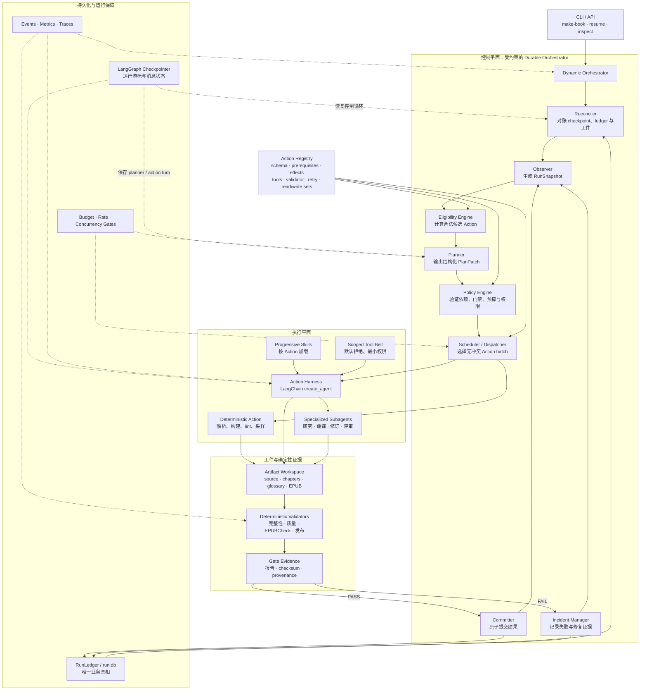
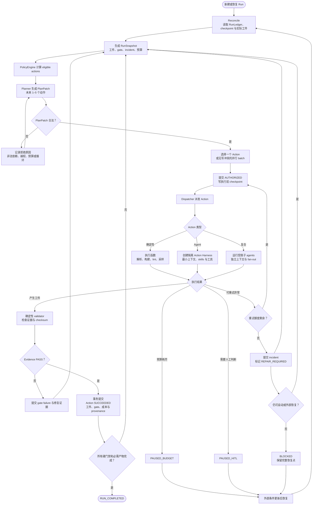
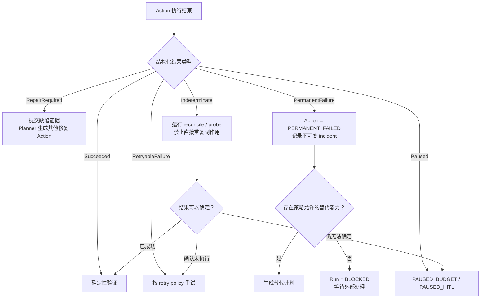

# 受约束的动态 Agent 编排

> **状态：已批准，待实现。** 2026-08-04；书面设计于 2026-08-04 经用户确认。
>
> 本文定义 ABI 下一代宏观控制平面：用 `Planner + PolicyEngine + durable action loop`
> 取代固定 `HAPPY_PATH`。实现完成前，当前行为仍以
> [`agentic-pipeline.md`](./agentic-pipeline.md) 和
> [`langgraph-and-state-machine.md`](./langgraph-and-state-machine.md) 为准。
>
> 前置阅读：[`core-beliefs.md`](./core-beliefs.md)、
> [`agentic-pipeline.md`](./agentic-pipeline.md)、
> [`langgraph-and-state-machine.md`](./langgraph-and-state-machine.md)、
> [`tech-stack.md`](./tech-stack.md)。

## 1. 决策摘要

ABI 将保留“LLM 负责开放式工作、确定性代码负责裁决”的原则，但把这条边界从阶段内部扩展到
整条流水线：

- 不再按 `HAPPY_PATH` 的固定索引选择下一阶段。
- Planner 根据当前工件、门禁证据、缺陷、资源和预算提出短期 `PlanPatch`。
- `PolicyEngine` 计算合法动作并批准或拒绝计划；Planner 没有状态写权限。
- `ActionRegistry` 取代 `STAGE_SEQUENCE`，声明每种能力的 schema、前置条件、效果、权限、
  validator、重试和并发规则。
- Dispatcher 每轮执行一个 Action，或一组读写集合互不冲突的 Action。
- Validator 只根据确定性证据裁决；Committer 在事务中提交业务事实。
- SQLite `RunLedger` 是唯一业务真相；LangGraph checkpointer 只保存运行时游标与 agent 上下文。
- 业务提交追求 exactly-once；Action 执行允许 at-least-once，但必须幂等或可对账。
- 不兼容旧 `pipeline_state.json`、旧 run 或旧状态枚举；不提供迁移器。

选型为**定制领域控制平面 + LangGraph durable runtime + LangChain v1 Action Harness**。
Deep Agents 的 context、skills、filesystem permission、subagent 等模式按需吸收，但不直接把
`write_todos` 当作 ABI 业务计划。第一版不引入 Temporal、DBOS 或 Restate 等外部 durable engine。

## 2. 为什么改变当前设计

当前系统已经有阶段内 ReAct loop，但宏观层仍是固定 workflow：

```text
pipeline_state.status
  → 在 HAPPY_PATH 中找下一个索引
  → 运行整个 StageSpec
  → validate(spec.produces)
  → advance
```

它的优点是可预测，但限制了自适应性和恢复粒度：

1. 不同书籍无论体裁、公式、插图和风险，都走近似相同的阶段链。
2. gate FAIL 后通常重跑大阶段，不能精准表达“只审计一个缺陷族并修订受影响章节”。
3. 宏观层无法显式并行无依赖工作。
4. `AgentRuntime.run()` 每次创建 `InMemorySaver`，阶段中断后丢失推理上下文。
5. 除预算外的运行时异常可能直接穿透 orchestrator，缺少统一恢复语义。
6. `FAILED` 被视为终态，当前 `resume` 无法从它继续。
7. agent 可调用 `set_state` 跳到任意 `Status`；这使确定性状态边界依赖 prompt 自律。
8. `validate()` 对未覆盖状态 fail-open，新增状态可能被错误视为 PASS。

新设计解决的是**宏观闭环控制**，不是取消所有依赖。诸如“先有完整译文才能评审”“所有发布硬门禁
通过后才能发布”仍由代码强制。

## 3. 目标与非目标

### 3.1 目标

- 根据书籍特征和实时质量证据动态选择、重排、重复或并行工作。
- 所有硬门禁、权限、预算和状态提交由确定性代码控制。
- 把恢复粒度降到 Action、agent turn 和 tool side effect。
- 区分可重试、需要其他动作修复、永久失败、结果不确定与主动暂停。
- 保留人类可审计的计划、证据、工件 provenance 和事件链。
- 让新增能力主要通过注册 Action 完成，而不是扩展全局状态枚举和固定阶段链。
- 保持翻译调用精简、reviewer 独立、所有 LLM 调用可观测等现有质量原则。

### 3.2 非目标

- 不让 Planner 自由创建任意工具、代码或子 agent。
- 不允许 agent 直接写业务状态、gate 或完成标志。
- 不迁移旧书籍工程、旧 `pipeline_state.json` 或进行中的任务。
- 第一版不支持分布式 worker、跨机器调度或外部 durable engine。
- 不把整本书内容、全部历史消息或所有 skills 长驻 Planner 上下文。
- 不以“更 agentic”为理由把可确定执行的解析、构建、lint、采样改成 LLM 任务。

## 4. 业界实现与取舍

调研结论不是选择一个包替换 ABI，而是吸收多个成熟实现已经收敛的边界：

| 实现 | 可借鉴能力 | ABI 的取舍 |
| --- | --- | --- |
| LangChain v1 `create_agent` | 标准 tool loop、structured output、middleware、动态模型和错误处理 | 用于每个 Action 的隔离 harness，替代已弃用的 `create_react_agent` |
| LangGraph | checkpoint、durable execution、interrupt、`Command`、retry 和图状态 | 承载宏观 control loop 与 Action harness 的恢复游标 |
| Deep Agents | 文件 backend、permissions、context offloading、skills、subagents、HITL | 吸收 harness 模式；`write_todos` 只是轻量任务表，不作为业务 Planner |
| OpenAI Agents SDK | LLM 编排与代码编排混合、agents-as-tools、guardrails、结构化结果 | 采用“LLM 提议、代码检查与执行”的混合模式，不绑定 OpenAI runner |
| Google ADK 2.0 | 动态代码控制流、子节点自动 checkpoint、恢复时跳过已完成节点 | 采用可重入 orchestrator + 已提交 Action 跳过语义 |
| Microsoft Agent Framework | Harness 与 type-safe workflow 分层、checkpoint 和 HITL | 保持 Action Harness 与领域控制平面分离 |
| Temporal / DBOS / Restate | 长任务、跨进程恢复、外部事件和可靠副作用 | 单机 CLI 第一版过重；保留未来替换 runtime 的边界 |

相关一手资料：

- [LangGraph persistence](https://docs.langchain.com/oss/python/langgraph/persistence)
- [LangGraph interrupts](https://docs.langchain.com/oss/python/langgraph/interrupts)
- [LangGraph fault tolerance](https://docs.langchain.com/oss/python/langgraph/fault-tolerance)
- [LangGraph v1 migration](https://docs.langchain.com/oss/python/migrate/langgraph-v1)
- [Deep Agents overview](https://docs.langchain.com/oss/python/deepagents/overview)
- [OpenAI Agents SDK orchestration](https://openai.github.io/openai-agents-python/multi_agent/)
- [OpenAI Agents SDK runner and durable integrations](https://openai.github.io/openai-agents-python/running_agents/)
- [Google ADK dynamic workflows](https://adk.dev/graphs/dynamic/)
- [Microsoft Agent Framework overview](https://learn.microsoft.com/en-us/agent-framework/overview/)

## 5. 总体架构



## 6. 动态控制循环



循环的唯一自由度是 Planner 提出“接下来做什么”。合法性、执行权限、证据裁决和业务提交都不由
Planner 控制。

## 7. 核心领域模型

所有外部边界使用 Pydantic frozen models。内部持久化也只接受已解析模型。

### 7.1 `ActionSpec`

```python
class ActionSpec(BaseModel):
    capability: str
    input_schema: str
    action_kind: Literal["deterministic", "agent", "composite"]
    prerequisites: tuple[PredicateSpec, ...]
    effects: tuple[EffectSpec, ...]
    expected_evidence: tuple[EvidenceSpec, ...]
    tool_allowlist: tuple[str, ...]
    skill_refs: tuple[str, ...]
    read_set: tuple[str, ...]
    write_set: tuple[str, ...]
    retry_policy: RetryPolicySpec
    validator: str
    resource_class: str
```

Registry 启动时校验 capability 唯一、schema 可序列化、validator 存在、工具与 skill 引用有效、
read/write 集合合法。Registry 校验失败时进程拒绝启动。

### 7.2 `PlanPatch`

```python
class PlanPatch(BaseModel):
    objective: str
    proposed_actions: tuple[ProposedAction, ...]
    superseded_action_ids: tuple[str, ...] = ()
    rationale: str

class ProposedAction(BaseModel):
    capability: str
    arguments: tuple[ActionArgument, ...]
    dependencies: tuple[str, ...]
    expected_evidence: tuple[str, ...]
    priority: int

class ActionArgument(BaseModel):
    name: str
    value_json: str
```

Planner 输出仅能引用本轮 `eligible_actions` 中的 capability。`PlanPatch` 采用短视窗策略，每次
包含 1–5 个未来动作；PolicyEngine 仍需重新验证模型输出，不能因为候选列表受限而信任它。

`ActionArgument` 是 Planner 边界的传输形状，不是业务输入。PolicyEngine 根据 `input_schema` 从
Registry 取得对应 `TypeAdapter`，将 `value_json` 解析成 capability 专属的 frozen Pydantic model，
再生成 `AuthorizedAction`。解析失败即拒绝计划；未解析的 JSON、`dict` 或 `Any` 不得进入 Dispatcher
或持久化为已授权参数。

### 7.3 `RunSnapshot`

Planner 看到的是压缩后的证据视图：

- 已提交 Action 与当前 plan version；
- gate evidence 摘要；
- artifact manifest、checksum 与统计，不含整本正文；
- 未解决 incident 及其错误分类；
- 剩余预算、并发资源与人工约束；
- 本轮合法 capability 及其简短说明。

如果需要阅读更多材料，Planner 必须提出注册的 `inspect_*` 或 `research_*` Action，而不是直接获得
业务工具。

### 7.4 `ActionOutcome`

```python
ActionOutcome = Annotated[
    Succeeded
    | RetryableFailure
    | RepairRequired
    | PermanentFailure
    | Indeterminate
    | Paused,
    Field(discriminator="kind"),
]
```

ActionRunner 必须返回该联合类型。未能解析为 `ActionOutcome` 本身是 `ModelBehaviorFailure`，按
ActionSpec 的模型错误策略处理，不能隐式视为成功。

## 8. Planner 与 PolicyEngine

### 8.1 Planner

Planner 是结构化模型调用，不是拥有业务工具的通用 agent。它：

- 只能输出 `PlanPatch`；
- 不写文件、ledger、gate 或完成状态；
- 不创建 registry 外 capability；
- 不选择具体 worker 实例；
- 不读取整本书或全部 agent 轨迹；
- 不能通过文本声称 PASS/DONE。

以下事件触发 replan：Action/batch 完成、gate FAIL、新缺陷、artifact drift、重试用尽、预算阈值、
人工恢复或约束改变。

### 8.2 PolicyEngine

PolicyEngine 是纯确定性模块，输入 `RunSnapshot + ActionRegistry + PlanPatch`，输出
`AuthorizationDecision`。它强制：

- capability 在 registry 且当前 eligible；
- 参数可解析；
- 依赖无环且已满足或在同一计划中可满足；
- 所有硬门禁不可跳过；
- 不得读取/写入越权路径；
- 并行 Action 的 write/write 和 read/write 集合无冲突；
- fan-out、成本、turn、时限和并发上限有效；
- 相同失败签名不得形成无界循环；
- release Action 只能在 terminal policy 的全部前置条件满足后授权。

拒绝决定与原因进入 ledger，作为下一次 Planner 输入和 L1 eval 数据。

## 9. Action Harness 与子 Agent

每个 agent Action 获得隔离的 `ActionEnvelope`：

```text
Action 参数
+ 最小相关工件
+ 5–8 条任务规则
+ 命中术语/证据
+ 专用工具 allowlist
+ Action 预算
+ 明确退出条件
```

Harness 使用 LangChain v1 `create_agent`，运行在 LangGraph 上，并配置：

- 持久 checkpointer；
- tool error middleware；
- 上下文摘要和大工具结果 offloading；
- token、turn、wall-clock 和费用上限；
- 动态模型选择与显式 fallback；
- 默认拒绝的文件权限；
- Langfuse、本地 events 与 BudgetGate；
- 结构化 `ActionOutcome`。

Skills 按 Action 渐进加载。翻译 Action 仍只得到原文、5–8 条文体规则和命中术语；QA、EPUB 和
release 规则不能混入翻译上下文。

子 agent 只能由注册的 composite Action 创建。Planner 选择能力，Dispatcher 决定实例和 fan-out。
reviewer 默认只读；独立 reviewer 不共享消息或结论；所有子 agent 调用复用同一预算与观测管道。

## 10. RunLedger：唯一业务真相

`state/run.db` 使用 SQLite WAL。最小逻辑表：

```text
runs
plan_versions
actions
action_attempts
artifacts
gate_evidence
incidents
interrupts
budget_entries
event_outbox
```

关键约束：

- Plan 不可原地修改；replan 创建新 version。
- Action 状态只能经仓储方法和合法 transition 更新。
- Gate 必须关联 evidence ID、validator version 和输入 artifact checksums。
- Artifact 记录路径、hash、producer action、attempt 和 committed_at。
- 业务 commit 与 outbox event 写入同一事务；事件发布后标记 delivered。
- `events.jsonl`、`metrics.json`、`state/status.json` 是可重建投影，不是真相源。

Run 状态只有：

```text
RUNNING
PAUSED_BUDGET
PAUSED_HITL
BLOCKED
COMPLETED
CANCELLED
```

不再有不可恢复的全局 `FAILED`。失败属于 Action attempt 或 incident；`BLOCKED` 在外部条件变化后
仍可恢复。

## 11. Checkpoint 与恢复

`state/graph-checkpoints.sqlite` 保存 LangGraph 运行游标、Planner/agent 消息、待恢复 Action 与
interrupt。它不是业务真相。

每次启动和恢复先运行 Reconciler：

```text
LangGraph checkpoint
+ RunLedger 已提交事实
+ 文件系统工件
→ 安全的下一步
```

恢复矩阵：

| 中断位置 | 恢复行为 |
| --- | --- |
| Action 执行前 | 重新派发 |
| 执行中且没有工件 | 按 retry policy 重试 |
| staging 已写但 promotion 仍为 `PENDING` | 按第 12 节的 create-only 协议验证并补完，或保留证据进入 `CONFLICT` |
| promotion 已 `COMMITTED` 但进程尚未完成文件系统后验 | Reconciler 重做 inode/checksum/目录链检查；drift 时补偿为 `CONFLICT` |
| ledger 已 commit 但 graph 未 checkpoint | Reconciler 发现已成功并跳过执行 |
| gate FAIL | 保留证据并 replan 修复动作 |
| 预算耗尽 | `PAUSED_BUDGET`；提高预算后恢复 |
| 需要人工判断 | `PAUSED_HITL`；以 interrupt/Command 恢复 |
| 外部条件缺失 | `BLOCKED`；条件修复后恢复 |

业务事实提供 exactly-once commit。执行是 at-least-once，因此所有 Action 必须有稳定
`action_id + plan_version + attempt + idempotency_key`，且副作用必须幂等或可对账。

## 12. 工件隔离与提交

Action 不直接覆盖 canonical artifacts。每次 attempt 的 staging 命名空间为：

```text
state/staging/{action_id}/{attempt}/...
```

`ArtifactStore` 生命周期内固定持有项目根目录 fd 及其 device/inode；staging 与 canonical 的所有
遍历均相对该 fd，使用 `O_DIRECTORY | O_NOFOLLOW`，并在关键边界重开 durable 路径确认根目录和
目录链仍绑定到原 inode。`staging_dir()` 只返回展示路径，不授予安全写能力。

staging 写入采用 create-only 协议：`write_staged_bytes()` 通过 no-follow dirfd 链创建父目录，以
`O_WRONLY | O_CREAT | O_EXCL | O_NOFOLLOW | O_NONBLOCK` 打开叶子，`fstat` 要求 regular file，写完
后 fsync 文件与父目录。已存在名称一律拒绝，不能截断现有 inode 或经 hardlink 修改别处内容。
公共 `sha256_file()` 同样以 `O_RDONLY | O_NOFOLLOW | O_NONBLOCK` 打开，`fstat` 后只接受 regular
file，并在所有成功/异常路径关闭 fd；symlink 被拒绝，FIFO 不得阻塞。

validator PASS 后按以下顺序提升：

1. 通过安全 staging fd 计算 checksum，规范化 staged/canonical 相对路径，并在 ledger 中唯一预留
   canonical 路径，写入 `PENDING` promotion intent；
2. 固定持有 canonical parent dirfd，复核项目根、目录链、staging checksum；
3. canonical 名称若已存在，只读验证 regular-file/inode/checksum；相同 checksum 是幂等候选，不同
   checksum 立即进入 `CONFLICT`；
4. canonical 名称若不存在，直接以
   `O_RDWR | O_CREAT | O_EXCL | O_NOFOLLOW | O_NONBLOCK` 打开**最终名称一次**，从已验证的 staged fd
   复制，fsync 并对 canonical fd 计算 checksum；
5. 证明 canonical 名称仍指向该 fd 的 inode，目录链仍绑定到 pinned root，然后在一个 SQLite 事务
   中提交 `PENDING → COMMITTED`；
6. ledger commit 返回后再次检查 canonical fd checksum、名称/inode 和目录链。任何失败都立即在
   SQLite 中原子补偿 `COMMITTED → CONFLICT` 并创建 subject-scoped incident。

第 5 步之前的最后一次文件系统检查与 SQLite 更新之间存在不可消除的窗口；本文**不宣称文件系统与
SQLite 原子**。若进程在 ledger commit 后、第 6 步之前崩溃，durable 状态暂为 `COMMITTED`；启动
Reconciler 必须重做后验，发现 identity/checksum/目录链 drift 时转为 `CONFLICT`，不能继续把该
intent 当成成功。

同一窗口也允许另一个连接把该 intent 补偿为 `CONFLICT`。由于协议不虚构文件系统与 SQLite 的
原子性，已经按先前 `PENDING` 快照进入 copy 的 worker 可能在获知补偿前创建或写入 canonical
候选；它在 ledger commit 处必须被拒绝，将该拒绝转换为可聚合的 artifact conflict，并保留候选
文件。任何**已经读取到** `CONFLICT` 的后续调用都不得再写入或删除。这里的终止语义不追溯撤销
另一个 worker 已经执行的系统调用。

协议不创建 promotion temporary name，不把 staging rename/replace/link 到 canonical，不覆盖现有
canonical，也不自动删除 staging、partial canonical 或其他候选 inode。canonical 创建后的 copy、
file fsync 或 parent-dir fsync 发生 partial write、`ENOSPC` 或其他 durability failure 时保留 partial
canonical 与 staged 证据，记录
`canonical_write_incomplete`，处置为检查存储并保留两者；不得误记为 `artifact_intent_invalid` 或
“repair ledger”。crash 后只知道 canonical checksum 不同时可记 `artifact_checksum_conflict`，仍须
保留所有文件供人工选择。

Promotion intent 的合法状态与恢复语义为：

| Durable 状态 | 文件系统证据 | Reconciler 行为 |
| --- | --- | --- |
| `PENDING` | staged 有效、canonical 不存在 | 执行 create-only copy 和受保护 commit |
| `PENDING` | canonical checksum 相同；staged 不存在或相同 | 完成受保护 commit，转 `COMMITTED` |
| `PENDING` | staged/canonical 都不存在 | 保持 `PENDING`，幂等记录 `artifact_promotion_missing` |
| `PENDING` | canonical 不同或 partial、staged checksum 不同、intent 路径不安全 | 原子转 `CONFLICT` 并记录对应 incident；不删文件 |
| `COMMITTED` | canonical 名称/inode/checksum/目录链一致；staged 不存在或相同 | 保持 `COMMITTED` |
| `COMMITTED` | canonical 缺失或 drift、staged 不同、identity/目录链复核失败 | 原子补偿为 `CONFLICT`；不得从 staging 重建 canonical |
| `CONFLICT` | 任意 | 观察到该状态的调用不再 commit、写入或删除；返回已有冲突，同时继续对账后续 intents；已在途的旧 `PENDING` worker 只能保留候选并在 commit 处失败 |

ledger 只允许验证后的 `PENDING → COMMITTED`、幂等 `COMMITTED → COMMITTED`，以及原子的
`PENDING/COMMITTED → CONFLICT + incident`。重复补偿保持 `CONFLICT` 且不重复 incident；
`CONFLICT → COMMITTED` 非法。`reconcile_all()` 处理全部 intents 后才汇总抛错，一个冲突不得阻断
后续可恢复 intent。自动清理只有在未来另行设计 durable ownership/unlink 协议后才可加入。

发布、上传等不可逆动作采用 `prepare → commit → reconcile` 协议并携带 idempotency key。

## 13. 异常分类与不可重试结果



分类规则：

| Outcome | 语义 | 例子 | 下一步 |
| --- | --- | --- | --- |
| `RetryableFailure` | 同一输入再次执行可能成功 | 429、5xx、临时网络/锁 | 指数退避、jitter、上限 |
| `RepairRequired` | 原动作不该重试，但其他工作可修复证据 | 术语冲突、章节质量 FAIL、EPUB lint FAIL | replan 修复 Action |
| `PermanentFailure` | 相同能力和输入不会成功 | 版权禁止、格式不支持、权限永久拒绝、invariant 冲突 | 替代能力或 `BLOCKED` |
| `Indeterminate` | 副作用可能已发生 | 发布超时、commit 后崩溃 | probe/reconcile，禁止盲重试 |
| `Paused` | 等待预算或人类 | 预算上限、敏感动作确认 | interrupt 后恢复 |

不根据异常类名字符串猜测语义。每个 ActionSpec 明确列出可重试错误和最大尝试；未分类异常默认
`PermanentFailure` 或 `Indeterminate`（如果可能产生外部副作用），采用 fail-closed。

## 14. 并发与调度

Scheduler 从已批准计划中选择可运行 Action。第一版并发只用于：

- 相互独立的研究任务；
- 不同章节的翻译/只读审查；
- 独立 reviewer；
- 确定性、无共享写入的检查。

并行前必须证明：依赖满足、write/write 无交集、read/write 无交集或读取的是 immutable snapshot、
预算与 provider semaphore 有容量。无法证明则串行。

同一章节的翻译与修订不能并行；glossary 写入使用单 writer；release、ledger commit 与 canonical
artifact promotion 串行。

## 15. 预算、权限与安全

- 预算在 Planner、Action、agent turn 和工具调用四层执行。
- Planner 看到剩余预算和 capability 估算，不得授权超预算计划。
- Action 工具默认不可见；只暴露 allowlist。
- 文件权限使用 registry 的 read/write 集合和工具运行时双重检查。
- reviewer 只读 canonical 译文，只能写自己的报告 staging 路径。
- 版权/私人自用政策是只读 hard policy，不进入可修改 skill memory。
- shell、网络、发布等敏感 capability 默认需要更严格 policy，必要时 HITL。
- 共享 memory 的任何 agent 写入都先变成 proposal，防止 prompt injection 持久化。

## 16. 可观测性

每次动态决策必须能解释。除现有 LLM/tool/cost 事件外，新增：

```text
plan.proposed
plan.rejected
plan.authorized
action.authorized
action.started
action.outcome
action.validated
action.committed
action.reconciled
incident.created
run.replanned
run.paused
run.resumed
run.completed
```

事件包含 `run_id`、`plan_version`、`action_id`、`attempt`、capability、输入/输出 artifact hashes、
validator version、错误分类、成本和 trace IDs。敏感正文是否进入 trace 继续受安全配置控制。

## 17. Eval 与测试策略

动态控制流新增一套 L0/L1 编排 eval：

### 17.1 确定性单元测试

- ActionRegistry 启动校验；
- eligibility predicates；
- plan schema 与拒绝规则；
- hard gate 不可跳过；
- dependency cycle；
- read/write 冲突；
- terminal policy；
- ActionOutcome 分类；
- ledger transition 和事务回滚；
- artifact promotion 与 checksum 冲突。

### 17.2 Planner eval

- 给定 snapshot 是否选择合法且最小的修复动作；
- 是否避免重复失败动作；
- 是否在预算下降时缩短计划；
- 是否针对公式、插图、体裁等特征选择需要的 capability；
- plan rejection 后是否能正确修正；
- 不同模型下授权率、无效动作率、平均 replan 次数和成本。

### 17.3 故障注入

在每个 checkpoint/commit 边界注入崩溃，验证：

- 已提交 Action 不重复；
- 未提交 staging 可验证并保留；本协议不自动清理 staging；
- ledger commit 后 graph crash 能跳过；
- `Indeterminate` 不会盲重试；
- budget/HITL/blocked 可恢复；
- outbox 不丢事件且不会重复投影业务事实。

### 17.4 端到端场景

- 普通小说 happy case；
- 技术书动态插入公式检查；
- 术语缺陷只修订受影响章节；
- 并行章节执行；
- 独立双评审；
- EPUB gate FAIL 后精准修复；
- permanent copyright failure；
- release 结果不确定后的 reconcile；
- Planner 连续产生非法 plan 时安全阻断。

最终仍运行现有 L2 译文和 L3 EPUB 质量 eval，确保宏观动态化没有牺牲成品质量。

## 18. 代码边界

建议的新模块边界：

```text
src/abi/
├── types/orchestration.py          # frozen 领域模型
├── project/run_ledger.py           # SQLite 业务真相
├── actions/
│   ├── registry.py                 # ActionSpec 注册与启动校验
│   ├── predicates.py               # eligibility / terminal policy
│   ├── outcomes.py                 # ActionOutcome
│   └── builtins/                    # 领域 Action 定义
├── planning/
│   ├── context.py                  # RunSnapshot
│   ├── planner.py                  # LLMRouter structured PlanPatch
│   └── policy.py                   # 确定性授权
├── orchestrator/
│   ├── controller.py               # 业务 control loop callbacks
│   ├── dispatcher.py
│   ├── committer.py
│   └── reconcile.py
├── providers/
│   ├── orchestration_runtime/       # LangGraph generic durable loop
│   └── agent_runtime/               # LangChain v1 Action Harness
└── cli/                             # run/resume/inspect/unblock/cancel
```

继续保持业务层不直接 import LangGraph/LangChain。`providers.orchestration_runtime` 暴露泛型的
durable loop 接口并接收业务 callbacks，自身不依赖 ABI 业务模块。公共边界返回强类型模型，不透传
dict/Any。

## 19. 依赖与文档变化

- 升级到 LangChain/LangGraph v1 兼容版本。
- `create_react_agent` 迁移为 `langchain.agents.create_agent`。
- 引入 LangGraph SQLite checkpointer 对应包。
- SQLite 访问使用一个明确的 async repository 方案，禁止在 event loop 内同步阻塞。
- `ARCHITECTURE.md`、`docs/DESIGN.md`、`docs/RELIABILITY.md`、产品规格、CLI 帮助与 generated docs
  在实现阶段同步更新。
- 旧 `project/state.py`、`prompts/stages.py`、`stages/runner.py` 和固定 orchestrator 在替代实现通过
  端到端测试后删除，不保留双运行模式。

## 20. 实现完成判据

1. 源码中不存在宏观 `HAPPY_PATH` 选择逻辑和 agent 可见的 `set_state`/`record_gate`。
2. Planner 只能产出强类型 `PlanPatch`；非法计划被 PolicyEngine fail-closed 拒绝。
3. 所有 Action 通过 Registry 声明前置条件、证据、工具、retry 和 read/write 集合。
4. RunLedger 是唯一业务真相，投影可从它重建。
5. Action staging、validator、promotion、ledger commit 和 reconcile 通过故障注入测试。
6. `PermanentFailure`、`RepairRequired`、`Indeterminate`、预算暂停和 HITL 都有端到端测试。
7. 恢复不会重复已提交业务事实；不确定副作用不会盲重试。
8. 动态并行不会产生未声明的写冲突。
9. 所有 LLM 与子 agent 调用仍受预算、Langfuse 和本地事件管道覆盖。
10. 现有 L2/L3 质量门禁和全量自动化测试通过。

## 21. 明确放弃的替代方案

### 21.1 仅让现有 Orchestrator 由 LLM 选择下一个 StageSpec

改动小，但无法解决状态提交、恢复粒度、错误分类和并发；最危险的是给模型实际跳转权限。拒绝。

### 21.2 Deep Agents 直接作为业务 orchestrator

能快速得到强 harness，但 TodoList 不表达 ABI 的 evidence、gate、read/write set 和事务提交；需要大量
自定义 middleware 后仍难证明边界。Deep Agents 模式可复用，但不作为业务真相和调度核心。

### 21.3 外部 durable engine

Temporal/DBOS/Restate 的跨进程可靠性更强，但 ABI 当前是本地、单机、文件密集型 CLI。第一版引入
额外服务或 runtime 会显著扩大运维面。通过 `orchestration_runtime` provider 抽象保留未来替换空间。
