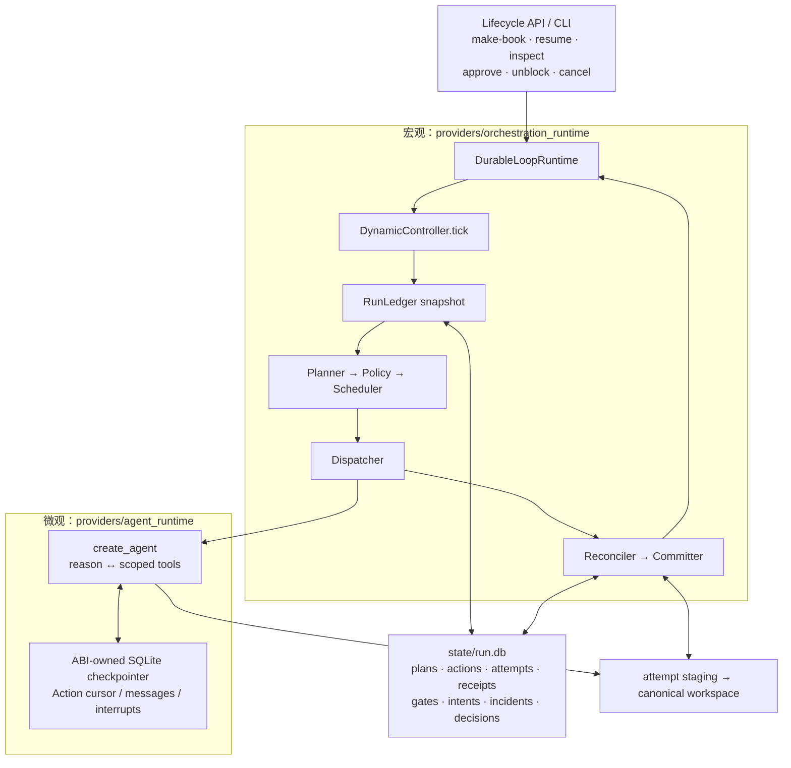
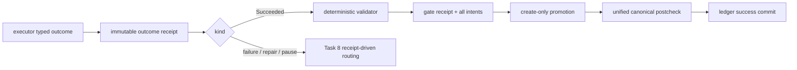
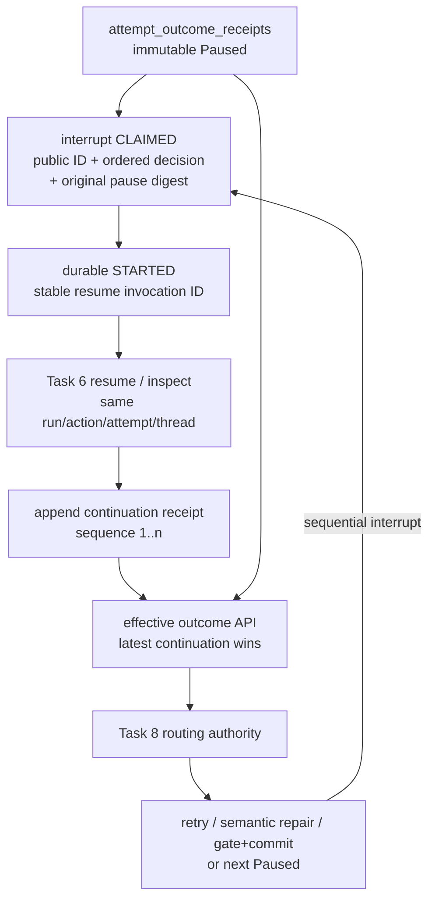
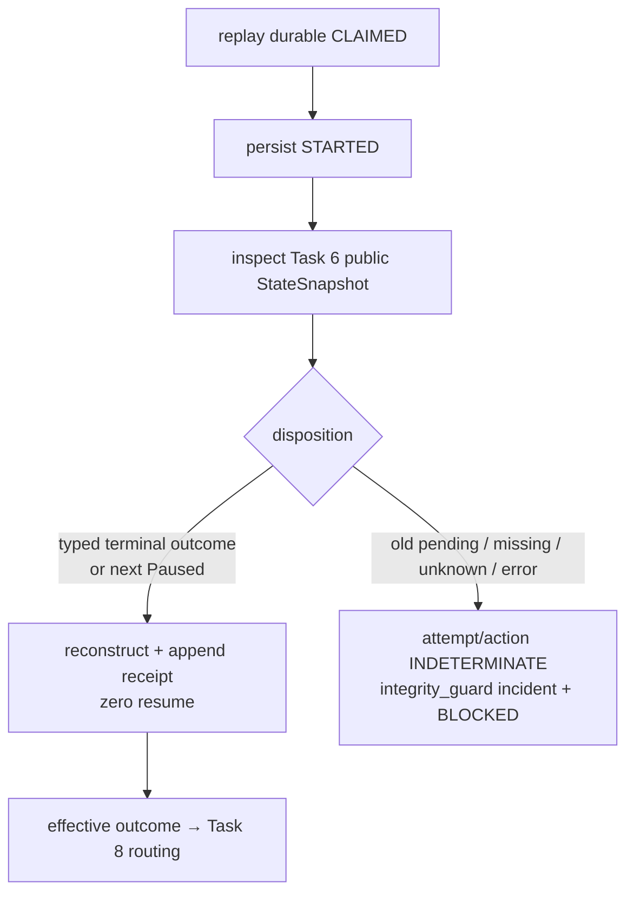

# LangGraph 与 ABI 动态状态机

> ABI 使用两层 LangGraph：宏观层是 provider-generic durable loop，微观层是 Action 内的
> LangChain `create_agent` harness。两层都只保存执行游标；`state/run.db` 的 RunLedger 才是业务真相。
>
> 前置阅读：[`dynamic-agent-orchestration.md`](./dynamic-agent-orchestration.md)（权威业务协议）、
> [`RELIABILITY.md`](../RELIABILITY.md)（重试与恢复约束）。

## 1. 两层运行时，一套业务真相



宏观 runtime 不 import ABI 业务类型，只接收 controller callback。微观 runtime 是业务代码唯一允许
接触 LangChain/LangGraph agent/checkpointer API 的位置。Planner 和 agent 都不能直接写 run、Action、
gate 或完成状态；所有状态变化由 RunLedger、Reconciler 和 Committer 的确定性事务完成。

## 2. 生命周期与默认组装

`make_book()` scaffold 新目录合约，创建 `state/run.db`、`state/staging/` 与 checkpoint 父目录，随后只
创建一个 business run。`resume()` 必须从 ledger 解析恰好一个既有 run，并复用相同 run ID；多 run、
零 run 或 runtime 返回不同 ID 都 fail closed。events/metrics 和 checkpoint thread identity 也复用该 ID。

未注入测试 factory 时，生命周期默认组装真实的：

```text
RunServices + ActionRegistry + ArtifactStore
→ Planner + PolicyEngine + SnapshotBuilder + Scheduler
→ Dispatcher + Reconciler + Committer + OutboxProjector
→ DynamicController + DurableLoopRuntime
```

CLI 服务与业务权限边界如下：

| 命令 | 权威行为 |
| --- | --- |
| `make-book` | scaffold、放置输入、创建唯一 run、驱动到 terminal/safe stop |
| `resume` | 复用唯一 durable run，不能隐式创建第二个 run |
| `inspect` | 只读 run/plan/action/receipt/gate/intent/incident/budget，暴露当前 effective pause 的 public ID、sequence、claim 状态与可复制的精确 `approve` 命令 |
| `approve` | 由 public interrupt ID 解析当前 effective pause，记录 ordered decision 后恢复 Task 6 checkpoint |
| `unblock` | budget pause 可直接恢复；integrity conflict 必须有显式 reason/evidence/canonical disposition；HITL indeterminate 必须有副作用证据；两者都创建 new plan/action/staging |
| `cancel` | 非 completed run 幂等取消；completed 不能被重新打开 |

`inspect`、`cancel`、`unblock` 和 `approve` 不把 projection 当真相，也不直接翻转业务状态。它们调用
ledger-owned transaction 或 continuation/reconciliation authority。

## 3. Action 执行与 Task 8 提交链

每个授权 Action 在 executor 启动前冻结 parameters、expected manifest、retry policy/fingerprint 与
attempt-scoped staging namespace。executor 只返回 typed `ActionOutcomeEnvelope`；返回后先写 immutable
outcome receipt，再允许 controller hook 或业务路由。

`Succeeded` 不能直接让 Action success：validator 只读 staging-aware view；PASS gate receipt 与完整
promotion-intent 集同事务持久化；promotion 逐项 create-only；所有 intents `COMMITTED` 后统一校验
canonical bundle，最后才由 Committer 在一个 SQLite 事务中提交 artifacts/evidence/action success。
文件系统与 SQLite 之间不宣称跨介质原子性，恢复靠 receipts、intents、checksums 和 Reconciler 对账。



## 4. 持久化分层

| 层 | 位置 | 保存内容 | 权威性 |
| --- | --- | --- | --- |
| 业务控制平面 | `state/run.db` | run、plan、Action、attempt、receipts、gates、intents、incidents、human decisions | 唯一业务真相 |
| 微观 Action 恢复 | `state/graph-checkpoints.sqlite` | messages、tool cursor、current tasks、interrupts、structured response | 只用于 Task 6 恢复 |
| 工件 | attempt staging + canonical workspace | 输入、译文、QA、EPUB、release evidence | 由 ledger receipt/checksum 绑定 |
| 投影 | `events.jsonl`、`metrics.json`、`state/status_projection.json` | 可观测事件与人类视图 | 可从真相重建 |

checkpoint path 是 ABI 管理的本地单进程资源。fresh 初始化先以 no-follow/no-overwrite 协议原子发布
versioned ownership sidecar，再初始化 LangGraph schema 和 ABI marker；进程内所有 runtime、线程与 event
loop 通过绝对路径共享 coordinator。symlink、foreign DB、marker 不匹配、corrupt/permission 错误全部
fail closed。该协议不宣称 multiprocess/distributed locking，也不允许业务层读取 saver 私有表。

## 5. Public HITL 与不可变 continuation 链

Task 6 把 provider interrupt 立即转换为 ABI-owned `PendingHitlInterrupt`：稳定 public ID、按原顺序排列的
tool reviews/arguments/description/allowed decisions。第一版只允许小写 `approve` / `reject`；unsupported
decision 在模型或工具启动前被拒绝。

需要审批的工具不是由 harness 推断，也不是“所有工具默认审批”。`ActionRegistry` 为每个能力显式声明
`approval_tools`，且启动时验证它是 `tool_allowlist` 的子集；fresh invocation 与 resume 使用同一份冻结策略。
当前默认目录只有 `output.finalize` 的 `write_file` 进入 HITL，其余注册工具按各自最小权限自主执行。

初始 `Paused` attempt outcome receipt 永远不改写。`approve` 必须先在一个 ledger 事务中验证：

- run 正处于 `PAUSED_HITL`；
- action/attempt/thread 与当前 effective `Paused` 完全一致；
- public interrupt ID 正是当前 pending ID；
- ordered decisions/feedback 数量及允许集合有效；
- claim 同时绑定原始 pause digest。

事务先产生 `interrupts.status=CLAIMED`。紧接着，RunLedger 在调用 provider 前持久化
`STARTED(resume_invocation_id, resume_started_at)`；invocation ID 由 thread、interrupt 与 decision digest
确定性派生。Task 6 再用稳定 `thread_id={run_id}/{action_id}/{attempt}` 和 public `HitlResume` 恢复。
返回后 RunLedger 追加独立的 `hitl_continuation_receipts`，按同 attempt 的 sequence 排序，再把 claim 置为
`RESOLVED`。相同已解决 decision 重放返回缓存 receipt，但仍幂等重跑 Task 8 reconciliation；它不再次
调用 checkpoint。不同 decision 与 stale/wrong identity 都 fail closed。



effective outcome 是 RunLedger 的确定性读取规则，不是覆盖初始 receipt 的可写缓存。Controller、
Reconciler、Committer、retry successor 与 semantic repair 都必须使用它；这样 continuation 的
`Succeeded` 仍完整经过 Task 8 gate/intent/promotion/postcheck/commit，不能由 CLI 或 lifecycle 直接宣布
成功。

## 6. `CLAIMED / STARTED` 崩溃恢复：先标记，再裁决

SQLite marker 与 LangGraph checkpoint 不存在跨介质原子事务。若进程在 `STARTED` 后、continuation
receipt 追加前崩溃，重放不能盲目 `resume`。Task 6 inspector 只调用公共 `agent.aget_state(config)`，解析
typed `StateSnapshot.tasks` / `structured_response`；它不调用 `ainvoke`、模型、工具，也不读取 saver blob。



`CLAIMED` 只表示决定已被 ledger 接受；只有同一进程把它原子推进为 `STARTED` 后才允许第一次 provider
调用。`STARTED` 后即使 inspector 报告旧 interrupt 仍 pending，也不能证明工具尚未产生副作用，因此必须
保守阻断。人工 `unblock` 不复活旧 attempt：无 canonical conflict 时提交 typed side-effect evidence 与
reason 即可；存在 promotion conflict 时仍必须精确覆盖全部 canonical dispositions。两条路径都创建新的
plan version、Action ID 与 staging namespace，并保留旧 pause、claim、attempt 和 receipt。

terminal、next pause 与不确定阻断三类裁决支持同一 attempt/thread 的连续 interrupts：上一 continuation 可以是携带第二个 public ID 的新
`Paused`；新的 ordered decision 产生下一个 sequence，而历史 pause 与 continuation 都保留。

## 7. 宏观恢复矩阵

| Durable facts | 安全恢复 |
| --- | --- |
| Action `AUTHORIZED`、attempt 未启动 | 首次 claim/dispatch |
| attempt `RUNNING`、receipt 缺失 | 不重跑同 attempt；按 frozen manifest 重建或 integrity block |
| outcome receipt durable、未路由 | 按 effective outcome discriminant 幂等路由 |
| retry 被 frozen policy 允许 | 旧 attempt/action → `RETRY_WAIT`，显式创建 attempt+1 + new staging |
| semantic repair 已映射 | 保留旧事实，run 保持 `RUNNING`，new plan/action/staging |
| integrity conflict / unknown side effect / HITL STARTED indeterminate | 原 action/attempt `INDETERMINATE`，保留证据，run `BLOCKED`；人工 resolve/unblock 后 new identity |
| gate + intents durable、promotion 部分完成 | 逐项对账补完；不重跑 executor |
| run `PAUSED_BUDGET` | 提高预算并记录 evidence 后恢复 |
| run `PAUSED_HITL` | 走 §5 append-only continuation 协议 |
| HITL `CLAIMED` 崩溃 | 先持久化 `STARTED`，然后执行第一次 provider 调用 |
| HITL `STARTED` 崩溃 | 只走 §6 inspector；除可重建 terminal/next pause 外全部 integrity block |
| run `COMPLETED` | terminal success；cancel/unblock/resume 不得重开 |

## 8. 相关源码入口

| 关注点 | 文件 |
| --- | --- |
| durable business loop | `src/abi/providers/orchestration_runtime/` |
| controller callbacks | `src/abi/orchestrator/controller.py` |
| Planner / policy / scheduler | `src/abi/planning/` |
| receipt routing与对账 | `src/abi/orchestrator/reconcile.py` |
| gate/promotion/success authority | `src/abi/orchestrator/committer.py` |
| Task 6 Action harness + inspector | `src/abi/providers/agent_runtime/runner.py` |
| Action request reconstruction | `src/abi/actions/builtins/catalog.py` |
| RunLedger + HITL continuation protocol | `src/abi/project/run_ledger.py`、`ledger_schema.py` |
| lifecycle/default assembly | `src/abi/orchestrator/run.py` |
| six-command CLI | `src/abi/cli/main.py` |

业务层继续不得 import `langchain*` / `langgraph*` / `langfuse*`。公共边界只传 frozen typed model；
checkpoint 永远不能替代 RunLedger，也不能被 lifecycle 当作可查询业务数据库。

L1 eval 同样只通过 RunLedger typed public reads 取得 plan、attempt、outcome/effective outcome、gate、
intent、repair、probe、HITL、unblock 与 outbox facts；不得读取 checkpointer 私有表或绕过 repository
查询 SQLite。它重放 policy conformance，而不是固定路径的状态子序列。
