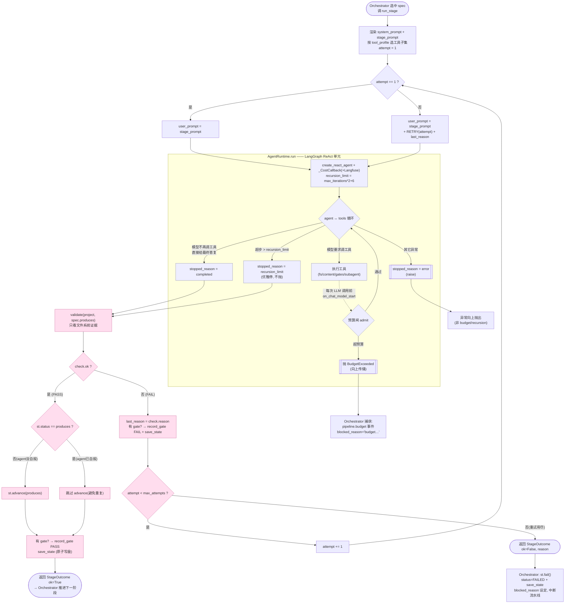
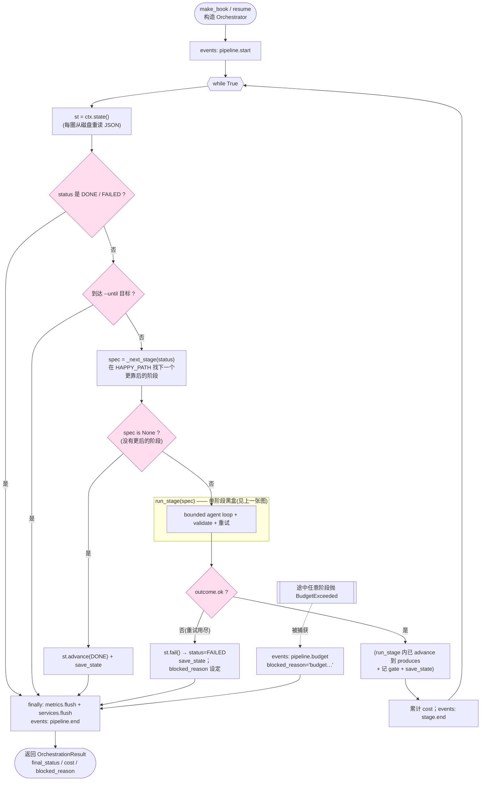

# LangGraph 与 ABI 状态机：原理与实现

> 一句话定位：ABI 把"一本书的翻译流水线"拆成两个正交的东西——**一个与业务无关、会自循环干活的
> LangGraph ReAct 单元**（`AgentRuntime.run`），和**一张声明式阶段配置表 + 一个走 28 态状态机的
> 确定性 while 循环**（`STAGE_SEQUENCE` + `Orchestrator`）。前者提供"智能"，后者提供"可信赖的
> 工序编排"。20 多个阶段不是 20 多张图，而是**同一个单元被确定性循环按配置驱动了 17 次**。
>
> 前置阅读：[`agentic-pipeline.md`](./agentic-pipeline.md)（权威总览）、[`tech-stack.md`](./tech-stack.md)
> （LangChain/LangGraph 选型与 lint 不变量）。本文是对 agentic-pipeline §1 运行时那一格的深入展开。

---

## 0. 为什么单独成文

`agentic-pipeline.md` 讲了"有哪些阶段、走什么 happy path"。本文回答三个更底层的问题：

1. **LangGraph 到底在 ABI 里扮演什么角色**（以及刻意**不**扮演什么角色）；
2. **一个 `create_react_agent` ReAct 单元，怎么组建出整条 17 阶段流水线**；
3. **持久化分几层**，以及 LangGraph 原生的 checkpointer / store 能不能、该不该替代它们。

核心认知一句话：**LangGraph 只负责"一个阶段内部"的 reason↔tool 微观循环；阶段之间的宏观编排
完全由确定性代码 + JSON 状态机掌控。** 理解这条分界线，就理解了 ABI 的整个控制平面。

---

## 1. 双层架构：图在内，状态机在外

很容易误以为：17 个阶段 = 一张 17 节点的大 LangGraph 图。**ABI 刻意不这么做。**

| 你可能以为的做法 | ABI 实际的做法 |
| --- | --- |
| 把 17 个阶段做成一张 17 节点的图，用边连起来 | 只有**一个** ReAct 单元（2 节点小图），用不同参数**调用 17 次** |
| 阶段间数据靠图的 State 传递 | 阶段间数据靠**文件系统 + `pipeline_state.json`** 传递 |
| 控制流（顺序、分支、重试）写在图的边上 | 控制流是一个**普通 Python while 循环**走状态机 |

```
宏观（确定性，非图）   Orchestrator while 循环  ──走 HAPPY_PATH(28态)──┐
                          │ 每圈取 STAGE_SEQUENCE[N]                │
                          ▼                                        │
                       run_stage = agent + validator + 重试         │
                          │ 按 StageSpec 配置                       │
                          ▼                                        │
微观（LangGraph）      AgentRuntime.run = create_react_agent        │
                          │ agent ↔ tools ReAct 循环                │
                          └────────────────────────────────────────┘
```

这条边界由架构不变量 4 用 lint 强制：**只有 `providers/agent_runtime` 和 `providers/llm`
能 import `langgraph*` / `langchain*`**，业务层（`stages` / `tools` / `orchestrator`）只看
`AgentRuntime.run(...)` 的接口。换框架时业务层一行都不用改。

---

## 2. LangGraph 概念在 ABI 的落点

全部 LangGraph 用法集中在 `src/abi/providers/agent_runtime/runner.py` 一个文件。

### 2.1 Graph：带环的图，不是链

ABI 不手写节点和边，用预构建的 ReAct 图：

```207:213:src/abi/providers/agent_runtime/runner.py
        checkpointer = InMemorySaver()
        agent = create_react_agent(
            model,
            tools,
            prompt=system_prompt,
            checkpointer=checkpointer,
        )
```

`create_react_agent` 一行生成一张标准 ReAct 图，内部是两个节点 + 一条条件边：

```
        ┌─────────┐
入口 → │  agent  │  ← LLM 推理，决定"调工具"还是"结束"
        └────┬────┘
             │ 条件边
       ┌─────┴─────┐
       ▼           ▼
  ┌─────────┐    [END]
  │  tools  │  ← 执行 LLM 要求的工具调用，结果追加回 State
  └────┬────┘
       └──→ 回到 agent 节点
```

这个 `agent ↔ tools` 的**环**就是 agentic loop 能自循环、自修复的根本。ABI 的"门禁 FAIL →
agent 自己修因重跑"正建立在这个环上。LangGraph 的价值是它是**带环的图**，不是一条直线的 chain。

### 2.2 State：在图里流动的消息列表

`create_react_agent` 用内置 `MessagesState`，核心字段 `messages` 带 `add_messages` reducer
（节点返回的消息是**追加**而非覆盖）。

输入——往 State 塞一条 `HumanMessage`：

```230:232:src/abi/providers/agent_runtime/runner.py
                result = await agent.ainvoke(
                    {"messages": [HumanMessage(content=user_prompt)]}, config=cfg
                )
```

输出——取出完整 `messages`（人类消息 + AI 推理 + tool call + tool 结果的完整轨迹），ABI 自己
遍历它统计工具调用次数、抽出最终文本：

```272:280:src/abi/providers/agent_runtime/runner.py
        for m in messages:
            if isinstance(m, AIMessage):
                tc = getattr(m, "tool_calls", None) or []
                tool_calls += len(tc)
                for call in tc:
                    tool_log.append({"name": call.get("name"), "args": call.get("args")})
                if isinstance(m.content, str) and m.content.strip():
                    final_text = m.content
```

要点：图里流动的不是字符串 prompt，而是**结构化消息列表**。`AIMessage.tool_calls` 是模型想调
什么工具、传什么参数；这条 history 就是 agent 的短期"记忆"。

### 2.3 Tools：节点能调用的能力

工具用 `StructuredTool.from_function` 把普通 Python 函数变成 `BaseTool`——它从函数签名 +
docstring **自动生成 JSON schema**，docstring 就是给模型看的工具说明：

```95:103:src/abi/tools/fs.py
    return [
        StructuredTool.from_function(read_file),
        StructuredTool.from_function(write_file),
        StructuredTool.from_function(append_file),
        StructuredTool.from_function(edit_file),
        StructuredTool.from_function(list_dir),
        StructuredTool.from_function(glob),
        StructuredTool.from_function(grep),
    ]
```

两个工程模式：

- **闭包注入依赖 + 沙箱**：工具定义在 `make_fs_tools(ctx)` 内部，闭包捕获 `ctx`，所有路径走
  `ctx.resolve(path)` 沙箱化在项目根内——模型无法读写项目目录之外。
- **按档位分组**：`ToolBelt` 把工具分成 authoring / production / review 子集，不同阶段给不同
  子集，缩小模型可调的工具面（见 `src/abi/tools/belt.py`）。
- **异步工具**：`async def` 工具用 `StructuredTool.from_function(coroutine=...)` 注册。

### 2.4 recursion_limit：给环加终止闸

因为图里有环，必须有终止保护。LangGraph 用 `recursion_limit` 限制 super-step（约每个
reason↔tool 循环消耗 2 个超步）。ABI 把业务语义的"最大迭代数"换算成它，并把
`GraphRecursionError` **翻译成可控的业务信号**而非崩溃：

```214:215:src/abi/providers/agent_runtime/runner.py
        # recursion_limit counts graph super-steps; ~2 per reason/tool cycle.
        recursion_limit = max_iterations * 2 + 6
```

```234:246:src/abi/providers/agent_runtime/runner.py
        except Exception as exc:
            name = type(exc).__name__
            if "GraphRecursionError" in name or "recursion" in str(exc).lower():
                stopped = "recursion_limit"
                self._events.event("agent.run.capped", agent=agent_name, detail=str(exc)[:200])
            elif name == "BudgetExceeded":
                self._events.event("agent.run.budget", agent=agent_name, detail=str(exc)[:200])
                raise
            else:
                stopped = "error"
                self._events.event("agent.run.error", agent=agent_name, error=name,
                                   detail=str(exc)[:300])
                raise
```

`stopped_reason="recursion_limit"` 回传给 stage runner，由确定性门禁决定是否重试——agent
转太久不算失败，门禁说了算。

### 2.5 Config + Callbacks：横切注入预算与观测

`agent.ainvoke(input, config=cfg)` 的 `config` 贯穿整张图。ABI 往里塞三类东西：

```216:223:src/abi/providers/agent_runtime/runner.py
        cfg: dict[str, Any] = {
            "callbacks": callbacks,
            "recursion_limit": recursion_limit,
            "configurable": {"thread_id": thread_id or agent_name},
            "metadata": {"agent": agent_name},
            "tags": [agent_name],
            "run_name": agent_name,
        }
```

其中 `callbacks` 是满足"LLM 可观测 + 预算门禁"不变量的关键。`_CostCallback` 继承
`BaseCallbackHandler`，挂在图执行的生命周期钩子上：每次模型调用**前** `on_chat_model_start`
估算成本过预算闸（超了抛 `BudgetExceeded` 终止整张图），**后** `on_llm_end` 记录真实
token/成本到 `metrics.json` 与 `events.jsonl`。

```70:83:src/abi/providers/agent_runtime/runner.py
    def on_chat_model_start(
        self, serialized: Any, messages: list[list[BaseMessage]], **kwargs: Any
    ) -> None:
        joined = ""
        for batch in messages:
            for m in batch:
                content = m.content if isinstance(m.content, str) else str(m.content)
                joined += content + "\n"
        est_in = _estimate_text_tokens(joined)
        est_cost = estimate_cost_usd(
            self._model, tokens_in=est_in, tokens_out=self._max_out
        )
        # Raises BudgetExceeded -> propagates out of the graph (graceful stop).
        self._budget.admit(est_cost)
```

这是 callback 机制的典型用法：**不改图结构，就给图里每一次 LLM 调用注入横切逻辑**（计费、限流、
日志、tracing）。Langfuse handler 也以同样方式追加进 `callbacks`。

### 2.6 Subgraph / 多 agent：图里再起一张隔离的图

一个工具体内可以再跑一张完整的图。ABI 的"独立评审子 agent"就是这样——它是一个**工具**，但内部
又调 `AgentRuntime.run`，用**独立 thread_id + 全新 InMemorySaver**，所以两个评审 agent
（agent_a / agent_b）互相看不到对方的消息历史和推理，保证独立评审的客观性（见
`src/abi/tools/subagent.py`）。

---

## 3. 一个单元如何组建整条流水线（四层组合）

复杂度被搬进**声明式配置**，而不是图代码。"做出 17 个不同 agent" = "写 17 行配置 + 17 个
prompt 模板"。

### 第 1 层：原子 —— 可复用的 ReAct 单元

`AgentRuntime.run()` 每次被调用都全新构建一张 ReAct 图、跑完即弃。入参全是可变钩子
（`system_prompt` / `user_prompt` / `tools` / `agent_name` / `max_iterations`）。同一段代码，
喂不同 prompt + 不同工具子集，就变成"不同的 agent"。它**完全不知道"翻译流水线"的存在**。

### 第 2 层：StageSpec —— 把单元特化成 17 种阶段的配置

```26:34:src/abi/prompts/stages.py
@dataclass(frozen=True)
class StageSpec:
    stage_id: str           # e.g. "07_translate_chapters"
    title: str
    template: str           # template filename under stages/
    produces: Status        # status set on successful completion
    tool_profile: ToolProfile = "authoring"
    gate: str | None = None  # gate name recorded in state.gates
    max_iterations: int = 40
```

"逐章翻译"和"独立评审"用的是**同一个** `AgentRuntime.run`，差异全是数据：

- `template` → 换 prompt（本阶段任务 + 退出条件 + 调哪个门禁工具）。Jinja2 用
  `{source_lang}-{target_lang}` 渲染，一套链服务任意语言方向。
- `tool_profile` → 换工具子集（authoring / production / review）。
- `produces` + `gate` + `max_iterations` → 换"成功的定义"和"循环上限"。

整张表是 `STAGE_SEQUENCE`（见 `src/abi/prompts/stages.py`），orchestrator 走它。

### 第 3 层：run_stage —— 给原子套上"确定性门禁 + 重试"的细胞

agent **不能自己宣布成功**（不变量 3）。`run_stage` 把单元包装成自愈细胞：跑 agent → 文件
系统级确定性校验 → 失败把原因拼回 prompt 重跑：

```72:96:src/abi/stages/runner.py
        result = await ctx.services.agent.run(
            system_prompt=system_prompt,
            user_prompt=user_prompt,
            tools=tools,
            agent_name=spec.stage_id,
            max_iterations=spec.max_iterations,
            thread_id=f"{spec.stage_id}#{attempt}",
        )
        total_cost += result.cost_usd

        check = validate(ctx.project, spec.produces)
        if check.ok:
            st = ctx.state()
            if st.status != spec.produces:
                st.advance(spec.produces, step=spec.stage_id, note=f"gate ok ({attempt} attempt)")
            if spec.gate:
                st.record_gate(spec.gate, "PASS")
            ctx.save_state(st)
            return StageOutcome(spec.stage_id, True, "ok", attempt, total_cost)

        last_reason = check.reason
```

裁决权在 `validate()` 手里，它**只看文件系统证据**，按 `produces` 分发检查。例如"翻译完成"
必须每个源章都有对应译文（见 `src/abi/stages/validators.py`）。

#### 单阶段运行流程图（从进入到结束 + 边界条件）

下图是一个阶段从被 `Orchestrator` 选中到结束的完整生命周期，覆盖 ReAct 循环、预算/递归/异常等
边界条件、门禁裁决与重试、以及失败上报。粉色为 LangGraph 微观循环，黄色为确定性门禁与对账。



边界条件速查：

| 边界 | 触发 | 结果 |
| --- | --- | --- |
| **首次 vs 重试** | `attempt > 1` | user_prompt 追加 `RETRY` + 上次 `last_reason`，让 agent 修因 |
| **正常收敛** | 模型不再调工具 | `stopped_reason=completed` → 进入 `validate()` |
| **递归封顶** | 超步 > `recursion_limit` | `stopped_reason=recursion_limit`，**优雅停**（不抛），仍进 `validate()` 让门禁裁决 |
| **预算超限** | `BudgetGate.admit` 拒绝 | 抛 `BudgetExceeded`，穿出图被 `Orchestrator` 捕获，整条流水线优雅中断 |
| **其它异常** | 网络/SDK 等 | `stopped_reason=error` 并 `raise`，向上抛出 |
| **门禁 PASS** | `validate().ok` | 推进 status（若 agent 未自报）+ 记 gate PASS + 原子存盘 → 成功返回 |
| **门禁 FAIL + 可重试** | `attempt < max_attempts` | 记 gate FAIL，带 reason 回到下一次 attempt |
| **门禁 FAIL + 重试用尽** | `attempt == max_attempts` | 返回 `ok=False`，`Orchestrator` 置 `FAILED` 并中断（可 `resume` 续跑） |
| **status 对账** | agent 已用 `set_state`/content 工具自报到 `produces` | `run_stage` 跳过重复 advance，仅补记 gate 并存盘 |

> 注意 `recursion_limit` 与门禁 FAIL 的区别：前者是"agent 转太久没收敛"，后者是"收敛了但产物不
> 达标"。两者都不直接判定阶段失败——都交给 `validate()` 看文件证据后，再决定重试或成功。

### 第 4 层：Orchestrator —— while 循环走状态机 = 整条流水线

最外层不是图，是普通 while 循环。每轮读当前状态、算"下一个该跑的阶段"、调 `run_stage`、推进。
17 阶段就是这个循环转 17 圈：

```58:90:src/abi/orchestrator/driver.py
            while True:
                st = ctx.state()
                if st.status in (Status.DONE, Status.FAILED):
                    break
                if until is not None and happy_index(st.status) >= happy_index(until) >= 0:
                    break
                spec = _next_stage(st.status)
                if spec is None:
                    if st.status != Status.DONE:
                        st.advance(Status.DONE, step="done", note="all stages complete")
                        ctx.save_state(st)
                    break
                ...
                outcome = await run_stage(
                    spec=spec, ctx=ctx, belt=self._belt,
                    max_attempts=self._max_stage_attempts,
                )
                ...
                if not outcome.ok:
                    fail_st = ctx.state()
                    fail_st.fail(step=spec.stage_id, error=outcome.reason)
                    ctx.save_state(fail_st)
                    result.blocked_reason = f"{spec.stage_id}: {outcome.reason}"
                    break
```

"下一个阶段"= 在 `HAPPY_PATH` 上找第一个比当前状态更靠后的阶段：

```32:41:src/abi/orchestrator/driver.py
def _next_stage(current: Status) -> StageSpec | None:
    """First stage whose ``produces`` is later on the happy path than ``current``."""
    cur_idx = happy_index(current)
    if cur_idx < 0:
        # Off-path (e.g. a *_FAILED status); restart from the matching stage.
        cur_idx = -1
    for spec in STAGE_SEQUENCE:
        if happy_index(spec.produces) > cur_idx:
            return spec
    return None
```

进度这个唯一真相持久化在 `pipeline_state.json`（28 态，`HAPPY_PATH` 见
`src/abi/project/state.py`）。带来一个图做不到的好处：**断点续跑免费**——`resume` 重新 new 一个
Orchestrator，读 JSON 的 `status`，`_next_stage` 自动算出从哪接着跑。

#### Orchestrator 宏观 while 循环流程图

这是上一张「单阶段图」的外层配套：宏观循环每圈选一个阶段、把整个 `run_stage`（含其内部的
ReAct 循环 + 门禁 + 重试）当成一个黑盒调用，按结果决定继续、停止还是中断。蓝色虚线框即上一张图
展开的内容。



宏观循环的退出/边界条件：

| 边界 | 触发 | 结果 |
| --- | --- | --- |
| **正常完成** | `_next_stage` 返回 `None`（无更后阶段） | 推进到 `DONE` 并存盘，循环结束 |
| **已终态** | `status ∈ {DONE, FAILED}` | 直接 break（幂等：重复 run 不重跑） |
| **`--until` 截停** | 当前状态已达目标 | break，停在目标态（部分运行 / 续跑友好） |
| **阶段失败** | `run_stage` 返回 `ok=False`（重试用尽） | `st.fail()` 置 `FAILED` + 设 `blocked_reason`，中断；可 `resume` |
| **预算超限** | 任意阶段抛 `BudgetExceeded` | 被 `try/except` 捕获，记 `pipeline.budget`，优雅中断 |
| **每圈推进** | `run_stage` 成功 | status 已被推进（写入点见第 6 节），累计 cost，进入下一圈 |

> 两张图的接缝：宏观图里那个蓝色 `run_stage(spec)` 黑盒，**展开**就是上一张「单阶段运行流程图」。
> 宏观循环只关心 `outcome.ok` 这一个布尔；阶段内部的 ReAct 循环、recursion/budget、门禁重试全
> 被封装在黑盒里。这正是 ABI 把"智能探索"和"可信赖工序编排"解耦的体现。
>
> 注意 `BudgetExceeded` 是唯一能从单阶段黑盒里**穿透**宏观循环的异常（其它失败都被 `run_stage`
> 收敛成 `outcome.ok=False`）；它由 `Orchestrator` 的 `try/except` 在循环外捕获，对应单阶段图里
> 那条"向上传播"的红色出口。

---

## 4. 阶段之间的数据怎么传（不靠图的 State）

LangGraph 的 `MessagesState` 在 `AgentRuntime.run` 返回那刻就被丢弃（`InMemorySaver` 是局部
变量）。那阶段 07 翻译的结果，阶段 11 评审怎么看到？**靠文件系统。**

- **阶段内的记忆** = LangGraph 消息历史（短期、易失）。
- **阶段间的记忆** = 文件系统产物（`chapters/translated/`、`glossary/terms.csv`、
  `output/book.epub`……）+ `pipeline_state.json`（持久、可审计、可续跑）。

每个阶段把产物写进目录合约约定位置（见 `src/abi/project/layout.py` 的 `BookProject`），下一阶段
用 `read_file` / `glob` / `grep` 工具读，`validate()` 也读这些文件来裁决。

---

## 5. 实跑证据：状态机推进 + JSON 持久化

用 726 字节的 `tests/fixtures/short_book.txt`（3 章小书）实跑，`abi make-book ... --until
SOURCE_SPLIT`，命令行实时打印状态机推进：

```
15:34:08 stage 01_ingest_clean (from INIT)
15:34:51 stage 02_split (from SOURCE_INGESTED)
… pipeline stopped at SOURCE_SPLIT
   - 01_ingest_clean: ok (1 attempt(s))
   - 02_split: ok (1 attempt(s))
```

跑完的 `state/pipeline_state.json`（节选）：

```json
{
  "status": "SOURCE_SPLIT",
  "current_step": "split_chapters",
  "gates": { "rights_check": "PASS" },
  "history": [
    { "ts": "...07:34:14", "status": "SOURCE_INGESTED", "step": "01_ingest_clean", "note": "5 paragraphs, 4 sections" },
    { "ts": "...07:34:53", "status": "SOURCE_SPLIT",     "step": "02_split",        "note": "4 chapters" },
    { "ts": "...07:35:01", "status": "SOURCE_SPLIT",     "step": "split_chapters",  "note": "Split into 4 files..." }
  ]
}
```

三个关键字段：`status`（状态机当前态，唯一真相）、`gates`（门禁裁决）、`history`（每次跃迁的审计
轨迹，带时间戳和 note）。原子写盘见 `BookProject.save_state`（`tmp.write_text → tmp.replace`）。

同一次运行的 `events.jsonl` 宏观/微观事件一一对应：

```
pipeline.start   status=INIT
stage.start      stage=01_ingest_clean produces=SOURCE_INGESTED
agent.run.start  agent=01_ingest_clean          ← 一个 ReAct 单元启动
agent.run.end    agent=01_ingest_clean stopped_reason=completed
stage.end        stage=01_ingest_clean attempts=1 ok=True
...
pipeline.end     status=SOURCE_SPLIT
```

随后对同一工程 `abi resume ... --until GLOBAL_RESEARCH_DONE`，**只跑了阶段 03**，没有重跑
01/02——因为新进程没有内存图状态，纯粹读 `pipeline_state.json` 的 `status` 接着走。这就是
"进度在 JSON 不在内存图，断点续跑免费"的直接证据。

| 现象 | 背后机制 |
| --- | --- |
| `(from INIT)` → `(from SOURCE_INGESTED)` 逐阶段推进 | `Orchestrator` while 循环 + `_next_stage` 走 `HAPPY_PATH` |
| 每阶段 `agent.run.start/end` | 一个 `create_react_agent` 单元被调用一次 |
| `attempts=1` / 不重跑 | `run_stage` 里 `validate()` 一次通过 |
| `history` 追加 + 原子写盘 | `st.advance()` + `save_state()` |
| resume 只跑 03 | 进度在 JSON 不在内存图 |

---

## 6. 持久化分三层，及 checkpointer / store 的取舍

ABI 现在的持久化有三类，和 LangGraph 两个原语只是**部分重叠**：

| ABI 当前持久化 | 作用域 / 性质 | LangGraph 对应物 |
| --- | --- | --- |
| `pipeline_state.json`（28 态） | 宏观进度，领域状态机，唯一真相 | ❌ 无直接对应 |
| 阶段内 ReAct 消息历史 | 单次 `agent.run` 短期记忆 | ✅ **Checkpointer**（现用 `InMemorySaver` 跑完即弃） |
| 文件系统产物 | 阶段间数据 + 人类可校验产物 | ❌ 无（也不该塞进 store） |
| 跨书复用知识（术语 / 缺陷族 skill / 风格偏好） | 跨 run / 跨书长期记忆 | ✅ **Store**（现用文件 + git，未用 store） |
| `events.jsonl` / `metrics.json` | 观测 | ➖ 正交 |

关键认知：**Checkpointer 存"一次图运行的执行状态"（thread 级）；Store 存"跨 thread 共享的 KV
长期记忆"。两者都不是"业务进度状态机"。**

### 6.1 用 Checkpointer 替代 `pipeline_state.json`？— 不推荐（错配）

要让 checkpointer 表达 28 态，必须把整条 pipeline 重写成一张大图——正是 §1 说的 ABI 刻意不做的
事。代价：① 失去"进度是 git 可读 JSON"；② `validate()` 确定性门禁要塞进图的条件边，稀释
"agent 不能自判通过"的边界；③ 唯一真相从领域模型 `Status` 漂移到框架内部状态。**宏观进度继续用
`pipeline_state.json`。**

### 6.2 持久化 Checkpointer 增强**Action 内**恢复

Action harness 已使用 `AsyncSqliteSaver` 和调用者提供的稳定 `thread_id`。它保存模型消息、工具结果、
待处理 interrupt 与结构化结果，让预算暂停、迭代上限、提供方瞬态失败和 HITL 都能在同一 Action
边界续跑。checkpointer 仍只是"微观加速器"；`pipeline_state.json` 继续是宏观进度唯一真相。

#### Checkpoint 所有权与只读预检

fresh invocation 仅认领经路径检查后确认不存在的直接文件；它在一个 saver context 内首次初始化
LangGraph 的 `checkpoints` / `writes` 表，并写入
`abi_checkpoint_metadata(marker_key='abi_action_checkpoint', format_version=1)`。若 fresh 指向已存在文件，
也必须先通过下述只读预检。未带 marker 的旧数据库
没有兼容要求；它与任意外部 SQLite 一样返回 `RepairRequired(checkpoint_foreign_database)`，不能被
`AsyncSqliteSaver.setup()` 顺手切换 WAL 或创建表。

resume 的顺序是强制不变量：

1. 对绝对化后的每个现存路径组件执行 `lstat`；任意 symlink、非目录中间组件或非普通最终文件均
   fail closed，缺失目标也不创建；
2. 只打开**一个** `AsyncSqliteSaver` context / SQLite 连接；
3. 在该连接上仅用 `SELECT` 检查 LangGraph 必需列和 ABI marker，期间不调用 saver `setup()`，不执行
   PRAGMA/CREATE，也不改变外部数据库的 journal mode 或表；
4. 预检通过后，仍用同一个 saver 实例调用 `aget_tuple`、编译 agent 并 `ainvoke`，不关闭后重开。

上述路径保证以 ABI 的本地单进程执行平台为边界：同一进程内不通过路径别名或 symlink 换目标，且
"预检→执行"没有第二次 saver open 的替换窗口。它不声称防御另一进程或分布式攻击者在系统调用之间
替换文件；若平台未来引入多进程写入，需要升级为描述符级身份校验/锁协议，而不是在本地方案上增加
无界对抗模型。

#### 多 interrupt HITL

`CheckpointTuple.pending_writes` 中的 pending HITL 以 `(task_id, Interrupt.id)` 标识。同一 `task_id`
已有 `__resume__` 写入时，其旧 `__interrupt__` 不再算 pending。ABI 的 `HitlResume` 按 interrupt id
携带一组组强类型决策；请求 id 集合必须与真实 pending id 集合精确相等，每组再按自己的 HITL payload
验证工具数量、Action approval allowlist 与 allowed decisions。全部验证在构图前完成，随后统一映射为
`Command(resume={interrupt_id: {"decisions": [...]}, ...})`；单 interrupt 不走特殊分支。

SQLite 错误先匹配完整扩展码，再退回 base code：`IOERR_ACCESS` / `IOERR_AUTH` 等权限扩展返回
`checkpoint_permission_denied`，busy/locked 可重试，corrupt/not-a-database 要求修复，其余读取 I/O
失败不冒充数据损坏。扩展常量通过安全 `getattr` 获取，以兼容不同 Python/SQLite 构建。

### 6.3 用 Store 做**跨书长期记忆** — store 的甜区，但要权衡

ABI 目前没有运行时的跨书学习载体：阶段 19 把缺陷族回填进 `skills/*/SKILL.md`（git 管），下一本
书靠 scaffold 复制 + agent 读文件。Store 能升级成**运行时语义检索记忆**：namespace 如
`("glossary", source_target)`、`("defect_families", target_lang)`、`("style_pref", book_type)`，
配 `index={"embed": ...}` 做语义检索，翻译时 `store.asearch` 命中相关缺陷族/术语注入 slim prompt。

但 ABI 选文件 + git 有理由：人类可读、可 review、可版本化、可发布到开源 template。建议折中：
**真相仍是 git 里的 skill / glossary 文件；Store 只作为它们的派生语义检索缓存**，加一个同步步骤把
文件 ingest 进 store，store 坏了能从文件重建。

### 6.4 落点纪律

checkpointer 与 store 都**只能**出现在 `providers/agent_runtime/runner.py`，业务层继续只依赖
`AgentRuntime.run(...)` 接口（不变量 4）。

### 6.5 推荐的三层持久化架构

```
宏观进度  → pipeline_state.json (28态)      ← 保留，唯一真相，人类可读 / git
微观恢复  → LangGraph Checkpointer (sqlite) ← 可选增强：阶段内续跑 + HITL + 调试
长期记忆  → LangGraph Store (带 embeddings) ← 可选新增：跨书术语/缺陷族语义检索
                                              （作为 git 文件的派生检索层）
```

三者各司其职、互不替代。ABI 现在第一层完整、第二层是临时版（InMemorySaver）、第三层用文件凑
（无语义检索）。Checkpointer 和 Store 不是用来重做第一层，而是补强第二、三层。

---

## 7. 相关源码入口

| 关注点 | 文件 |
| --- | --- |
| agent 运行时（唯一的 LangGraph 落点） | `src/abi/providers/agent_runtime/runner.py` |
| 预算 / 成本回调 | `src/abi/providers/agent_runtime/runner.py`（`_CostCallback`） |
| 工具带（fs / content / gates / subagent） | `src/abi/tools/`（`belt.py`、`fs.py`、`subagent.py`…） |
| 单阶段 agent 循环 + 重试 | `src/abi/stages/runner.py` |
| 确定性门禁校验 | `src/abi/stages/validators.py` |
| 阶段配置表 / prompt 注册 | `src/abi/prompts/stages.py` + `prompts/stages/*.md.j2` |
| 系统提示（约束复用单元的硬规则） | `src/abi/prompts/stages/_system.md.j2` |
| 状态机驱动（while 循环） | `src/abi/orchestrator/driver.py` |
| 28 态状态机 / HAPPY_PATH | `src/abi/project/state.py` |
| 目录合约 / 状态原子写盘 | `src/abi/project/layout.py` |
| CLI（make-book / resume / state） | `src/abi/cli/main.py` |
