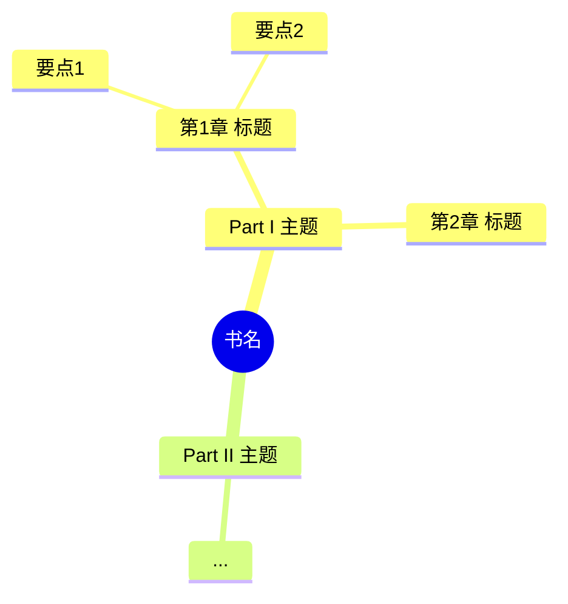

# Survey Design (Pass 1)

> 详细规范见 [`pipeline.md#pass-1`](./pipeline.md#pass-1survey通读)。本文件聚焦**算法细节与边角案例**。

## Map-Reduce 的边界条件

### 章节过长

阈值：`section_token_count > config.survey.max_chunk_tokens`（默认 6000）。

策略：
1. 按 `Paragraph` 把章节切分为 ≤ 阈值的 chunk（按段落边界，不切碎段落）
2. 对每个 chunk 跑 `ChunkSummarizer`（轻量 prompt）得到 `(abstract, key_points, key_terms)`
3. 把所有 chunk 摘要喂给 `ChapterSummarizer` 做章节级 reduce

### 章节过短

`paragraphs.len < 3` 的 section：不单独走 LLM，直接合并到父 section 的摘要里。

### 嵌套层级深

只对 `level ∈ {1, 2}` 的 section 生成 `ChapterSummary`。
更深层级（5.2.3 这种）在父章节摘要中作为"分点"出现，不单独建条目。

## Glossary 提取详细算法

### Step 1: 章节级候选

每个章节的 `ChapterSummarizer` 输出 `key_terms: list[TermCandidate]`：
```python
class TermCandidate(BaseModel):
    surface_form: str       # 原文中的实际写法
    proposed_target: str
    definition: str         # ≤ 80 字
    importance: Literal["core", "secondary", "peripheral"]
    first_surface_paragraph_id: str
```

### Step 2: 跨章节归并

```python
def merge_candidates(all_candidates: list[TermCandidate]) -> list[GlossaryEntry]:
    # 1) 表面归一：lowercase + lemmatize（英文用 spacy lemma；中文按整词）
    groups = defaultdict(list)
    for c in all_candidates:
        key = normalize_surface(c.surface_form)
        groups[key].append(c)

    # 2) 语义归并：对每对 group 计算 embedding 相似度，>= 0.92 视为同一术语
    groups = embedding_merge(groups, threshold=0.92)

    # 3) 每个 group 产出一个 GlossaryEntry
    entries = []
    for key, members in groups.items():
        targets = Counter(m.proposed_target for m in members)
        if len(targets) == 1:
            target = list(targets)[0]
        else:
            target = GlossaryArbiter.run(members)   # LLM 仲裁
        entries.append(GlossaryEntry(
            term=key,
            surface_forms=sorted({m.surface_form for m in members}),
            target=target,
            alt_targets=[t for t, _ in targets.most_common()[1:]],
            definition=longest_def(members),
            first_seen=earliest_paragraph(members),
            locked=True,
            source="survey",
        ))
    return entries
```

### Step 3: 仲裁 prompt（GlossaryArbiter）

输入：
- 术语本身 + surface_forms
- 所有候选 target + 每个的支持理由
- 该术语首次出现的段落（提供语境）

输出 schema：
```json
{
  "chosen_target": "...",
  "rationale": "...",
  "rejected": [
    {"target": "...", "reason": "..."}
  ]
}
```

仲裁完写入 `survey/arbitration-log.jsonl`，便于审计。

## Mindmap 生成

`MindmapDrawer` 接收 `BookOverview` + 所有 `ChapterSummary`，输出 Mermaid：



约束：
- 节点数 ≤ 80（控制可视化复杂度）
- 深度 ≤ 4
- 直接嵌入到 `annotated.md` 输出

## Style Guide 派生

### 预设模板

按 `register` 选预设：

```yaml
# templates/style/academic-formal-zh.yaml
register_directives:
  - "使用书面学术汉语，避免口语化表达"
  - "保留作者的论证连接词（therefore→因此、moreover→此外、however→然而）"
  - "被动语态酌情转换为主动，符合汉语习惯"
  - "长句按汉语习惯切分，但保持逻辑连接"
forbidden_patterns:
  - "..."
quote_style: "「」"
```

### LLM 微调

`StyleGuideDeriver` 接收预设 + `BookOverview.tone_notes`，输出该书定制版（追加/修改 directives）。

## 输出 Markdown 版

`overview.md` / `style-guide.md` / `chapters/<id>.md` 都是从 JSON 渲染的 Markdown 镜像，便于人类阅读。
**真相**在 JSON，Markdown 由 `tools/render/survey_md.py` 生成；不允许手改 .md 后不同步 JSON。

## 性能预算

对一本 30 万字英文学术书：
- 章节数典型 10-15
- Pass 1 并行调用数 ≈ 章节数
- 总 token 消耗目标：≤ 全书翻译 token 的 15%
- 总耗时目标：≤ 全书翻译耗时的 25%

超出预算时落 `survey/budget-warning.json`。

## 不变量

1. `Glossary.entries[*].target` 非空（不允许"未决定"）
2. `Glossary.entries[*].first_seen` 必须是有效 `paragraph_id`
3. 同一术语只有一个 entry（归并不彻底视为 bug）
4. `BookOverview.thesis` 非空
5. `mindmap_mermaid` 必须通过 `tools/lint/mermaid_lint.py`
