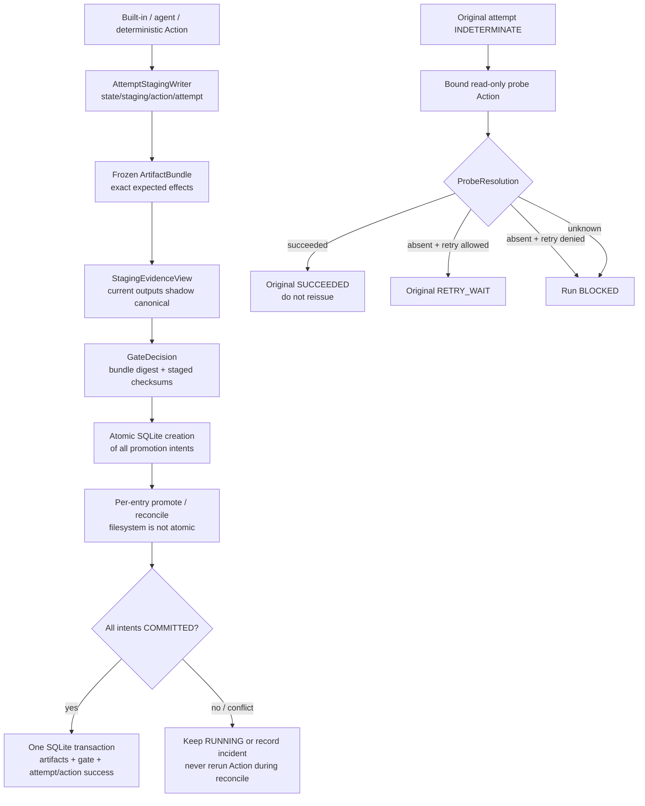

# Constrained Dynamic Orchestration Implementation Plan

> **For agentic workers:** REQUIRED SUB-SKILL: Use superpowers:subagent-driven-development (recommended) or superpowers:executing-plans to implement this plan task-by-task. Steps use checkbox (`- [ ]`) syntax for tracking.

**Goal:** Replace ABI's fixed `HAPPY_PATH`/28-state macro workflow with a policy-gated Planner, durable Action loop, transactional run ledger, typed failure semantics, and resumable Action harness.

**Architecture:** A structured-output Planner proposes short `PlanPatch` objects from compressed `RunSnapshot` evidence. A deterministic `PolicyEngine` authorizes only registered, eligible Actions; a durable controller dispatches them, validates staging artifacts, and records business facts in SQLite before replanning. LangGraph checkpoints runtime cursors and Action conversations, while `state/run.db` remains the only business source of truth.

**Tech Stack:** Python 3.11+, Pydantic 2, SQLite/aiosqlite, LangChain 1.x `create_agent`, LangGraph 1.x, `langgraph-checkpoint-sqlite` 3.x, Typer, pytest/pytest-asyncio, Ruff, mypy.

> **Authorized breaker amendment (2026-08-05):** The artifact-bundle, attempt-scoped staging,
> staging-aware validation, multi-intent commit, and typed probe-resolution protocol below replaces
> the earlier Tasks 1/4/7/8/9 contract. Do not preserve the old single-file `Succeeded` shape or
> compatibility with artifacts, tasks, attempts, or state created from the superseded draft.

## Global Constraints

- Work only in `/Users/yezhitong/my-projects/ai-book-interpreter/.worktrees/agent-loop-research` on branch `codex/research-agent-loop`.
- Do not preserve `pipeline_state.json`, old run data, `Status`, `HAPPY_PATH`, `STAGE_SEQUENCE`, `StageSpec`, or `--until` compatibility.
- The dependency order becomes `types → config → ir → project → epub → qa → release → tools → actions → planning → orchestrator → cli`; providers may depend only on `types` and `config`, while business layers may call provider interfaces.
- `langchain*`, `langgraph*`, `langfuse*`, and provider SDK imports remain under `src/abi/providers/**`; business tools use ABI-owned `ToolBinding` values.
- Every external value is parsed into a frozen Pydantic model at the boundary; no `dict` or `Any` crosses providers into business code.
- Planner may propose only; PolicyEngine, validators, Committer, and Reconciler exclusively control authorization, gates, run status, and business commits.
- Unknown capability, validator, predicate, outcome, or exception classification fails closed with an error message that includes a repair instruction.
- `state/run.db` is the business source of truth; `events.jsonl`, `metrics.json`, and `state/status.json` are rebuildable projections.
- Action execution is at-least-once; business commits are exactly-once by stable `run_id`, `plan_version`, `action_id`, `attempt`, and `idempotency_key`.
- Filesystem promotion and SQLite commits use `promotion_intent` plus reconciliation; never claim cross-medium atomicity.
- The platform remains single-process. Machine-managed canonical relpaths are exact portable lowercase keys; after an intent is `COMMITTED`, canonical plus ledger are authoritative and staged residue is non-authoritative.
- Externally supplied, foreign-owned, dirty, or hot-journal SQLite files are invalid input; no mutation-free inspection guarantee is made for them.
- Every built-in, agent tool handler, and deterministic writer writes only under `state/staging/{action_id}/{attempt}/...`; deterministic builders receive a staged sink/output view and never a canonical output path.
- Ordinary success carries a non-empty frozen typed artifact bundle bound to `action_id + attempt`; directories, globs, duplicate staged/canonical paths, non-portable canonical paths, and expected-effect mismatches fail closed.
- Parameter expansion creates an exact expected artifact manifest. Extra and missing bundle entries are equally invalid; a write set is only a permission ceiling.
- Validators read a staging-aware evidence view: this attempt's staged outputs shadow their logical canonical paths, while all other dependencies are read-only committed canonical artifacts. Gate evidence binds the canonical bundle digest and staged checksums.
- Committer persists every bundle promotion intent before copying any canonical file, promotes/reconciles all entries, and records success only after every intent is `COMMITTED`. Multi-file filesystem promotion is not atomic.
- `ProbeResolution` is a separate evidence-only outcome. It atomically resolves the original `INDETERMINATE` attempt through the ledger; ordinary `Succeeded` never implicitly resolves an external operation.
- Unclassified failures are `PermanentFailure`, except possible external side effects, which are `Indeterminate` and must be probed before retry.
- Translation Actions receive only source text, five to eight style rules, and matched terminology; QA, EPUB, and release rules are excluded.
- Use TDD for every task, run the named focused test first, and make the listed commit only after the focused and regression checks pass.

---

## File and Boundary Map

| Area | Files | Responsibility |
| --- | --- | --- |
| Pure contracts | `src/abi/types/orchestration.py`, `src/abi/types/tools.py` | Frozen run, plan, artifact bundle/manifest, evidence, probe resolution, outcome, authorization, and tool-binding shapes |
| Configuration | `src/abi/types/run.py`, `src/abi/config/loader.py` | Planner horizon, loop, retry, timeout, and concurrency limits |
| Business persistence | `src/abi/project/ledger_schema.py`, `src/abi/project/run_ledger.py` | SQLite schema, legal transitions, plans, attempts, bundle/gate facts, probe resolutions, incidents, outbox |
| Artifact transactions | `src/abi/project/artifacts.py` | Attempt-scoped writer, canonical bundle JSON/digest, atomic all-intent creation, per-item promotion/reconciliation |
| Action control | `src/abi/actions/contracts.py`, `registry.py`, `effects.py`, `evidence.py`, `validators.py`, `builtins/catalog.py` | Capability definitions, parameter-expanded expected manifests, staging-aware evidence, eligibility, execution, deterministic gates |
| Planning | `src/abi/planning/context.py`, `planner.py`, `policy.py`, `scheduler.py` | Snapshot compression, structured proposal, deterministic authorization and conflict-free batches |
| Provider runtimes | `src/abi/providers/agent_runtime/runner.py`, `tooling.py`, `src/abi/providers/orchestration_runtime/runtime.py` | LangChain Action harness, ABI tool adaptation, LangGraph durable cycle cursor |
| Control plane | `src/abi/orchestrator/controller.py`, `dispatcher.py`, `committer.py`, `reconcile.py`, `run.py` | Observe-plan-authorize-dispatch-validate-commit-replan loop |
| User surface | `src/abi/cli/main.py`, `src/abi/project/scaffold.py`, `layout.py` | Create/resume/inspect/unblock/cancel over the new ledger |
| Removal/docs | legacy state/stage files, architecture/reliability/product/eval docs | Delete fixed path and document the implemented behavior |

## Binding Protocol Flow



## Task 1: Frozen Orchestration and Tool Contracts

**Files:**
- Create: `src/abi/types/orchestration.py`
- Create: `src/abi/types/tools.py`
- Modify: `src/abi/types/__init__.py`
- Modify: `src/abi/types/run.py`
- Test: `tests/test_orchestration_types.py`

**Interfaces:**
- Produces: `RunStatus`, `ActionStatus`, `ActionKind`, `RetryPolicySpec`, `ActionSpec`, `ArtifactMetadata`, `ArtifactBundleEntry`, `ArtifactBundle`, `ExpectedArtifact`, `ExpectedArtifactManifest`, `ActionArgument`, `ProposedAction`, `PlanPatch`, `RunSnapshot`, `AuthorizedAction`, `AuthorizationDecision`, bundle-bound `GateDecision`, `ProbeResolution`, `ActionOutcomeEnvelope`, `ToolCallRecord`, `AgentRunResult`, `RunResult`, and `ToolBinding`.
- Consumes: existing `abi.types._base.FrozenModel`.

- [ ] **Step 1: Write the failing contract tests**

```python
from pydantic import ValidationError

from abi.types.orchestration import (
    ActionArgument,
    ActionOutcomeEnvelope,
    PermanentFailure,
    PlanPatch,
    ProposedAction,
    RunStatus,
)


def test_plan_patch_is_frozen_and_rejects_unknown_fields() -> None:
    patch = PlanPatch(
        objective="ingest source",
        proposed_actions=(ProposedAction(
            proposal_id="p1",
            capability="source.ingest",
            arguments=(ActionArgument(name="source_relpath", value_json='"source/raw.txt"'),),
            dependencies=(),
            expected_evidence=("source_manifest",),
            priority=100,
        ),),
        rationale="source evidence is absent",
    )
    with pytest.raises(ValidationError):
        patch.objective = "mutated"  # type: ignore[misc]


def test_action_outcome_is_discriminated() -> None:
    envelope = ActionOutcomeEnvelope.model_validate({
        "outcome": {"kind": "permanent_failure", "error_code": "unsupported_format",
                    "message": "convert the source to txt or epub"}
    })
    assert isinstance(envelope.outcome, PermanentFailure)
    assert RunStatus.BLOCKED.value == "BLOCKED"
```

Add parameterized tests that reject an empty bundle; directory/glob paths; uppercase, Unicode,
absolute, dot, backslash, or `state/staging` canonical paths; a staged path outside the exact
action/attempt namespace; duplicate staged or canonical paths; unordered entries/metadata; and
conflicting `ActionOutcomeEnvelope` identity. Add a golden canonical-JSON/digest test and parse all
three `ProbeResolution.disposition` values. Assert the superseded single-file payload is rejected as
an extra/missing-field error.

- [ ] **Step 2: Run the tests and confirm the missing-module failure**

Run: `.venv/bin/pytest tests/test_orchestration_types.py -v`

Expected: collection fails with `ModuleNotFoundError: No module named 'abi.types.orchestration'`.

- [ ] **Step 3: Implement the complete pure contract surface**

Use `StrEnum`, `Literal`, `Annotated`, `Field(discriminator="kind")`, and `FrozenModel`. Define exactly these terminal shapes:

```python
class RunStatus(StrEnum):
    RUNNING = "RUNNING"
    PAUSED_BUDGET = "PAUSED_BUDGET"
    PAUSED_HITL = "PAUSED_HITL"
    BLOCKED = "BLOCKED"
    COMPLETED = "COMPLETED"
    CANCELLED = "CANCELLED"


class ArtifactMetadata(FrozenModel):
    name: str
    value_json: str


class ArtifactBundleEntry(FrozenModel):
    staged_relpath: str
    canonical_relpath: str
    media_type: str
    evidence_role: str
    metadata: tuple[ArtifactMetadata, ...] = ()


class ArtifactBundle(FrozenModel):
    action_id: str
    attempt: int = Field(ge=1)
    entries: tuple[ArtifactBundleEntry, ...] = Field(min_length=1)


class ExpectedArtifact(FrozenModel):
    canonical_relpath: str
    media_type: str
    evidence_role: str
    required_metadata: tuple[str, ...] = ()


class ExpectedArtifactManifest(FrozenModel):
    entries: tuple[ExpectedArtifact, ...] = Field(min_length=1)


class Succeeded(FrozenModel):
    kind: Literal["succeeded"] = "succeeded"
    artifact_bundle: ArtifactBundle
    evidence_refs: tuple[str, ...] = ()


class RetryableFailure(FrozenModel):
    kind: Literal["retryable_failure"] = "retryable_failure"
    error_code: str
    message: str
    retry_after_s: float | None = None


class RepairRequired(FrozenModel):
    kind: Literal["repair_required"] = "repair_required"
    defect_codes: tuple[str, ...]
    message: str


class PermanentFailure(FrozenModel):
    kind: Literal["permanent_failure"] = "permanent_failure"
    error_code: str
    message: str


class Indeterminate(FrozenModel):
    kind: Literal["indeterminate"] = "indeterminate"
    operation_key: str
    message: str


class ProbeResolution(FrozenModel):
    kind: Literal["probe_resolution"] = "probe_resolution"
    operation_key: str
    disposition: Literal["succeeded", "absent", "unknown"]
    evidence_refs: tuple[str, ...] = Field(min_length=1)
    message: str


class Paused(FrozenModel):
    kind: Literal["paused"] = "paused"
    reason: Literal["budget", "hitl"]
    message: str


ActionOutcome = Annotated[
    Succeeded | RetryableFailure | RepairRequired | PermanentFailure | Indeterminate
    | ProbeResolution | Paused,
    Field(discriminator="kind"),
]


class ActionOutcomeEnvelope(FrozenModel):
    outcome: ActionOutcome
    action_id: str
    attempt: int = Field(ge=1)


class ToolCallRecord(FrozenModel):
    name: str
    arguments_json: str


class AgentRunResult(FrozenModel):
    outcome: ActionOutcome
    llm_calls: int
    tool_calls: int
    cost_usd: float
    stopped_reason: Literal["completed", "iteration_limit", "paused", "error"]
    tool_log: tuple[ToolCallRecord, ...] = ()
```

Define the remaining contracts with these exact fields and defaults:

```python
class ActionKind(StrEnum):
    DETERMINISTIC = "deterministic"
    AGENT = "agent"
    COMPOSITE = "composite"


class ActionStatus(StrEnum):
    AUTHORIZED = "AUTHORIZED"
    RUNNING = "RUNNING"
    SUCCEEDED = "SUCCEEDED"
    RETRY_WAIT = "RETRY_WAIT"
    REPAIR_REQUIRED = "REPAIR_REQUIRED"
    PERMANENT_FAILED = "PERMANENT_FAILED"
    INDETERMINATE = "INDETERMINATE"
    PAUSED = "PAUSED"


class RetryPolicySpec(FrozenModel):
    max_attempts: int = Field(default=3, ge=1)
    retryable_codes: tuple[str, ...] = ()
    base_delay_s: float = Field(default=1.0, ge=0)
    max_delay_s: float = Field(default=30.0, ge=0)


class PredicateSpec(FrozenModel):
    name: str
    arguments: tuple[ActionArgument, ...] = ()


class EffectSpec(FrozenModel):
    name: str
    artifact_pattern: str | None = None


class EvidenceSpec(FrozenModel):
    name: str
    required: bool = True


class ActionSpec(FrozenModel):
    capability: str
    description: str
    input_schema: str
    action_kind: ActionKind
    prerequisites: tuple[PredicateSpec, ...] = ()
    effects: tuple[EffectSpec, ...] = ()
    expected_evidence: tuple[EvidenceSpec, ...] = ()
    tool_allowlist: tuple[str, ...] = ()
    skill_refs: tuple[str, ...] = ()
    read_set: tuple[str, ...] = ()
    write_set: tuple[str, ...] = ()
    retry_policy: RetryPolicySpec = Field(default_factory=RetryPolicySpec)
    validator: str
    resource_class: str = "default"
    estimated_cost_usd: float = Field(default=0.0, ge=0)
    may_have_side_effects: bool = False
    probe_capability: str | None = None


class ActionArgument(FrozenModel):
    name: str
    value_json: str


class ProposedAction(FrozenModel):
    proposal_id: str
    capability: str
    arguments: tuple[ActionArgument, ...] = ()
    dependencies: tuple[str, ...] = ()
    expected_evidence: tuple[str, ...] = ()
    priority: int = 0


class PlanPatch(FrozenModel):
    objective: str
    proposed_actions: tuple[ProposedAction, ...]
    superseded_action_ids: tuple[str, ...] = ()
    rationale: str


class ArtifactRef(FrozenModel):
    artifact_id: str
    relpath: str
    sha256: str
    producer_action_id: str


class GateEvidence(FrozenModel):
    evidence_id: str
    gate: str
    passed: bool
    validator_version: str
    artifact_checksums: tuple[str, ...] = ()


class IncidentView(FrozenModel):
    incident_id: str
    error_code: str
    message: str
    action_id: str | None = None


class ActionView(FrozenModel):
    action_id: str
    capability: str
    status: ActionStatus
    failure_signature: str | None = None


class EligibleAction(FrozenModel):
    capability: str
    description: str
    input_schema: str
    estimated_cost_usd: float = Field(ge=0)


class RunSnapshot(FrozenModel):
    run_id: str
    status: RunStatus
    plan_version: int = Field(default=0, ge=0)
    actions: tuple[ActionView, ...] = ()
    artifacts: tuple[ArtifactRef, ...] = ()
    gate_evidence: tuple[GateEvidence, ...] = ()
    incidents: tuple[IncidentView, ...] = ()
    eligible_actions: tuple[EligibleAction, ...] = ()
    remaining_budget_usd: float | None = Field(default=None, ge=0)
    failure_signatures: tuple[str, ...] = ()


class AuthorizedAction(FrozenModel):
    action_id: str
    proposal_id: str
    plan_version: int = Field(ge=1)
    capability: str
    parameters_json: str
    dependencies: tuple[str, ...] = ()
    priority: int = 0
    read_set: tuple[str, ...] = ()
    write_set: tuple[str, ...] = ()
    idempotency_key: str
    retry_policy_fingerprint: str


class AuthorizationDecision(FrozenModel):
    authorized: bool
    reason_codes: tuple[str, ...] = ()
    actions: tuple[AuthorizedAction, ...] = ()


class GateDecision(FrozenModel):
    passed: bool
    reason_code: str
    message: str
    validator_version: str
    bundle_digest: str
    artifact_checksums: tuple[str, ...]
    evidence_refs: tuple[str, ...] = ()


class RunResult(FrozenModel):
    run_id: str
    status: RunStatus
    cost_usd: float = Field(default=0.0, ge=0)
    blocked_reason: str | None = None
```

Implement one canonicalization function for artifact bundles. Validate staged paths as relative
regular-file candidates scoped exactly beneath `state/staging/{action_id}/{attempt}/`; validate
canonical paths through `canonical_artifact_key()`; reject directories, globs, empty bundles,
duplicate staged paths, duplicate canonical paths, empty media/evidence roles, duplicate metadata
names, and metadata values that are not canonical JSON. Sort entries by
`(canonical_relpath, staged_relpath)` and metadata by `name`. Serialize with UTF-8, sorted keys, and
compact separators, then SHA-256 the bytes as `bundle_digest`. Do not casefold, Unicode-normalize,
or dot-normalize paths. `ExpectedArtifactManifest` uses the same canonical ordering and rejects
duplicate canonical paths.

No legacy single-file `Succeeded` field or compatibility parser is permitted. An ordinary success
must contain at least one entry; evidence-only probe Actions return `ProbeResolution`, never an
empty bundle. `ActionOutcomeEnvelope.action_id` and `.attempt`, when parsed at the dispatcher
boundary, are required to equal the bundle identity before commit.

Add `PlannerConfig(horizon=5, max_rejections=3)`, `OrchestrationConfig(max_cycles=500, max_parallel_actions=4, default_action_attempts=3)`, and fields on `RunConfig` with frozen defaults. Define `ToolBinding` as a frozen dataclass containing `name`, `description`, `args_schema: type[FrozenModel]`, and a sync-or-async callable; it is an internal runtime binding, not a persisted model.

- [ ] **Step 4: Run focused type and configuration tests**

Run: `.venv/bin/pytest tests/test_orchestration_types.py tests/test_project_model.py -v`

Expected: all tests pass.

- [ ] **Step 5: Commit the contracts**

```bash
git add src/abi/types tests/test_orchestration_types.py
git commit -m "feat: define dynamic orchestration contracts"
```

## Task 2: Action Registry, Predicates, and Deterministic Policy

**Files:**
- Create: `src/abi/actions/__init__.py`
- Create: `src/abi/actions/contracts.py`
- Create: `src/abi/actions/registry.py`
- Create: `src/abi/actions/predicates.py`
- Create: `src/abi/planning/__init__.py`
- Create: `src/abi/planning/policy.py`
- Test: `tests/test_action_registry.py`
- Test: `tests/test_policy_engine.py`

**Interfaces:**
- Consumes: Task 1 models.
- Produces: `ActionDefinition`, `ResolvedAction`, `ActionExecutionContext`, `ActionRegistry.register()`, `ActionRegistry.resolve()`, `PredicateCatalog`, and `PolicyEngine.authorize(snapshot, patch, next_plan_version)`.

- [ ] **Step 1: Write registry fail-closed tests**

```python
def test_registry_rejects_missing_validator_and_duplicate_capability() -> None:
    registry = ActionRegistry(predicates=PredicateCatalog(), validators={})
    with pytest.raises(RegistryConfigurationError, match="register validator"):
        registry.register(definition_for("source.ingest", validator="source_manifest"))


def test_registry_parses_arguments_with_capability_schema() -> None:
    registry = populated_registry()
    resolved = registry.resolve(
        "source.ingest",
        (ActionArgument(name="source_relpath", value_json='"source/raw.txt"'),),
    )
    assert resolved.parameters.source_relpath == "source/raw.txt"
```

- [ ] **Step 2: Write policy tests for illegal plans and conflicts**

```python
def test_policy_rejects_unknown_capability_cycle_and_write_conflict() -> None:
    decision = policy.authorize(snapshot, illegal_patch(), next_plan_version=2)
    assert decision.authorized is False
    assert set(decision.reason_codes) == {
        "unknown_capability", "dependency_cycle", "write_conflict"
    }


def test_policy_emits_only_canonical_validated_parameters() -> None:
    decision = policy.authorize(snapshot, ingest_patch(), next_plan_version=2)
    assert decision.authorized is True
    action = decision.actions[0]
    assert action.parameters_json == '{"source_relpath":"source/raw.txt"}'
```

- [ ] **Step 3: Run both test files and observe missing implementations**

Run: `.venv/bin/pytest tests/test_action_registry.py tests/test_policy_engine.py -v`

Expected: collection fails because `abi.actions.registry` and `abi.planning.policy` do not exist.

- [ ] **Step 4: Implement registry startup validation and argument parsing**

Use this public shape:

```python
@dataclass(frozen=True)
class ActionDefinition:
    spec: ActionSpec
    input_model: type[FrozenModel]
    executor: ActionExecutor
    validator: ActionValidator


@dataclass(frozen=True)
class ResolvedAction:
    definition: ActionDefinition
    parameters: FrozenModel
    parameters_json: str


class ActionExecutor(Protocol):
    async def __call__(
        self, context: ActionExecutionContext, parameters: FrozenModel
    ) -> ActionOutcomeEnvelope: ...


class ActionValidator(Protocol):
    def __call__(self, project: BookProject, parameters: FrozenModel) -> GateDecision: ...


class ActionRegistry:
    def register(self, definition: ActionDefinition) -> None:
        capability = definition.spec.capability
        if capability in self._definitions:
            raise RegistryConfigurationError(
                f"duplicate capability {capability}; remove one registration"
            )
        self._validate_definition(definition)
        self._definitions[capability] = definition

    def get(self, capability: str) -> ActionDefinition:
        try:
            return self._definitions[capability]
        except KeyError as exc:
            raise UnknownCapabilityError(
                f"unknown capability {capability}; choose an eligible registered capability"
            ) from exc

    def resolve(
        self, capability: str, arguments: tuple[ActionArgument, ...]
    ) -> ResolvedAction:
        definition = self.get(capability)
        raw = self._decode_unique_arguments(capability, arguments)
        parameters = definition.input_model.model_validate(raw)
        return ResolvedAction(
            definition=definition,
            parameters=parameters,
            parameters_json=parameters.model_dump_json(),
        )
```

`validate_startup()` iterates every definition and calls `_validate_definition()`. `eligible()` evaluates every declared predicate through `PredicateCatalog`, then returns immutable `EligibleAction` summaries sorted by capability. Unit tests must exercise those two methods directly rather than relying only on `register()`.

`resolve()` rejects duplicate argument names, parses each `value_json`, builds one JSON object only inside the parsing boundary, validates it through `input_model.model_validate`, and immediately stores `model_dump_json()` as canonical JSON. Error text names the capability, field, and how to correct the plan.

- [ ] **Step 5: Implement deterministic policy checks**

`PolicyEngine.authorize()` runs in this order: horizon 1–5, unique proposal IDs, known/eligible capability, argument parsing, dependencies exist, acyclic graph, hard prerequisites, budget estimate, read/write conflicts, repeated-failure signature, terminal release policy. It returns all rejection codes in stable sorted order and never partially authorizes a rejected patch.

```python
class PolicyEngine:
    def __init__(self, registry: ActionRegistry) -> None:
        self._registry = registry

    def authorize(
        self, snapshot: RunSnapshot, patch: PlanPatch, *, next_plan_version: int
    ) -> AuthorizationDecision:
        reasons = self._collect_rejections(snapshot, patch)
        if reasons:
            return AuthorizationDecision(authorized=False, reason_codes=tuple(sorted(reasons)))
        actions = self._resolve_actions(patch, next_plan_version)
        return AuthorizationDecision(authorized=True, actions=actions)
```

- [ ] **Step 6: Run focused tests and static checks**

Run: `.venv/bin/pytest tests/test_action_registry.py tests/test_policy_engine.py -v`

Run: `.venv/bin/ruff check src/abi/actions src/abi/planning tests/test_action_registry.py tests/test_policy_engine.py`

Expected: both commands pass.

- [ ] **Step 7: Commit registry and policy**

```bash
git add src/abi/actions src/abi/planning tests/test_action_registry.py tests/test_policy_engine.py
git commit -m "feat: authorize registered actions with deterministic policy"
```

## Task 3: Async RunLedger and Legal State Transitions

**Files:**
- Modify: `pyproject.toml`
- Modify: `uv.lock`
- Create: `src/abi/project/ledger_schema.py`
- Create: `src/abi/project/run_ledger.py`
- Modify: `src/abi/project/__init__.py`
- Test: `tests/test_run_ledger.py`

**Interfaces:**
- Consumes: Task 1 models.
- Produces: `RunLedger.open(path)`, `create_run()`, `append_plan()`, `authorize_actions()`, `start_attempt()`, `finish_attempt()`, `commit_success()`, `record_incident()`, `set_run_status()`, `load_snapshot()`, and `rebuild_status_projection()`.

- [ ] **Step 1: Write transaction, transition, and exactly-once tests**

```python
@pytest.mark.asyncio
async def test_commit_success_is_exactly_once(tmp_path: Path) -> None:
    async with RunLedger.open(tmp_path / "run.db") as ledger:
        await seed_authorized_action(ledger, action_id="a1")
        first = await ledger.commit_success(success_commit("a1", checksum="abc"))
        second = await ledger.commit_success(success_commit("a1", checksum="abc"))
        assert first == second
        assert await ledger.count_committed_actions("a1") == 1
        assert await ledger.count_outbox_events("action.committed", "a1") == 1


@pytest.mark.asyncio
async def test_illegal_transition_rolls_back(tmp_path: Path) -> None:
    async with RunLedger.open(tmp_path / "run.db") as ledger:
        run_id = await ledger.create_run(run_seed())
        with pytest.raises(LedgerTransitionError, match="resume or unblock"):
            await ledger.set_run_status(run_id, RunStatus.COMPLETED)
        assert (await ledger.get_run(run_id)).status is RunStatus.RUNNING
```

- [ ] **Step 2: Run the ledger tests and confirm failure**

Run: `.venv/bin/pytest tests/test_run_ledger.py -v`

Expected: collection fails because `abi.project.run_ledger` does not exist.

- [ ] **Step 3: Add the async SQLite dependency and schema**

Add `"aiosqlite>=0.20,<1"` to runtime dependencies and run `uv lock`. `SCHEMA_SQL` must create WAL-backed tables `runs`, `plan_versions`, `actions`, `action_attempts`, `artifact_bundles`, `artifacts`, `promotion_intents`, `gate_evidence`, `probe_resolutions`, `incidents`, `interrupts`, `budget_entries`, and `event_outbox`. Persist the authorized retry-policy fingerprint on `actions`. Add unique constraints on `(run_id, version)`, `(run_id, action_id)`, `(action_id, attempt)`, one bundle per action attempt, artifact canonical path, one probe resolution per original action attempt/operation key, and event idempotency key.

```sql
CREATE TABLE IF NOT EXISTS actions (
  action_id TEXT PRIMARY KEY,
  run_id TEXT NOT NULL REFERENCES runs(run_id),
  plan_version INTEGER NOT NULL,
  capability TEXT NOT NULL,
  parameters_json TEXT NOT NULL,
  status TEXT NOT NULL,
  idempotency_key TEXT NOT NULL UNIQUE,
  committed_at TEXT
);
```

- [ ] **Step 4: Implement `RunLedger` with explicit transactions**

Use `aiosqlite.Connection`, `BEGIN IMMEDIATE`, injected UTC clock, and repository-owned row-to-model parsing. `commit_success()` writes Action status, artifacts, gate evidence, budget entry, and outbox event in one SQLite transaction. An identical repeated commit returns the prior record; a different checksum for the same Action creates a conflict incident and raises `LedgerConflictError`.

```python
@asynccontextmanager
async def transaction(self) -> AsyncIterator[aiosqlite.Connection]:
    await self._db.execute("BEGIN IMMEDIATE")
    try:
        yield self._db
    except BaseException:
        await self._db.rollback()
        raise
    else:
        await self._db.commit()
```

- [ ] **Step 5: Run ledger tests and regression tests**

Run: `.venv/bin/pytest tests/test_run_ledger.py tests/test_project_model.py -v`

Expected: all tests pass.

- [ ] **Step 6: Commit the ledger**

```bash
git add pyproject.toml uv.lock src/abi/project tests/test_run_ledger.py
git commit -m "feat: add transactional run ledger"
```

## Task 4: Staging, Promotion Intents, and Reconciliation

**Files:**
- Create: `src/abi/project/artifacts.py`
- Create: `src/abi/project/artifact_paths.py`
- Extend: `src/abi/project/run_ledger.py`
- Extend: `src/abi/project/ledger_schema.py`
- Modify: `src/abi/project/layout.py`
- Test: `tests/test_artifact_promotion.py`
- Test: `tests/test_run_ledger.py`

**Interfaces:**
- Consumes: `RunLedger`, `ArtifactBundle`, and `ExpectedArtifactManifest`.
- Produces: attempt-bound `ArtifactStore.writer(action_id, attempt) -> AttemptStagingWriter`,
  create-only `AttemptStagingWriter.write_bytes(canonical_relpath, data, media_type,
  evidence_role, metadata) -> ArtifactBundleEntry`, display-only `staging_dir()`, canonical
  bundle JSON/digest, `create_bundle_intents()` (one SQLite transaction), per-item `promote()`,
  `reconcile_attempt(run_id, action_id, attempt)`, safe `sha256_file()`, and durable
  `PENDING | COMMITTED | CONFLICT` promotion transitions. `canonical_artifact_key()` is the one
  lexical boundary for portable canonical reservation keys.

- [ ] **Step 1: Write crash, race, storage-failure, and conflict-state tests**

```python
@pytest.mark.asyncio
@pytest.mark.parametrize("crash_point", ["after_intent", "after_canonical_write"])
async def test_reconcile_completes_interrupted_promotion(tmp_path: Path, crash_point: str) -> None:
    async with prepared_store(tmp_path, content="translation") as (store, ledger, staged):
        with pytest.raises(InjectedCrash):
            await store.promote(staged, crash_after=crash_point)
        await store.reconcile_all()
        assert (tmp_path / "chapters/final/001.md").read_text() == "translation"
        assert await ledger.promotion_state(staged.intent_id) == "COMMITTED"


@pytest.mark.asyncio
async def test_different_canonical_checksum_creates_conflict(tmp_path: Path) -> None:
    async with prepared_store(tmp_path, content="new") as (store, ledger, staged):
        canonical = tmp_path / "chapters/final/001.md"
        canonical.parent.mkdir(parents=True)
        canonical.write_text("old")
        with pytest.raises(ArtifactConflictError, match="choose the canonical artifact"):
            await store.promote(staged)
        assert await ledger.has_open_incident("artifact_checksum_conflict")


@pytest.mark.asyncio
async def test_bundle_persists_every_intent_before_any_canonical_copy(tmp_path: Path) -> None:
    bundle = two_file_bundle(tmp_path, action_id="a1", attempt=1)
    copied: list[str] = []
    store = instrumented_store(tmp_path, on_copy=lambda path: copied.append(path))
    intents = await store.create_bundle_intents(bundle)
    assert copied == []
    assert {item.status for item in intents} == {"PENDING"}
    assert await store.ledger.count_intents("a1", 1) == 2


@pytest.mark.asyncio
async def test_canonical_race_inside_ledger_commit_is_compensated(
    tmp_path: Path, monkeypatch: pytest.MonkeyPatch
) -> None:
    async with prepared_store(tmp_path, content="expected") as (store, ledger, intent):
        canonical = tmp_path / "chapters/final/001.md"
        commit = ledger.commit_promotion_intent

        async def commit_then_replace(intent_id: str) -> PromotionIntent:
            committed = await commit(intent_id)
            canonical.unlink()
            canonical.write_text("competing", encoding="utf-8")
            return committed

        monkeypatch.setattr(ledger, "commit_promotion_intent", commit_then_replace)
        with pytest.raises(ArtifactConflictError):
            await store.promote(intent)
        assert await ledger.promotion_state(intent.intent_id) == "CONFLICT"


def test_sha256_file_rejects_a_symlink(tmp_path: Path) -> None:
    target = tmp_path / "target.bin"
    target.write_bytes(b"artifact")
    alias = tmp_path / "alias.bin"
    alias.symlink_to(target)
    with pytest.raises(ValueError, match="symlink"):
        sha256_file(alias)
```

Add the companion FIFO test with a bounded worker join, forced teardown only for the RED run, and
`/dev/fd` counts before/after. It must fail if the call blocks, accepts the FIFO, or leaks its opened
descriptor. Add partial-write then `ENOSPC` injection that asserts `canonical_write_incomplete`, a
durable `CONFLICT`, preserved partial/staged bytes, and absence of `artifact_intent_invalid`.

Add portable-key tests that reject uppercase (`STATE/STAGING`, `CHAPTERS/FINAL`), Unicode and
casefold aliases, empty/dot components, backslashes, absolute paths, and the lowercase
`state/staging` prefix before intent or filesystem mutation. Legal lowercase examples must be
stored verbatim and reserve one unique key. Add restart tests proving that, after a valid
`COMMITTED` transition, changed, deleted, or externally cleaned staging residue causes neither
compensation nor an incident while the canonical facts remain valid. Retain the canonical
commit-window and post-commit drift tests unchanged.

Add bundle tests proving one failed intent insert rolls back all intent rows and performs zero
canonical copies; a crash after intent creation or after any individual copy leaves the attempt
`RUNNING`; reconciliation is scoped by `run_id/action_id/attempt`, completes every recoverable
intent without executing the Action, and reports every conflict after processing the rest. Assert a
bundle with one `CONFLICT` can never be reported successful even when all sibling intents commit.

- [ ] **Step 2: Run focused tests and confirm failure**

Run: `.venv/bin/pytest tests/test_artifact_promotion.py tests/test_run_ledger.py -v`

Expected: the new tests fail because `CONFLICT` parsing/compensation, post-commit repair,
`canonical_write_incomplete`, no-follow/nonblocking public hashing, portable canonical-key
validation, and the COMMITTED staging-authority boundary are absent.

- [ ] **Step 3: Implement the durable promotion state machine**

`PromotionIntent.status` is exactly `PENDING | COMMITTED | CONFLICT`. The ledger provides an
atomic compensation operation that changes either `PENDING` or `COMMITTED` to `CONFLICT` and
creates one subject-scoped incident in the same SQLite transaction. Repeating the same
compensation is idempotent. Repeating a matching `COMMITTED` transition is idempotent, but
`CONFLICT → COMMITTED` is an illegal transition with a repair-oriented error. Unknown persisted
states fail closed during repository-owned parsing.

Add `create_bundle_intents(bundle, checksums, media_types)` as the only intent-creation API. It
validates bundle identity against a currently `RUNNING` attempt, stores the canonical bundle JSON
and digest, inserts all intents in the same SQLite transaction, and returns existing rows only for
an exact idempotent replay. A partial prior set, different ordering/digest/checksum, duplicate
destination, or action/attempt mismatch is a durable conflict; it must not repair by adding missing
rows piecemeal.

| Current status | Requested transition | Result |
| --- | --- | --- |
| `PENDING` | commit after all prechecks | `COMMITTED` |
| `COMMITTED` | identical commit replay | unchanged `COMMITTED` |
| `PENDING` or `COMMITTED` | conflict compensation + incident | `CONFLICT` atomically |
| `CONFLICT` | repeated same compensation | unchanged `CONFLICT`, no duplicate incident |
| `CONFLICT` | commit | reject; never report success |

- [ ] **Step 4: Implement portable canonical keys, pinned staging, and checksum I/O**

Machine-managed canonical relpaths use `/` separators and components matching only
`[a-z0-9._-]+`. The shared lexical validator rejects uppercase, Unicode, empty, `.`, `..`, absolute
paths, backslashes, and the `state/staging` prefix without normalization. ArtifactStore invokes it
before canonical filesystem traversal; RunLedger invokes the same function before opening a
transaction and stores only its returned key. No old-path compatibility or casefold migration is
provided.

Pin the project root descriptor and its device/inode for the `ArtifactStore` lifetime. Traverse all
staging and canonical directories relative to pinned dirfds with `O_DIRECTORY | O_NOFOLLOW`, and
revalidate the durable root and directory-chain identities before commit and after commit.
`write_staged_bytes()` creates each leaf once with
`O_WRONLY | O_CREAT | O_EXCL | O_NOFOLLOW | O_NONBLOCK`, requires a regular file, and fsyncs the
file and parent. Expose writes only through an `AttemptStagingWriter` that maps requested logical
canonical paths to create-only staged leaves and returns typed effect entries; do not expose a raw
canonical output path or writer. `staging_dir()` is display-only. `sha256_file()` opens with
`O_RDONLY | O_NOFOLLOW | O_NONBLOCK`, requires a regular file through `fstat`, and closes the fd on
every success and failure path; symlinks are rejected and FIFOs never block.

- [ ] **Step 5: Implement all-intents-first bundle promotion**

Validate/canonicalize the complete bundle and persist every lexically valid `PENDING` intent in one
SQLite transaction before any canonical mutation. Any insert/identity/effect error rolls back the
whole set. Per-item promotion starts only after reloading and proving the durable intent count and
identities exactly match the bundle. Hold the
canonical-parent dirfd
through the whole operation. If the canonical name already exists, open it read-only without
following links and commit only when its checksum matches. If absent, open the final canonical name
exactly once with `O_CREAT | O_EXCL | O_NOFOLLOW | O_NONBLOCK`, copy verified staged bytes through
the returned fd, fsync and hash that fd, and prove that the name still identifies the same inode and
the parent still belongs to the pinned durable chain. Then commit the ledger intent and repeat the
inode/checksum/directory-chain checks.

The platform is single-process. While an intent is `PENDING`, staged bytes are authoritative
promotion input and must pass every existing precommit check. Once canonical creation, durability,
identity checks, and the ledger transition have succeeded, `COMMITTED` makes canonical plus ledger
the only authoritative facts; staging immediately becomes non-authoritative runtime residue.
COMMITTED reconciliation therefore never parses or hashes staged paths, and staged deletion,
cleanup, or drift creates no conflict or incident. This boundary does not remove or weaken any
canonical commit-window or post-commit checksum, inode, name, root, or directory-chain check.

The last filesystem precheck and the SQLite update are deliberately **not** described as atomic.
Any identity, checksum, or directory-chain failure after SQLite commit immediately compensates
`COMMITTED → CONFLICT` and records the incident. A process crash in that window leaves
`COMMITTED`; startup reconciliation repeats the postchecks and performs the same durable
compensation if it finds drift.

The same non-atomic window permits another connection to compensate a stale `PENDING` snapshot to
`CONFLICT` while a worker is already copying. That worker may have created or written the canonical
candidate before it learns the durable state, but its ledger commit must be rejected and converted
to an aggregateable artifact conflict. Preserve the candidate and continue later intents. Calls
that load `CONFLICT` perform no further write or delete; this rule does not claim to undo syscalls
already issued by an in-flight worker.

Filesystem promotion of multiple entries is not atomic and must never be described that way. Do not
create promotion temporary names, rename/replace/link an artifact into place, overwrite a
canonical name, or automatically unlink staged/canonical files. A partial canonical created by a
write, file-fsync, or parent-directory-fsync failure is retained. Record
`canonical_write_incomplete` with instructions to inspect storage and preserve the partial
canonical plus staged source; never misclassify that failure as `artifact_intent_invalid`.

- [ ] **Step 6: Implement reconciliation from the durable state table**

| Durable status | Filesystem evidence | Reconciliation |
| --- | --- | --- |
| `PENDING` | valid staged; canonical absent | perform the create-only copy and guarded commit |
| `PENDING` | canonical checksum matches; staged absent or matches | guarded commit to `COMMITTED` |
| `PENDING` | neither artifact exists | remain `PENDING`; idempotent `artifact_promotion_missing` incident |
| `PENDING` | canonical differs/is partial, staged differs, or intent path is unsafe | atomically enter `CONFLICT`; retain every artifact |
| `COMMITTED` | canonical name/inode/checksum/dirchain match; staged has any contents or is absent | remain `COMMITTED`; staged is non-authoritative residue |
| `COMMITTED` | canonical missing/drifted, or any canonical identity/dirchain check fails | atomically compensate to `CONFLICT`; never recreate canonical |
| `CONFLICT` | any evidence | a caller that observes it never commits, rewrites, or deletes; an already in-flight stale `PENDING` worker preserves its candidate and fails commit; surface the incident and continue later intents |

`reconcile_attempt(run_id, action_id, attempt)` processes every intent in the durable bundle before
raising an aggregate conflict. `reconcile_all()` may iterate attempts but cannot mix their success
conditions. Repeated
reconciliation and compensation do not duplicate incidents. Automatic staged cleanup remains out of
scope until a separate durable ownership protocol can prove safe unlinking.

- [ ] **Step 7: Run focused and project tests**

Run: `.venv/bin/pytest tests/test_artifact_promotion.py tests/test_project_model.py tests/test_run_ledger.py -v`

Expected: all tests pass.

- [ ] **Step 8: Commit artifact transactions**

```bash
git add src/abi/project tests/test_artifact_promotion.py tests/test_run_ledger.py
git commit -m "feat: reconcile staged artifact promotion"
```

## Task 5: Snapshot Builder and Structured Planner

**Files:**
- Create: `src/abi/planning/context.py`
- Create: `src/abi/planning/planner.py`
- Create: `src/abi/prompts/planner.py`
- Test: `tests/test_planner.py`

**Interfaces:**
- Consumes: `RunLedger.load_snapshot()`, `ActionRegistry.eligible()`, and `LLMRouter.invoke_structured()`.
- Produces: `SnapshotBuilder.build(run_id) -> PlanningContext` and
  `Planner.plan(context) -> PlanPatch`. `PlanningContext.policy_snapshot` is
  the complete durable evidence view for PolicyEngine revalidation;
  `planner_snapshot` is the separately bounded, code-only view serialized to
  the LLM.

- [ ] **Step 1: Write snapshot minimization and structured-output tests**

```python
@pytest.mark.asyncio
async def test_snapshot_contains_hashes_not_book_body(tmp_path: Path) -> None:
    builder = await seeded_snapshot_builder(tmp_path, body="SECRET BOOK BODY")
    snapshot = await builder.build("run-1")
    payload = snapshot.model_dump_json()
    assert "SECRET BOOK BODY" not in payload
    assert snapshot.artifacts[0].sha256 == sha256_text("SECRET BOOK BODY")


@pytest.mark.asyncio
async def test_planner_returns_a_valid_patch_from_structured_provider() -> None:
    router = DeterministicPlannerProvider(result=valid_patch())
    patch = await Planner(router=router).plan(snapshot_with_ingest_eligible())
    assert patch.proposed_actions[0].capability == "source.ingest"
    assert patch.objective == "produce missing source evidence"
    assert patch.proposed_actions[0].expected_evidence == ("source_manifest",)
```

- [ ] **Step 2: Run focused tests and confirm failure**

Run: `.venv/bin/pytest tests/test_planner.py -v`

Expected: collection fails because the planner modules do not exist.

- [ ] **Step 3: Implement compressed snapshot construction**

Read one complete durable ledger snapshot, derive eligible capabilities from
that full policy view, then construct a separately bounded Planner view. Keep
the full `policy_snapshot` for PolicyEngine; never substitute the sampled
planner view during authorization. The Planner view contains only artifact
metadata, bounded actions/gates/incidents/rejection codes, remaining budget,
and eligible capability descriptions—never book body or arbitrary rejection
messages. Limit incident messages to 500 characters, samples to configured
counts, and Planner horizon to five. Loading additional content is represented
by an eligible `inspect.*` Action rather than direct file access.

- [ ] **Step 4: Implement the Planner prompt and structured call**

```python
PLANNER_SYSTEM_PROMPT = """You are ABI's constrained planner.
Return one PlanPatch with one to five actions chosen only from eligible_actions.
You cannot mark gates passed, mutate run state, invent capabilities, or skip dependencies.
Prefer the smallest action that produces missing evidence or repairs an open incident.
Treat prior rejection reasons as hard feedback.
"""


class Planner:
    async def plan(self, snapshot: RunSnapshot) -> PlanPatch:
        patch, _ = await self._router.invoke_structured(
            PlanPatch,
            [system_message(PLANNER_SYSTEM_PROMPT), user_message(snapshot.model_dump_json())],
            agent_name="orchestration.planner",
            prompt_version="dynamic-plan-v1",
            max_retries=2,
        )
        return patch
```

- [ ] **Step 5: Run planner and policy tests**

Run: `.venv/bin/pytest tests/test_planner.py tests/test_policy_engine.py -v`

Expected: all tests pass.

- [ ] **Step 6: Commit snapshot and Planner**

```bash
git add src/abi/planning src/abi/prompts/planner.py tests/test_planner.py
git commit -m "feat: plan from compressed run evidence"
```

## Task 6: LangChain v1 Action Harness and Durable Checkpointers

**Files:**
- Modify: `pyproject.toml`
- Modify: `uv.lock`
- Create: `src/abi/providers/agent_runtime/tooling.py`
- Rewrite: `src/abi/providers/agent_runtime/runner.py`
- Modify: `src/abi/providers/agent_runtime/__init__.py`
- Modify: `src/abi/providers/services.py`
- Modify: `src/abi/tools/fs.py`
- Modify: `src/abi/tools/content.py`
- Modify: `src/abi/tools/gates.py`
- Modify: `src/abi/tools/subagent.py`
- Modify: `src/abi/tools/belt.py`
- Create: `tools/lint/architecture.py`
- Test: `tests/test_agent_runtime.py`
- Test: `tests/test_tool_boundaries.py`

**Interfaces:**
- Consumes: `ToolBinding`, `ActionOutcomeEnvelope`, project checkpoint path, shared budget/events/metrics.
- Produces: `AgentActionRequest` and `AgentRuntime.run_action(request) -> AgentRunResult` with no LangChain types in its public return value.

- [ ] **Step 1: Write migration and persistence tests**

```python
def test_architecture_linter_reports_forbidden_sdk_import(tmp_path: Path) -> None:
    module = tmp_path / "src/abi/tools/bad.py"
    module.parent.mkdir(parents=True)
    module.write_text("from langchain.tools import tool\n", encoding="utf-8")
    violations = scan_tree(tmp_path / "src/abi")
    assert [(item.rule, item.path, item.line) for item in violations] == [
        ("sdk-import-outside-providers", "tools/bad.py", 1)
    ]


@pytest.mark.asyncio
async def test_action_harness_resumes_same_thread(tmp_path: Path) -> None:
    runtime = fake_model_runtime(checkpoint_path=tmp_path / "graph-checkpoints.sqlite")
    first = await runtime.run_action(action_request(thread_id="run-1/a1/1"))
    second = await runtime.run_action(action_request(thread_id="run-1/a1/1", resume=True))
    assert first.outcome.kind == "paused"
    assert second.outcome.kind == "succeeded"
    assert second.outcome.evidence_refs == ("prior_tool_result",)
```

- [ ] **Step 2: Run focused tests before dependency changes**

Run: `.venv/bin/pytest tests/test_agent_runtime.py tests/test_tool_boundaries.py -v`

Expected: tests fail because `run_action` and ABI-owned tool bindings are absent.

- [ ] **Step 3: Upgrade the agent runtime dependency set**

Set these ranges in `pyproject.toml`, then run `uv lock` and `uv sync --extra dev`:

```toml
"langchain>=1.3.14,<2",
"langchain-openai>=1.3.5,<2",
"langchain-core>=1.3,<2",
"langgraph>=1.2.9,<2",
"langgraph-checkpoint-sqlite>=3.1,<4",
```

Keep Langfuse on its existing major during this refactor; its v4 rewrite is a separate migration. Verify the selected versions against the official [LangChain v1 release notes](https://docs.langchain.com/oss/python/releases/langchain-v1), [LangGraph v1 release notes](https://docs.langchain.com/oss/python/releases/langgraph-v1), and [SQLite checkpointer documentation](https://docs.langchain.com/oss/python/langgraph/persistence).

- [ ] **Step 4: Replace SDK-owned tools at business boundaries**

Each `make_*_tools()` returns `list[ToolBinding]`. Put Pydantic input models beside their business handler. `providers.agent_runtime.tooling.to_langchain_tool()` is the only adapter. `tools/lint/architecture.py` parses imports with `ast`, returns frozen `Violation` records, and offers a CLI that exits non-zero after printing repair instructions when actual source violates the boundary:

```python
def to_langchain_tool(binding: ToolBinding) -> BaseTool:
    return StructuredTool.from_function(
        func=binding.handler if not inspect.iscoroutinefunction(binding.handler) else None,
        coroutine=binding.handler if inspect.iscoroutinefunction(binding.handler) else None,
        name=binding.name,
        description=binding.description,
        args_schema=binding.args_schema,
    )
```

Remove `set_state` and `record_gate` from content tools. Replace `get_state` with read-only `get_run_snapshot`, supplied by an Action-scoped callback rather than direct ledger mutation.

- [ ] **Step 5: Implement `create_agent` with persistent `AsyncSqliteSaver`**

Use `langchain.agents.create_agent`, `response_format=ActionOutcomeEnvelope`, and `AsyncSqliteSaver.from_conn_string`. Map graph recursion to `RetryableFailure(error_code="iteration_limit")`, budget to `Paused(reason="budget")`, declared transient provider errors to `RetryableFailure`, and possible side-effect timeouts to `Indeterminate`. Unknown exceptions become `PermanentFailure(error_code="unclassified_exception")`.

Define the provider-owned request as a frozen dataclass so callable tools are not persisted as Pydantic data:

```python
@dataclass(frozen=True)
class AgentActionRequest:
    system_prompt: str
    user_prompt: str
    tools: tuple[ToolBinding, ...]
    agent_name: str
    thread_id: str
    checkpoint_path: Path
    max_iterations: int
    may_have_side_effects: bool = False
```

```python
async with AsyncSqliteSaver.from_conn_string(str(checkpoint_path)) as saver:
    agent = create_agent(
        model=model,
        tools=[to_langchain_tool(tool) for tool in request.tools],
        system_prompt=request.system_prompt,
        response_format=ActionOutcomeEnvelope,
        checkpointer=saver,
    )
    result = await agent.ainvoke(
        {"messages": [{"role": "user", "content": request.user_prompt}]},
        config={"configurable": {"thread_id": request.thread_id},
                "recursion_limit": request.max_iterations * 2 + 6,
                "callbacks": callbacks},
    )
```

- [ ] **Step 6: Run runtime, tool, and offline regressions**

Run: `.venv/bin/pytest tests/test_agent_runtime.py tests/test_tool_boundaries.py tests/test_orchestrator_offline.py -v`

Run: `.venv/bin/ruff check src tests`

Run: `.venv/bin/python tools/lint/architecture.py src/abi`

Expected: all three commands pass; repository search finds no `create_react_agent`.

- [ ] **Step 7: Commit the runtime migration**

```bash
git add pyproject.toml uv.lock src/abi/providers src/abi/tools tools/lint/architecture.py tests/test_agent_runtime.py tests/test_tool_boundaries.py tests/test_orchestrator_offline.py
git commit -m "feat: add durable LangChain v1 action harness"
```

## Task 7: Built-in Capability Catalog and Fail-Closed Validators

**Files:**
- Create: `src/abi/actions/builtins/__init__.py`
- Create: `src/abi/actions/builtins/inputs.py`
- Create: `src/abi/actions/builtins/catalog.py`
- Create: `src/abi/actions/effects.py`
- Create: `src/abi/actions/evidence.py`
- Create: `src/abi/actions/validators.py`
- Create: `src/abi/prompts/actions.py`
- Move: `src/abi/prompts/stages/*.md.j2` to `src/abi/prompts/actions/*.md.j2`
- Modify: `src/abi/tools/content.py`
- Modify: `src/abi/tools/gates.py`
- Test: `tests/test_builtin_actions.py`
- Test: `tests/test_action_validators.py`
- Test: `tests/test_action_permissions.py`

**Interfaces:**
- Consumes: Action registry/contracts, Action harness, existing deterministic EPUB/QA/release functions, and existing prompt contents.
- Produces: `build_action_registry()`, `ActionPromptRegistry`, typed inputs for every built-in capability, deterministic `expand_expected_artifacts(capability, parameters)`, attempt-scoped tool handlers/builders, `StagingEvidenceView`, and `validate_evidence(capability, evidence_view, parameters, bundle)`.

- [ ] **Step 1: Write catalog completeness and no-state-mutation tests**

```python
def test_builtin_catalog_has_closed_dependencies_and_validators() -> None:
    registry = build_action_registry()
    registry.validate_startup()
    assert {item.capability for item in registry.specs()} >= {
        "source.ingest", "source.split", "research.global", "research.book",
        "translation.trial", "glossary.prepare", "chapter.translate",
        "chapter.control", "chapter.review", "preproduction.spec",
        "preproduction.sample", "epub.build", "review.spotcheck",
        "review.independent", "release.prepare", "output.finalize",
        "retrospective.capture",
    }


def test_agent_visible_tools_cannot_mutate_control_state() -> None:
    names = {tool.name for tool in build_belt(fake_context()).all()}
    assert names.isdisjoint({"set_state", "record_gate", "commit_action", "mark_done"})


def test_action_receives_only_allowlisted_tools_and_paths() -> None:
    envelope = build_action_envelope("chapter.translate", ChapterBatchInput(chapters=("001",)))
    assert {tool.name for tool in envelope.tools} == {"read_file", "write_file", "grep"}
    assert envelope.permissions.can_write("chapters/translated/001.md")
    assert not envelope.permissions.can_write("glossary/terms.csv")


def test_parameter_expansion_declares_exact_chapter_outputs() -> None:
    manifest = expand_expected_artifacts(
        "chapter.translate", ChapterBatchInput(chapters=("002", "001"))
    )
    assert tuple(item.canonical_relpath for item in manifest.entries) == (
        "chapters/translated/001.md", "chapters/translated/002.md"
    )
```

- [ ] **Step 2: Write fail-closed validator tests**

```python
def test_unknown_capability_never_passes(tmp_path: Path) -> None:
    project = scaffold_without_ledger(tmp_path)
    result = validate_evidence(
        "invented.capability", empty_evidence_view(project), EmptyInput(), one_file_test_bundle()
    )
    assert result.passed is False
    assert result.reason_code == "validator_not_registered"


def test_chapter_validator_reads_current_attempt_staging_overlay(tmp_path: Path) -> None:
    project = project_with_committed_source(tmp_path, chapters=("001", "002"))
    bundle = staged_translation_bundle(project, action_id="a1", attempt=1, chapters=("001",))
    view = StagingEvidenceView.for_bundle(project, committed_manifest(project), bundle)
    one = validate_evidence(
        "chapter.translate", view, ChapterBatchInput(chapters=("001",)), bundle
    )
    two = validate_evidence(
        "chapter.translate", view, ChapterBatchInput(chapters=("002",)), bundle
    )
    assert one.passed is True
    assert two.passed is False
```

Add tests proving a canonical output prewritten before validation cannot satisfy the gate; current
attempt staged outputs shadow the same logical canonical path; unrelated dependencies come only
from the committed artifact manifest; another attempt's staging is invisible; and the returned
`GateDecision` binds the exact bundle digest, ordered staged checksums, evidence refs, and validator
version. Add fail-closed tests for extra and missing expected effects, media/evidence-role mismatch,
and a deterministic builder or agent tool attempting a direct canonical write.

- [ ] **Step 3: Run focused tests and confirm failure**

Run: `.venv/bin/pytest tests/test_builtin_actions.py tests/test_action_validators.py tests/test_action_permissions.py -v`

Expected: collection fails because the built-in catalog and validator router do not exist.

- [ ] **Step 4: Define typed inputs and registered capability effects**

Use separate models: `SourceIngestInput`, `SourceSplitInput`, `ResearchInput`, `ChapterBatchInput`, `ReviewBatchInput`, `BuildEpubInput`, `ReleaseInput`, and `EmptyInput`. Every ActionSpec declares `prerequisites`, `effects`, `expected_evidence`, `tool_allowlist`, `skill_refs`, `read_set`, `write_set`, retry policy, validator, estimated cost, and Action kind. Every artifact-producing ActionDefinition also binds a deterministic effect expander. It converts parsed parameters into a glob-free, directory-free `ExpectedArtifactManifest` with exact canonical path, media type, evidence role, and required metadata keys; runtime output must match it exactly. Keep dependency rules as predicates, not list ordering.

- [ ] **Step 5: Port prompts and Action execution without `StageSpec`**

`ActionPromptRegistry.render(capability, parameters, snapshot)` selects by capability. Agent Actions execute through one `AgentActionExecutor`; deterministic Actions call existing parsers/builders/linters through a staged sink/output view. Chapter Actions require an explicit chapter tuple so Scheduler can prove disjoint writes. Translation prompt construction enforces the source + five-to-eight style rules + matched-terms envelope. Resolve the registry's `tool_allowlist` through `ToolBelt`, then enforce the same read/write set again inside filesystem handlers.

All built-in, agent, and deterministic writes go through the current
`AttemptStagingWriter(state/staging/{action_id}/{attempt})`. Agent tools continue accepting logical
canonical paths, but the ABI handler maps them to staged leaves, records one typed effect entry, and
never opens canonical output. Deterministic parsers/builders receive a staged sink or
`AttemptOutputView`; remove direct canonical-output calls rather than wrapping them after the write.
At successful executor return, canonicalize recorded entries, compare them exactly with the
parameter-expanded manifest, and build `Succeeded(artifact_bundle=...)`. Composite review Actions
allocate independent thread IDs and reuse the shared BudgetGate.

- [ ] **Step 6: Move validators and make the router exhaustive**

Port checks from `src/abi/stages/validators.py` into capability validators. Change every validator
signature to accept `StagingEvidenceView` and the typed bundle. The view overlays only current
attempt staged outputs at their logical canonical paths and serves every other dependency from the
read-only committed artifact manifest. It must not expose arbitrary project paths or any other
attempt's staging. Replace the old final `return _ok()` with an explicit failure:

```python
def validate_evidence(
    capability: str,
    evidence_view: StagingEvidenceView,
    parameters: FrozenModel,
    bundle: ArtifactBundle,
) -> GateDecision:
    validator = _VALIDATORS.get(capability)
    if validator is None:
        return GateDecision(
            passed=False,
            reason_code="validator_not_registered",
            message=f"No validator for {capability}; register one before authorizing this Action.",
        )
    return validator(evidence_view, parameters, bundle)
```

Every PASS contains the bundle digest, ordered staged checksums, stable evidence refs, and validator
version. A validator may never pass by observing output prewritten to canonical.

- [ ] **Step 7: Run catalog, validator, ingest, EPUB, and QA tests**

Run: `.venv/bin/pytest tests/test_builtin_actions.py tests/test_action_validators.py tests/test_action_permissions.py tests/test_artifact_promotion.py tests/test_ingest_txt.py tests/test_epub_build.py tests/test_eval.py -v`

Expected: all tests pass.

- [ ] **Step 8: Commit the capability catalog**

```bash
git add src/abi/actions src/abi/prompts src/abi/tools tests/test_builtin_actions.py tests/test_action_validators.py tests/test_action_permissions.py
git commit -m "feat: register ABI work as typed capabilities"
```

**Mandatory Task 7 backfill before Task 8 continues:** The earlier Task 7 implementation predates
this breaker amendment. First replace its canonical writers, single-file effects, and project-root
validators with the attempt writer, exact bundle/manifest, and staging-aware contracts above. Do
not continue implementing the Task 8 Committer against the superseded Task 7 surface.

## Task 8: Scheduler, Dispatcher, Committer, and Dynamic Controller

> **Entry gate:** Do not continue the in-progress Task 8 implementation until the mandatory Task 7
> backfill has landed and its focused tests prove attempt-scoped writing, exact bundle effects, and
> staging-aware validation. Replace any in-progress single-file Committer code; do not adapt it with
> a compatibility branch.

**Files:**
- Create: `src/abi/planning/scheduler.py`
- Create: `src/abi/orchestrator/dispatcher.py`
- Create: `src/abi/orchestrator/committer.py`
- Create: `src/abi/orchestrator/projector.py`
- Create: `src/abi/orchestrator/reconcile.py`
- Create: `src/abi/orchestrator/controller.py`
- Modify: `src/abi/providers/observability/events.py`
- Create: `src/abi/providers/orchestration_runtime/__init__.py`
- Create: `src/abi/providers/orchestration_runtime/runtime.py`
- Rewrite: `src/abi/orchestrator/driver.py`
- Test: `tests/test_scheduler.py`
- Test: `tests/test_dynamic_controller.py`

**Interfaces:**
- Consumes: Planner, PolicyEngine, RunLedger, ArtifactStore/AttemptStagingWriter, ActionRegistry with effect expanders and staging-aware validators, AgentRuntime.
- Produces: `Scheduler.select_batch()`, `Dispatcher.execute()`, `Committer.commit()`, `OutboxProjector.flush()`, `Reconciler.reconcile()`, `DynamicController.tick()`, and generic `DurableLoopRuntime.run()`.

- [ ] **Step 1: Write conflict-free Scheduler tests**

```python
def test_scheduler_parallelizes_only_non_conflicting_actions() -> None:
    batch = Scheduler(max_parallel=4).select_batch((
        action("t1", reads=("chapters/src/001.md",), writes=("chapters/translated/001.md",)),
        action("t2", reads=("chapters/src/002.md",), writes=("chapters/translated/002.md",)),
        action("g", reads=("chapters/translated/*",), writes=("glossary/terms.csv",)),
        action("g2", reads=(), writes=("glossary/terms.csv",)),
    ))
    assert {item.action_id for item in batch} == {"t1", "t2", "g"}
```

- [ ] **Step 2: Write controller outcome-path tests**

```python
@pytest.mark.asyncio
async def test_controller_replans_after_repair_and_completes() -> None:
    rig = controller_rig(outcomes=(RepairRequired(
        defect_codes=("term_drift",), message="repair glossary"
    ), Succeeded(
        artifact_bundle=bundle(
            action_id="a2", attempt=1,
            entries=(("chapter.md", "chapters/translated/001.md", "text/markdown", "translation"),),
        ),
        evidence_refs=("gate",),
    )))
    await rig.runtime.run(run_id=rig.run_id, tick=rig.controller.tick)
    assert (await rig.ledger.get_run(rig.run_id)).status is RunStatus.COMPLETED
    assert await rig.ledger.event_names() == expected_replan_event_sequence()


@pytest.mark.asyncio
async def test_permanent_failure_blocks_without_retry() -> None:
    rig = controller_rig(outcomes=(PermanentFailure(
        error_code="copyright_denied", message="supply a license or use private mode"
    ),))
    await rig.runtime.run(run_id=rig.run_id, tick=rig.controller.tick)
    assert await rig.ledger.count_attempts(capability="rights.check") == 1
    assert (await rig.ledger.get_run(rig.run_id)).status is RunStatus.BLOCKED


@pytest.mark.asyncio
async def test_committer_requires_complete_multi_file_bundle(tmp_path: Path) -> None:
    rig = committer_rig(tmp_path, expected=("reports/a.json", "reports/b.json"))
    result = await rig.commit(two_file_success(rig, action_id="a1", attempt=1))
    assert {item.relpath for item in result.artifacts} == {"reports/a.json", "reports/b.json"}
    assert await rig.ledger.count_intents("a1", 1) == 2
    assert await rig.ledger.action_status("a1") is ActionStatus.SUCCEEDED
```

Add Committer tests for bundle/action/attempt mismatch; permission violation; non-regular staged
leaf; extra/missing/duplicate manifest entry; gate digest/checksum mismatch; zero canonical copies
until every intent is durable; crash after each intent/copy/postcheck; one conflict among committed
siblings; and refusal to mark either attempt or Action successful before every intent is
`COMMITTED`. Assert a crash leaves the attempt `RUNNING`.

- [ ] **Step 3: Run Scheduler and controller tests and confirm failure**

Run: `.venv/bin/pytest tests/test_scheduler.py tests/test_dynamic_controller.py -v`

Expected: collection fails because the Scheduler and dynamic controller do not exist.

- [ ] **Step 4: Implement batch selection and typed dispatch**

Scheduler sorts by priority then action ID, incrementally admits Actions whose dependencies are committed and whose read/write sets do not conflict with the batch. Dispatcher starts attempts in the ledger, resolves canonical parameters through Registry, creates the exact attempt-scoped writer/output view, runs deterministic/agent/composite executors, applies per-Action timeout, and always returns `ActionOutcomeEnvelope`. It rejects a `Succeeded` bundle whose identity differs from the durable action/attempt and rejects `ProbeResolution` from a non-probe capability before routing either outcome.

- [ ] **Step 5: Implement commit and reconciliation routing**

Implement ordinary-success commit in this exact order:

1. Parse and canonicalize the frozen bundle; validate current run/action/attempt identity, regular
   staged leaves, portable lowercase canonical paths, media/evidence metadata, write permission,
   unique staged/canonical names, and exact equality with the parameter-expanded expected manifest.
2. Construct `StagingEvidenceView` so current attempt outputs shadow their logical canonical paths
   and all other inputs are read-only committed canonical artifacts. Run the deterministic validator
   and require a PASS bound to this bundle digest, ordered staged checksums, evidence refs, and
   validator version.
3. Call the ledger's atomic `create_bundle_intents()`; every intent must be durable before
   `ArtifactStore` copies any canonical byte.
4. Promote/reconcile each intent using the create-only protocol and re-read all intents for this
   run/action/attempt. Continue sibling reconciliation after a conflict so evidence is complete.
5. Require every intent to be `COMMITTED`; then, and only then, use one SQLite transaction to write
   the bundle/artifact rows and gate evidence and transition the attempt/Action to `SUCCEEDED` with
   the cost/outbox facts.

Filesystem promotion across bundle entries is explicitly non-atomic. Any crash before step 5 leaves
the attempt `RUNNING`; it does not become retryable, repair-required, or successful merely because
some files exist. Outcome routing is exact: retryable → bounded retry; repair → incident + replan;
permanent → alternative capability or BLOCKED; indeterminate → registered probe Action only; paused
→ run pause; ordinary success → the five-step bundle protocol. Reconciler runs before every planning
cycle, groups facts by run/action/attempt, resumes all pending intents without rerunning the Action,
records an incident and withholds success on any `CONFLICT`, finalizes the same success transaction
only for a complete committed bundle, and skips execution when ledger already committed it.

`OutboxProjector.flush()` reads undelivered ledger events in sequence order, appends them to `events.jsonl` through `EventLogger.append_record(event_id, record)`, updates metrics/status projections, then marks each outbox row delivered. `EventLogger` builds a seen-event-ID set from the existing JSONL file at startup and refuses a second append of the same ID, closing the crash window between file append and the delivered flag. Provider events also receive stable call/attempt IDs, so one file remains a deduplicated projection.

- [ ] **Step 6: Implement a provider-generic durable cycle graph**

`DurableLoopRuntime` depends on no ABI business modules. Its graph state contains only `run_id`, `cycle`, and `continue_run`; one `tick` callback performs a business cycle. Use `AsyncSqliteSaver` and stable `thread_id=run_id`.

```python
class LoopState(TypedDict):
    run_id: str
    cycle: int
    continue_run: bool


async def cycle_node(state: LoopState) -> LoopState:
    keep_running = await tick(state["run_id"])
    return {"run_id": state["run_id"], "cycle": state["cycle"] + 1,
            "continue_run": keep_running}
```

Route back to `cycle` only while `continue_run` is true and `cycle < max_cycles`; otherwise end. Max-cycle exhaustion creates a controller incident and BLOCKED state, never implicit completion.

- [ ] **Step 7: Run focused control-plane tests**

Run: `.venv/bin/pytest tests/test_scheduler.py tests/test_dynamic_controller.py tests/test_policy_engine.py tests/test_run_ledger.py -v`

Expected: all tests pass.

- [ ] **Step 8: Commit the dynamic controller**

```bash
git add src/abi/planning src/abi/orchestrator src/abi/providers/orchestration_runtime src/abi/providers/observability/events.py tests/test_scheduler.py tests/test_dynamic_controller.py
git commit -m "feat: execute durable policy-gated action loop"
```

## Task 9: Fault Injection, Retry Exhaustion, and Indeterminate Side Effects

> **Required scope, not follow-up work:** Task 9 implements the complete two-entry bundle crash
> matrix and the complete `succeeded | absent | unknown` probe-resolution/idempotency/conflict
> matrix. Do not defer any row to a later reliability task.

**Files:**
- Extend: `src/abi/orchestrator/reconcile.py`
- Extend: `src/abi/orchestrator/dispatcher.py`
- Extend: `src/abi/project/run_ledger.py`
- Create: `tests/test_orchestration_recovery.py`
- Create: `tests/test_failure_semantics.py`

**Interfaces:**
- Consumes: Task 8 control plane.
- Produces: deterministic bundle crash-point hooks, retry signature accounting, frozen `ProbeResolution`, atomic `RunLedger.resolve_indeterminate()`, durable `probe_resolutions`, and resume behavior for paused/blocked runs.

- [ ] **Step 1: Write the recovery matrix as executable tests**

```python
@pytest.mark.asyncio
@pytest.mark.parametrize("boundary", [
    "before_dispatch", "after_action_output", "before_bundle_intents",
    "after_bundle_intents", "after_first_canonical_create", "after_first_canonical_write",
    "after_first_intent_commit_before_postcheck", "between_bundle_entries",
    "after_all_intents_committed", "after_success_ledger_commit", "before_graph_checkpoint",
])
async def test_crash_boundaries_do_not_duplicate_business_facts(
    tmp_path: Path, boundary: str
) -> None:
    rig = recovery_rig(tmp_path, crash_at=boundary)
    with pytest.raises(InjectedCrash):
        await rig.run()
    rig.disable_crash()
    await rig.resume()
    assert await rig.ledger.count_committed_actions("a1") == 1
    assert await rig.ledger.count_artifacts_for("a1") == 2
    assert await rig.executor.call_count("a1") == 1
```

For every boundary, use a two-entry bundle and assert: all intent rows existed before the first
canonical copy; the attempt stayed `RUNNING` until the complete success transaction; resume grouped
by run/action/attempt and did not rerun the Action; exactly one bundle/gate/success fact was
committed; and staged residue became non-authoritative only after each corresponding intent reached
`COMMITTED`. Add cases for a conflict on entry 1 and entry 2, proving sibling reconciliation
continues but bundle success is withheld and one stable incident is recorded.

- [ ] **Step 2: Write failure classification and probe tests**

```python
@pytest.mark.asyncio
async def test_indeterminate_release_is_probed_not_reissued(tmp_path: Path) -> None:
    operation_log = tmp_path / "external-operations.jsonl"
    rig = release_rig(first=Indeterminate(
        operation_key="release:abc", message="timeout after request"
    ), probe=ProbeResolution(
        operation_key="release:abc", disposition="succeeded",
        evidence_refs=("external:release:abc",), message="remote release exists",
    ), operation_log=operation_log)
    await rig.run()
    records = [json.loads(line) for line in operation_log.read_text().splitlines()]
    assert [record["operation"] for record in records] == ["release", "probe"]
    assert await rig.ledger.count_attempts(capability="release.prepare") == 1
    assert await rig.ledger.count_attempts(capability="release.probe") == 1
    assert await rig.ledger.action_status("release") is ActionStatus.SUCCEEDED


@pytest.mark.asyncio
@pytest.mark.parametrize(
    ("disposition", "original_status", "run_status"),
    [
        ("succeeded", ActionStatus.SUCCEEDED, RunStatus.RUNNING),
        ("absent", ActionStatus.RETRY_WAIT, RunStatus.RUNNING),
        ("unknown", ActionStatus.INDETERMINATE, RunStatus.BLOCKED),
    ],
)
async def test_probe_resolution_matrix(
    disposition: str, original_status: ActionStatus, run_status: RunStatus
) -> None:
    rig = indeterminate_rig(disposition=disposition, retry_allowed=True)
    await rig.run_probe()
    assert await rig.ledger.action_status(rig.original_action_id) is original_status
    assert (await rig.ledger.get_run(rig.run_id)).status is run_status
    assert await rig.ledger.action_status(rig.probe_action_id) is ActionStatus.SUCCEEDED


def test_unknown_exception_classifies_fail_closed() -> None:
    outcome = classify_exception(RuntimeError("boom"), may_have_side_effects=False)
    assert outcome.kind == "permanent_failure"
```

Add `absent` cases for retry exhausted, unregistered error code, and mismatched retry-policy
fingerprint; all must block rather than retry. Add wrong probe capability, writable/side-effecting
probe registration, wrong original status, wrong operation key, and probe returning ordinary
`Succeeded` tests. Replay the exact same resolution and assert idempotency; replay a different
disposition, evidence set, operation key, original attempt, or retry fingerprint and assert a
durable conflict with no overwritten fact. Inject a crash at every point of the single SQLite
resolve transaction and prove it rolls back probe evidence, probe success, and original status
together.

- [ ] **Step 3: Run recovery tests and confirm red results**

Run: `.venv/bin/pytest tests/test_orchestration_recovery.py tests/test_failure_semantics.py -v`

Expected: tests fail at the unimplemented crash hooks, signature accounting, and probe routes.

- [ ] **Step 4: Implement retry signatures and external-operation probes**

Hash `(capability, canonical_parameters_json, error_code)` as the failure signature. Retry only errors named by `RetryPolicySpec.retryable_codes`, enforce max attempts and jittered backoff, and convert exhaustion to `RepairRequired` or `PermanentFailure` according to the ActionSpec. Persist the canonical retry-policy fingerprint with authorization so probe resolution can verify the original policy durably. External Actions declare `may_have_side_effects=True` plus a separate `probe_capability`; Dispatcher refuses to retry them while the prior attempt is indeterminate.

Registry startup requires every probe capability to be read-only, evidence-only, side-effect-free,
effect/write-set empty, and bound to exactly the probed ActionSpec/operation-key input schema. A
probe executor returns only `ProbeResolution(kind="probe_resolution", operation_key,
disposition="succeeded|absent|unknown", evidence_refs, message)`. It never returns an empty or
ordinary `Succeeded` and never creates promotion intents.

Implement `probe_resolutions` and `RunLedger.resolve_indeterminate(request)` as one serialized
SQLite transaction. Validate probe/original action and attempt identity, registered probe binding,
operation key, original `INDETERMINATE` status, evidence-only probe status, idempotency key, and
retry-policy fingerprint. In the same transaction, commit the probe attempt/action and evidence,
insert the immutable resolution/outbox facts, then apply exactly one original route:

- `succeeded`: original attempt/Action → `SUCCEEDED`; never redispatch the external operation.
- `absent`: original Action → `RETRY_WAIT` only when its stored retry policy, error code, and attempt
  count allow; otherwise run → `BLOCKED` with an incident.
- `unknown`: leave original attempt/Action `INDETERMINATE`; run → `BLOCKED` with an incident that
  requests human/external evidence.

An exact replay returns the stored resolution. Any conflicting resolution/evidence/key/policy fact
fails closed and preserves the first durable fact.

- [ ] **Step 5: Implement all recovery boundaries**

At startup reconcile ledger/checkpoint/artifacts in this order: incomplete artifact bundles grouped
by run/action/attempt; all intents in each bundle; complete bundles whose success transaction is
missing; committed Actions missing graph progress; indeterminate operations through their bound
probe Actions; outbox delivery. A bundle crash never causes Action redispatch. An intent conflict
withholds success and records an incident but does not stop sibling intent reconciliation. Emit
`action.reconciled` for every correction and preserve the original incident.

- [ ] **Step 6: Run recovery and full unit tests**

Run: `.venv/bin/pytest tests/test_orchestration_recovery.py tests/test_failure_semantics.py -v`

Run: `.venv/bin/pytest -q`

Expected: focused tests and the full suite pass.

- [ ] **Step 7: Commit reliability semantics**

```bash
git add src/abi/orchestrator src/abi/project/run_ledger.py tests/test_orchestration_recovery.py tests/test_failure_semantics.py
git commit -m "feat: recover action failures without blind retries"
```

## Task 10: New Project Lifecycle and CLI Surface

**Files:**
- Rewrite: `src/abi/project/scaffold.py`
- Rewrite: `src/abi/project/layout.py`
- Rewrite: `src/abi/orchestrator/run.py`
- Rewrite: `src/abi/cli/main.py`
- Modify: `src/abi/project/__init__.py`
- Modify: `src/abi/orchestrator/__init__.py`
- Test: `tests/test_project_model.py`
- Create: `tests/test_dynamic_cli.py`
- Rewrite: `tests/test_orchestrator_offline.py`

**Interfaces:**
- Consumes: new controller and ledger.
- Produces: `make_book()`, `resume()`, `inspect_run()`, `approve_interrupt()`, `unblock()`, `cancel()`, and CLI commands `make-book`, `resume`, `inspect`, `approve`, `unblock`, `cancel`.

- [ ] **Step 1: Replace scaffold and CLI expectations with ledger behavior**

```python
def test_scaffold_creates_new_state_contract(tmp_path: Path) -> None:
    project = scaffold_project(request(tmp_path))
    assert project.run_db.exists()
    assert project.graph_checkpoints.parent.is_dir()
    assert not (project.root / "state/pipeline_state.json").exists()


def test_inspect_prints_plan_actions_and_incidents(cli_runner, seeded_project) -> None:
    result = cli_runner.invoke(app, ["inspect", str(seeded_project.root)])
    assert result.exit_code == 0
    assert "RUNNING" in result.stdout
    assert "source.ingest" in result.stdout
    assert "Open incidents" in result.stdout
```

- [ ] **Step 2: Run lifecycle tests and confirm they fail against old behavior**

Run: `.venv/bin/pytest tests/test_project_model.py tests/test_dynamic_cli.py tests/test_orchestrator_offline.py -v`

Expected: failures reference `pipeline_state.json`, `Status`, and absent CLI commands.

- [ ] **Step 3: Initialize the ledger during scaffold and build services with stable run ID**

Scaffold creates the directory contract, `state/run.db`, `state/staging`, and checkpoint parent. `make_book()` creates one ledger run, writes source, and starts the durable runtime. `resume()` loads the existing run ID and never creates a fresh business run. Observability uses that stable run ID across resumes.

- [ ] **Step 4: Replace status-based CLI commands**

Remove `--until` and the happy-path table. `inspect` prints run status, current plan version, authorized/running/recent Actions, gates, incidents, budget, and next recovery instruction. `approve` resumes one `PAUSED_HITL` interrupt by ID and records the human decision; `unblock` requires a reason, closes only externally resolved incidents, and transitions BLOCKED or `PAUSED_BUDGET` to RUNNING. `cancel` is idempotent and cannot reopen COMPLETED.

- [ ] **Step 5: Rewrite the offline end-to-end test around a deterministic Planner**

The fake Planner proposes eligible capabilities in small patches, fake agent executors write staging artifacts, deterministic validators decide PASS, and the run reaches `RunStatus.COMPLETED`. Assert at least one replan, one conflict-free chapter batch, all required evidence, and no agent-visible state mutation tools.

- [ ] **Step 6: Run lifecycle tests and CLI help smoke tests**

Run: `.venv/bin/pytest tests/test_project_model.py tests/test_dynamic_cli.py tests/test_orchestrator_offline.py -v`

Run: `.venv/bin/abi --help`

Expected: tests pass and help lists `make-book`, `resume`, `inspect`, `approve`, `unblock`, and `cancel`.

- [ ] **Step 7: Commit the new lifecycle**

```bash
git add src/abi/project src/abi/orchestrator src/abi/cli tests/test_project_model.py tests/test_dynamic_cli.py tests/test_orchestrator_offline.py
git commit -m "feat: expose durable dynamic run lifecycle"
```

## Task 11: Remove the Fixed Pipeline and Update Architecture, Reliability, Eval, and Generated Inputs

**Files:**
- Delete: `src/abi/project/state.py`
- Delete: `src/abi/stages/runner.py`
- Delete: `src/abi/stages/validators.py`
- Delete: `src/abi/stages/__init__.py`
- Delete: `src/abi/prompts/stages.py`
- Modify: `src/abi/tools/context.py`
- Modify: `src/abi/eval/trace.py`
- Modify: `src/abi/eval/book.py`
- Modify: `ARCHITECTURE.md`
- Modify: `docs/DESIGN.md`
- Rewrite: `docs/RELIABILITY.md`
- Modify: `docs/design-docs/agentic-pipeline.md`
- Modify: `docs/design-docs/langgraph-and-state-machine.md`
- Modify: `docs/design-docs/dynamic-agent-orchestration.md`
- Modify: `docs/product-specs/cli-and-config.md`
- Modify: `AGENTS.md`
- Modify: `tests/test_tool_boundaries.py`
- Modify: `tests/test_eval.py`

**Interfaces:**
- Consumes: completed dynamic implementation.
- Produces: no fixed macro path in source, L1 eval over ledger events, and documentation whose architecture/flow diagrams match implemented modules.

- [ ] **Step 1: Extend the executable architecture linter with legacy-symbol rules**

```python
def test_architecture_linter_reports_legacy_control_symbols(tmp_path: Path) -> None:
    module = tmp_path / "src/abi/orchestrator/old.py"
    module.parent.mkdir(parents=True)
    module.write_text("HAPPY_PATH = []\n", encoding="utf-8")
    violations = scan_tree(tmp_path / "src/abi")
    assert [(item.rule, item.symbol) for item in violations] == [
        ("fixed-macro-control", "HAPPY_PATH")
    ]
```

- [ ] **Step 2: Run the structural test and confirm old symbols are found**

Run: `.venv/bin/pytest tests/test_tool_boundaries.py -v`

Expected: failure lists the remaining legacy symbols and files.

- [ ] **Step 3: Delete legacy modules and update imports**

Remove the fixed state/stage code and numbered sequence registry. `ToolContext` exposes project, services, run ID, and read-only snapshot callback; it has no `state()` or `save_state()`. Remove every import of `abi.project.state` and `abi.stages`.

- [ ] **Step 4: Rewrite L1 process eval against the ledger**

Gate integrity replays `gate_evidence` against the canonical bundle digest, ordered artifact checksums, and validator version. Path conformance becomes policy conformance: every committed Action was authorized, every ordinary success had a non-empty exact expected bundle, every bundle intent existed before promotion and was `COMMITTED` before ledger success, every release prerequisite was committed, no failed/paused/indeterminate Action was treated as success except through a valid immutable probe resolution, and every plan rejection has reasons. Keep L2 translation and L3 EPUB scoring behavior unchanged.

- [ ] **Step 5: Synchronize all authoritative documentation**

Update layering, project layout, CLI behavior, checkpoint/recovery matrix, failure semantics, and event schema. Copy the approved Mermaid architecture and flow diagrams from `dynamic-agent-orchestration.md` into the current architecture overview where useful; do not create a second contradictory diagram. Change the design document status to `Implemented` only after the end-to-end tests pass.

- [ ] **Step 6: Run structural, eval, and documentation sanity checks**

Run: `.venv/bin/pytest tests/test_tool_boundaries.py tests/test_eval.py -v`

Run: `git diff --check`

Run: `.venv/bin/python tools/lint/architecture.py src/abi`

Run: `rg -n 'pipeline_state\.json|28.state|HAPPY_PATH|STAGE_SEQUENCE' ARCHITECTURE.md docs`

Expected: tests pass; diff check is clean; the search finds only historical explanation in the approved design document's “old design” discussion and no active instructions or source code.

- [ ] **Step 7: Commit legacy removal and documentation**

```bash
git add -A src/abi tests tools/lint/architecture.py ARCHITECTURE.md docs AGENTS.md
git commit -m "refactor: remove fixed macro workflow"
```

## Task 12: Final Verification and Design Completion Record

**Files:**
- Modify only if verification finds a defect in files owned by Tasks 1–11.
- Update: `docs/design-docs/dynamic-agent-orchestration.md` status and completion evidence.

**Interfaces:**
- Consumes: entire implementation.
- Produces: reproducible verification evidence and a clean branch ready for code review.

- [ ] **Step 1: Run the complete automated test suite from a clean process**

Run: `.venv/bin/pytest`

Expected: all tests pass with no unexpected skips.

- [ ] **Step 2: Run lint and type checks**

Run: `.venv/bin/ruff check src tests`

Run: `.venv/bin/mypy --python-version 3.12 src`

Expected: Ruff passes. Mypy must contain no new errors; the pre-existing 20-error baseline recorded in commit `fa0bd60` must be reduced to zero for files modified by this plan, and any untouched baseline errors must be listed explicitly in the completion evidence.

- [ ] **Step 3: Run recovery, control-plane, and offline acceptance tests separately**

Run: `.venv/bin/pytest tests/test_orchestration_recovery.py tests/test_failure_semantics.py tests/test_dynamic_controller.py tests/test_orchestrator_offline.py -v`

Expected: all two-entry bundle recovery boundaries, conflict positions, permanent failures, all three
probe dispositions and replay conflicts, replanning, concurrency, and completion scenarios pass.

- [ ] **Step 4: Verify forbidden symbols and SDK boundaries**

Run: `rg -n 'create_react_agent|HAPPY_PATH|STAGE_SEQUENCE|StageSpec|def set_state|def record_gate' src tests`

Run: `rg -n '^(from|import) (langchain|langgraph|langfuse)' src/abi --glob '!providers/**'`

Run: `rg -n 'Succeeded\x28staging_relpath|ProbeR[e]sult' src tests docs/superpowers/plans/2026-08-04-constrained-dynamic-orchestration.md`

Expected: all three searches return no matches. References to per-entry `staged_relpath` inside
`ArtifactBundleEntry` remain valid; only the superseded single-file outcome is forbidden.

- [ ] **Step 5: Record implementation evidence in the design document**

Add the implementation commit range, test counts, dependency versions from `uv.lock`, checkpoint database path, ledger schema version, and the exact recovery scenarios exercised. Set status to `Implemented` only now.

- [ ] **Step 6: Commit the verification record**

```bash
git add docs/design-docs/dynamic-agent-orchestration.md
git commit -m "docs: record dynamic orchestration verification"
```

- [ ] **Step 7: Request code review before integration**

Invoke `superpowers:requesting-code-review`, review the full diff from `main...codex/research-agent-loop`, resolve findings through `superpowers:receiving-code-review`, then rerun Steps 1–4 before using `superpowers:finishing-a-development-branch`.
